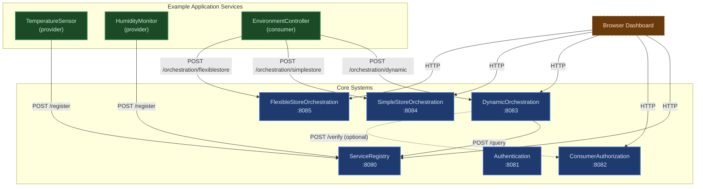
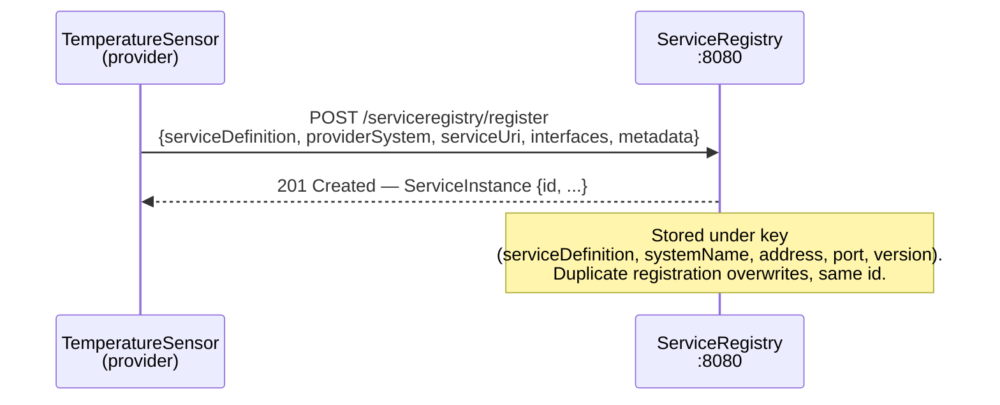
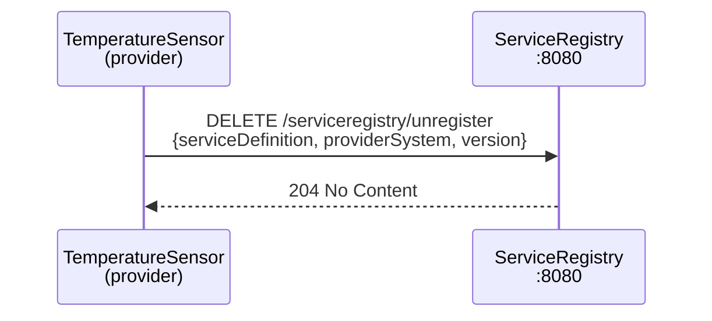
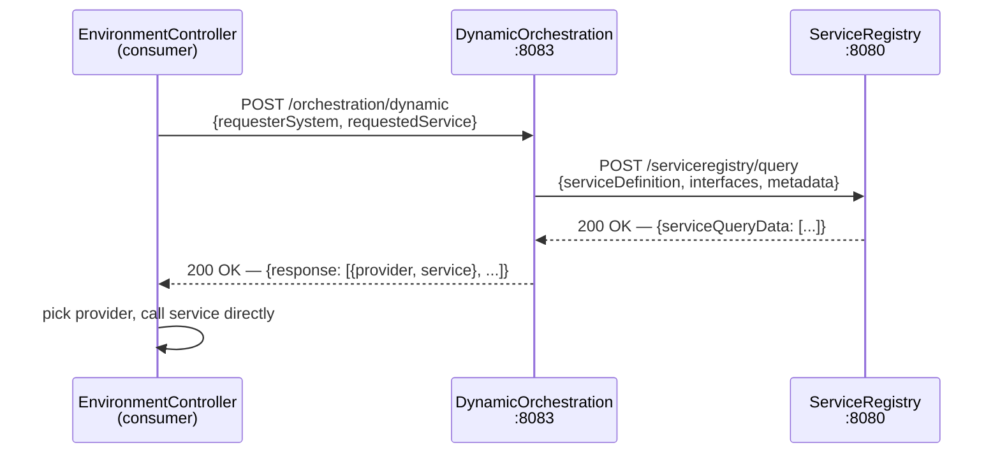
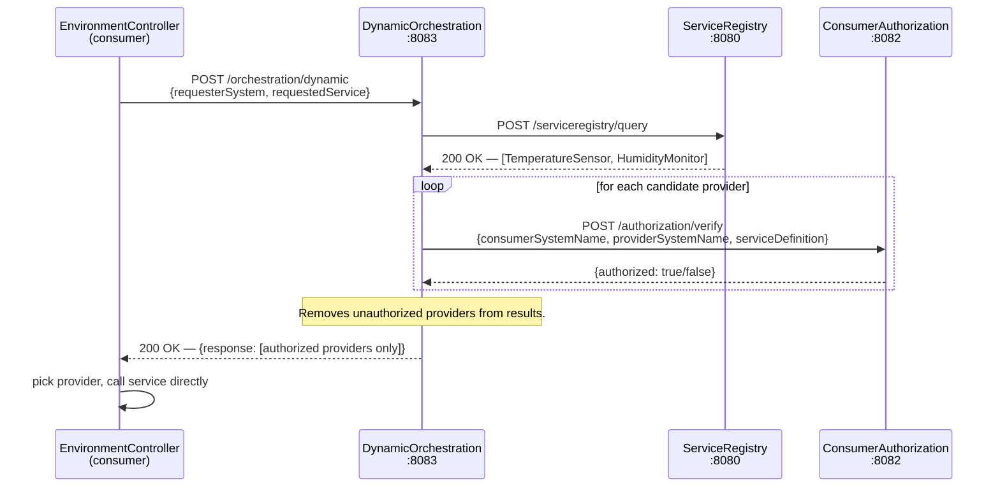
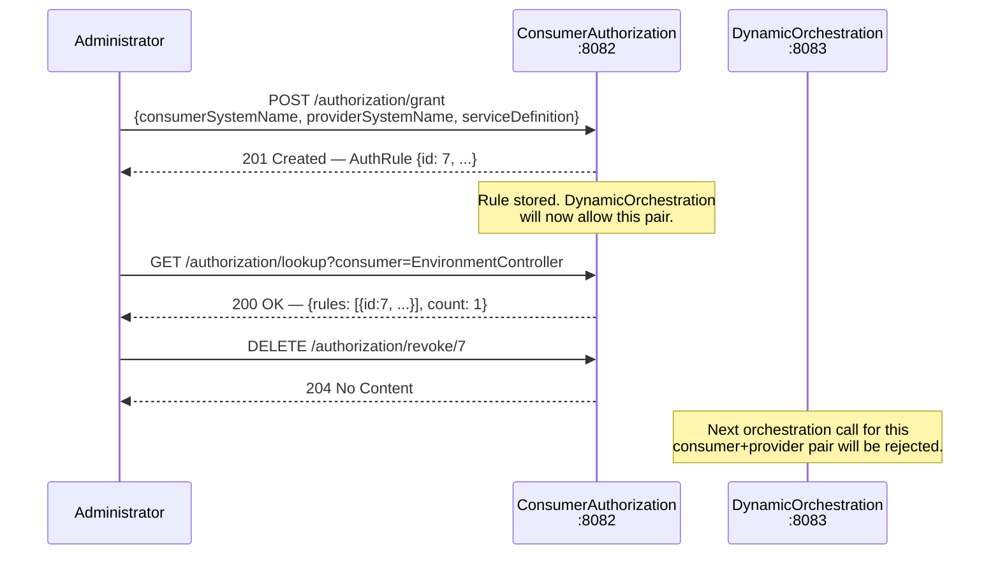
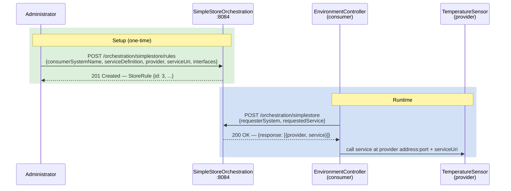
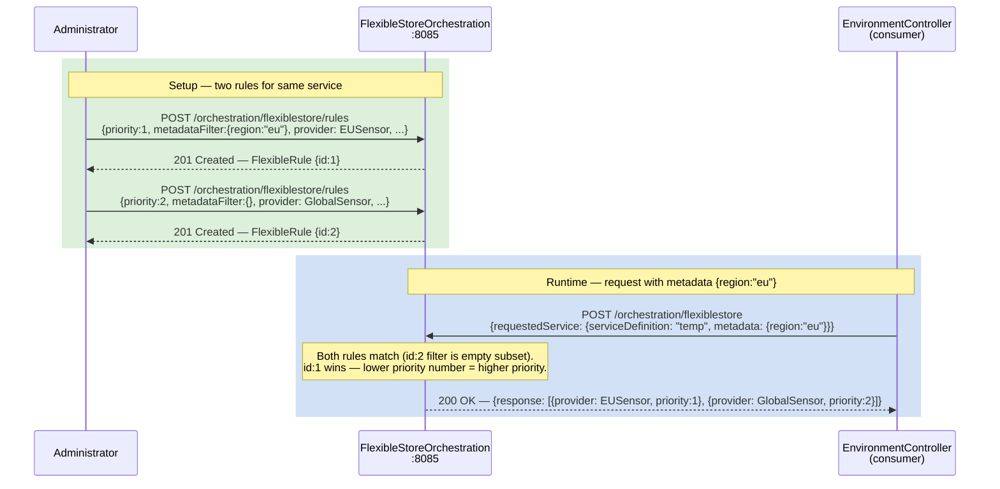
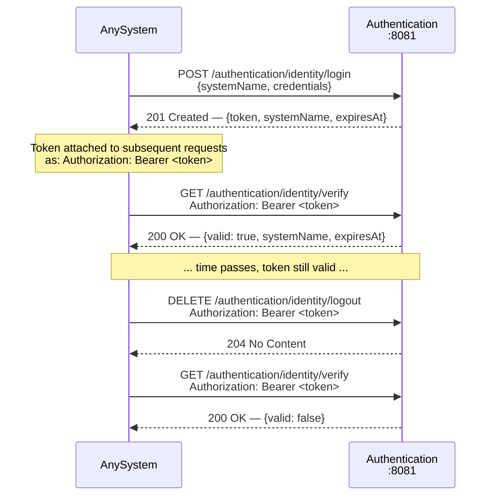
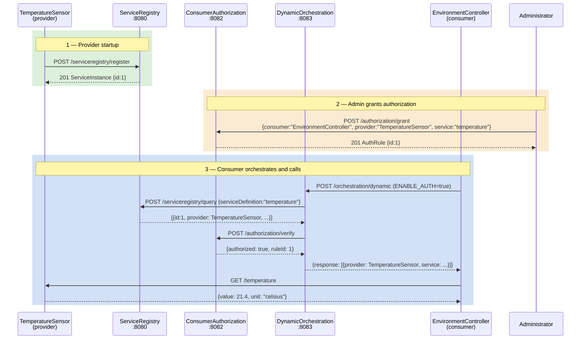

# Arrowhead Core — Diagrams

---

## System Architecture

Core systems are shown in **blue**. Example application services (not part of the core) are shown in **green**. The browser dashboard is shown in **amber**.

---

## Sequence Diagrams

### 1. Service Registration

A provider system announces a service to the Service Registry.

---

### 2. Service Unregistration

A provider removes its registration when shutting down.

---

### 3. Dynamic Orchestration (without authorization)

The orchestrator queries the Service Registry in real time and returns all matching providers.

---

### 4. Dynamic Orchestration (with authorization check)

When `ENABLE_AUTH=true`, the orchestrator additionally verifies that the consumer is authorized to access each candidate provider.

---

### 5. Authorization Rule Management

An administrator grants and later revokes a consumer→provider authorization rule.

---

### 6. SimpleStore Orchestration

An administrator pre-configures a fixed routing rule. The consumer uses the rule without any SR lookup.

---

### 7. FlexibleStore Orchestration

Like SimpleStore but supports multiple rules per consumer+service, matched by metadata filter and ordered by priority.

---

### 8. Authentication Token Lifecycle

A system obtains an identity token, uses it, then logs out.

---

### 9. Full End-to-End Flow

A complete interaction from provider startup through consumer service call, using Dynamic Orchestration with authorization.

