# QoS-Aware Composable Digital Twins for Resilient Coordination of Industrial Mobile Robots

A fully runnable local proof-of-concept implementation of the paper:

> **"QoS-Aware Composable Digital Twins for Resilient Coordination of Industrial Mobile Robots"**
> Ulf Bodin, Jan Niemi, and Ulf Andersson
> Department of Computer Science, Electrical and Space Engineering
> Luleå University of Technology (LTU), Sweden

The system emulates a heterogeneous fleet of underground mining machines using a three-layer composable Digital Twin architecture, orchestrated through an Eclipse Arrowhead-style service framework. Each machine is abstracted into an Individual Digital Twin (iDT) exposing QoS-annotated services; Composite Digital Twins (cDTs) dynamically compose these services to realise mission-level functionality. QoS-aware service selection enables resilient operation through controlled degradation — selecting lower-quality but functionally equivalent services rather than failing abruptly. It includes three reproducible experiments that generate publication-quality plots with uncertainty bands:

1. **QoS Trade-off Analysis** — how weighted utility scores drive provider selection across randomised QoS profiles.
2. **Controlled Degradation** — resilience of QoS-aware selection versus availability-based selection under simulated service degradation.
3. **Failover Delay Benchmark** — latency advantage of local (pre-configured) failover versus centralised Arrowhead reorchestration under increasing simulated network delay.

If you use this work, please cite:

```
U. Bodin, J. Niemi, and U. Andersson, "QoS-Aware Composable Digital Twins for Resilient
Coordination of Industrial Mobile Robots," Luleå University of Technology (LTU), 2026.
https://github.com/ulfbod/DT-as-proxies-for-mining-PoC
```

---

## Table of Contents

- [Architecture Overview](#architecture-overview)
- [Service Composition Graph](#service-composition-graph)
- [Sequence Diagrams](#sequence-diagrams)
- [Port Reference](#port-reference)
- [Quick Start (Local)](#quick-start-local)
- [Quick Start (Docker Compose)](#quick-start-docker-compose)
- [Demo Scenario](#demo-scenario)
- [Experiments and Evaluation](#experiments-and-evaluation)
- [QoS-Aware Failover Evaluation](#qos-aware-failover-evaluation)
- [API Reference](#api-reference)
- [Simplifications and Design Choices](#simplifications-and-design-choices)
- [Repository Structure](#repository-structure)

---

## Architecture Overview

The system follows the three-layer architecture described in the paper:

```
┌─────────────────────────────────────────────────────────────────┐
│                        VIRTUAL SPACE                            │
│                                                                 │
│  ┌─────────────────────────────────────────────────────────┐   │
│  │                    UPPER cDT LAYER                      │   │
│  │   cDTa: Inspection & Recovery  │  cDTb: Hazard Mon.&Access│   │
│  └────────────────────┬────────────────────────┬───────────┘   │
│                       │ composes                │               │
│  ┌────────────────────▼────────────────────────▼───────────┐   │
│  │                    LOWER cDT LAYER                      │   │
│  │  cDT1: Mapping │ cDT2: Gas │ cDT3: Hazard │ cDT4: LHD  │   │
│  │                        cDT5: Tele-Remote               │   │
│  └────────────────────┬────────────────────────┬───────────┘   │
│                       │ orchestrates via        │               │
│  ┌────────────────────▼────────────────────────▼───────────┐   │
│  │              ARROWHEAD CORE FRAMEWORK                   │   │
│  │  Service Registry │ Orchestration │ Authorization       │   │
│  └────────────────────┬────────────────────────┬───────────┘   │
│                       │ proxy for               │               │
│  ┌────────────────────▼────────────────────────▼───────────┐   │
│  │                  PHYSICAL/iDT LAYER                     │   │
│  │  iDT1a/b: Robots │ iDT2a/b: Gas │ iDT3a/b: LHD │ iDT4  │   │
│  └─────────────────────────────────────────────────────────┘   │
└─────────────────────────────────────────────────────────────────┘
         ▲  represents  ▼
┌─────────────────────────────────────────────────────────────────┐
│                       PHYSICAL SPACE                            │
│   Inspection Robots │ Gas Sensors │ LHD Vehicles │ Operator     │
└─────────────────────────────────────────────────────────────────┘
```

### Mermaid Architecture Diagram

```mermaid
graph TB
    subgraph PS["Physical Space"]
        M1["🤖 Robot A"]
        M2["🤖 Robot B"]
        M3["🔬 Gas Sensor A"]
        M4["🔬 Gas Sensor B"]
        M5["🚛 LHD A"]
        M6["🚛 LHD B"]
        M7["🖥️ Operator Station"]
    end

    subgraph VS["Virtual Space"]
        subgraph IDT["Physical/iDT Layer"]
            IDT1A["iDT1a\nInspection Robot A\n:8101"]
            IDT1B["iDT1b\nInspection Robot B\n:8102"]
            IDT2A["iDT2a\nGas Sensing A\n:8201"]
            IDT2B["iDT2b\nGas Sensing B\n:8202"]
            IDT3A["iDT3a\nLHD Vehicle A\n:8301"]
            IDT3B["iDT3b\nLHD Vehicle B\n:8302"]
            IDT4["iDT4\nTele-Remote\n:8401"]
        end

        subgraph AH["Eclipse Arrowhead Core :8000"]
            REG["Service Registry"]
            ORCH["Orchestration"]
            AUTH["Authorization"]
        end

        subgraph LOWER["Lower cDT Layer"]
            CDT1["cDT1\nExploration &\nMapping\n:8501"]
            CDT2["cDT2\nGas Concentration\nMonitoring\n:8502"]
            CDT3["cDT3\nHazard Detection\n& Classification\n:8503"]
            CDT4["cDT4\nMaterial Handling\n& Clearance\n:8504"]
            CDT5["cDT5\nTele-Remote\nIntervention\n:8505"]
        end

        subgraph UPPER["Upper cDT Layer"]
            CDTA["cDTa\nInspection &\nRecovery\n:8601"]
            CDTB["cDTb\nHazard Monitoring\n& Access Control\n:8602"]
        end
    end

    FE["🌐 Frontend\nReact+TypeScript\n:3000"]
    SC["⚙️ Scenario Runner\n:8700"]

    M1 -.->|proxied by| IDT1A
    M2 -.->|proxied by| IDT1B
    M3 -.->|proxied by| IDT2A
    M4 -.->|proxied by| IDT2B
    M5 -.->|proxied by| IDT3A
    M6 -.->|proxied by| IDT3B
    M7 -.->|proxied by| IDT4

    IDT1A & IDT1B -->|register| REG
    IDT2A & IDT2B -->|register| REG
    IDT3A & IDT3B -->|register| REG
    IDT4 -->|register| REG

    CDT1 -->|orchestrate via| ORCH
    CDT2 -->|orchestrate via| ORCH
    CDT3 -->|orchestrate via| ORCH
    CDT4 -->|orchestrate via| ORCH
    CDT5 -->|orchestrate via| ORCH

    ORCH -->|check| AUTH

    CDT1 -->|composes| IDT1A & IDT1B
    CDT2 -->|composes| IDT2A & IDT2B
    CDT3 -->|composes| IDT1A & IDT2A
    CDT4 -->|composes| IDT3A & IDT3B
    CDT5 -->|composes| IDT4

    CDTA -->|composes| CDT1 & CDT3 & CDT4 & CDT5
    CDTB -->|composes| CDT2 & CDT3

    FE -->|REST| AH
    FE -->|REST| CDTA & CDTB
    FE -->|REST| SC
    SC -->|control| IDT1A & IDT1B & IDT2A & IDT2B
```

---

## Service Composition Graph

The paper defines which services each cDT is authorized to consume:

| Consumer | Authorized Providers | Purpose |
|----------|---------------------|---------|
| **cDT1** | iDT1a, iDT1b | SLAM-based mapping, QoS-aware robot selection |
| **cDT2** | iDT2a, iDT2b | Gas monitoring, threshold alerting, QoS-aware sensor selection |
| **cDT3** | iDT1a, iDT2a | Hazard detection/classification, fuses robot scan data and gas readings |
| **cDT4** | iDT3a, iDT3b | Debris clearance, QoS-aware LHD vehicle selection |
| **cDT5** | iDT4 | Tele-remote intervention and manual override |
| **cDTa** | cDT1, cDT3, cDT4, cDT5 | Inspection, task allocation, QoS-aware coordination |
| **cDTb** | cDT2, cDT3 | Hazard assessment, safe-access decisions, gate control |

All cross-service calls are mediated by the Arrowhead Core — services discover endpoints and receive authorization tokens before making calls.

cDT1 and cDT2 each manage two redundant providers through a `ProviderSelector` that supports both **local failover** (instant pre-configured fallback) and **centralised reorchestration** (queries Arrowhead for a replacement), which is the subject of the failover experiment.

---

## Sequence Diagrams

### 1. Service Registration (startup)

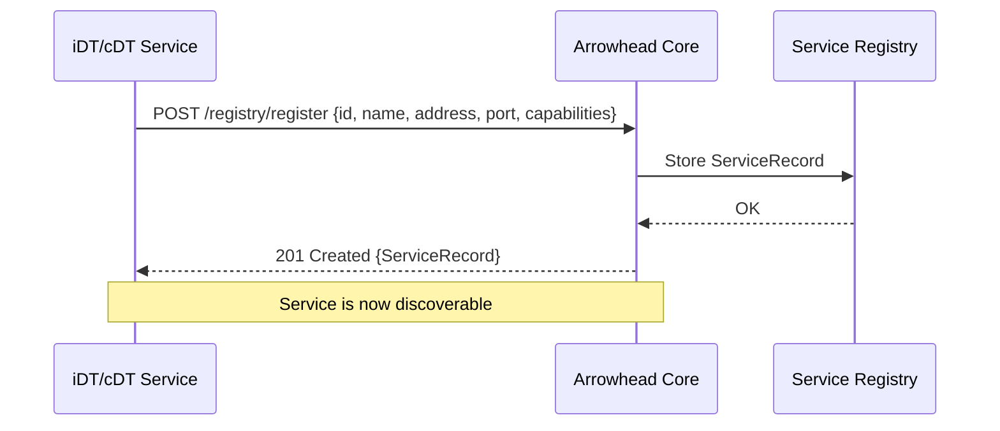

### 2. Arrowhead Orchestration + Authorization (inter-service call)

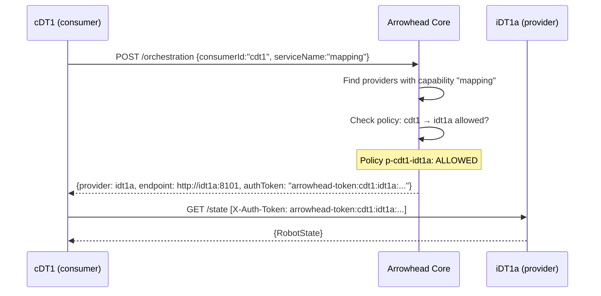

### 3. Post-Blast Mission Activation (cDTa orchestrating lower cDTs)

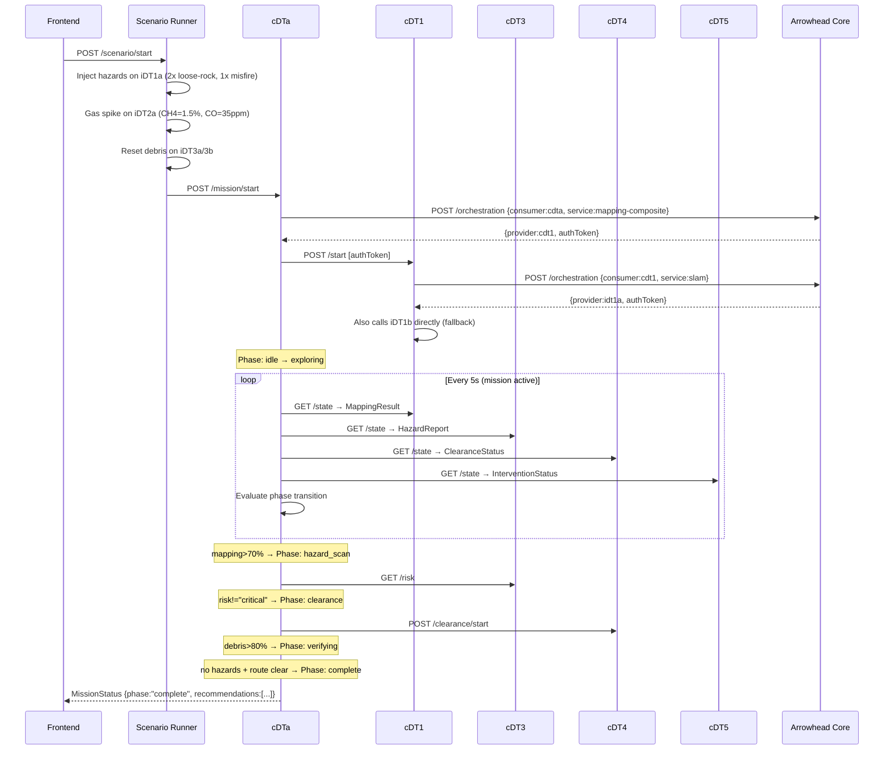

### 4. Safe-Access Decision (cDTb)

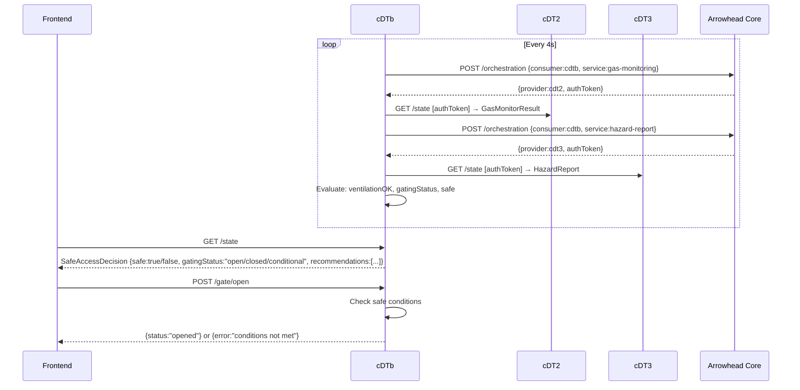

### 5. Unauthorized Service Call (blocked by Arrowhead)

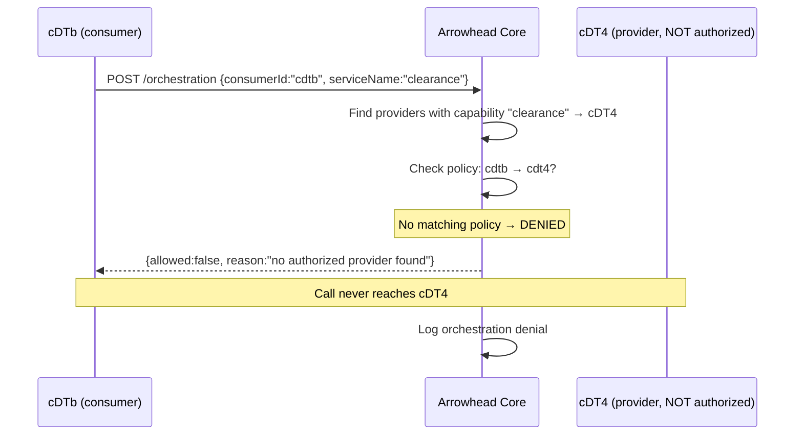

### 6. Failover Decision: Local vs. Centralised

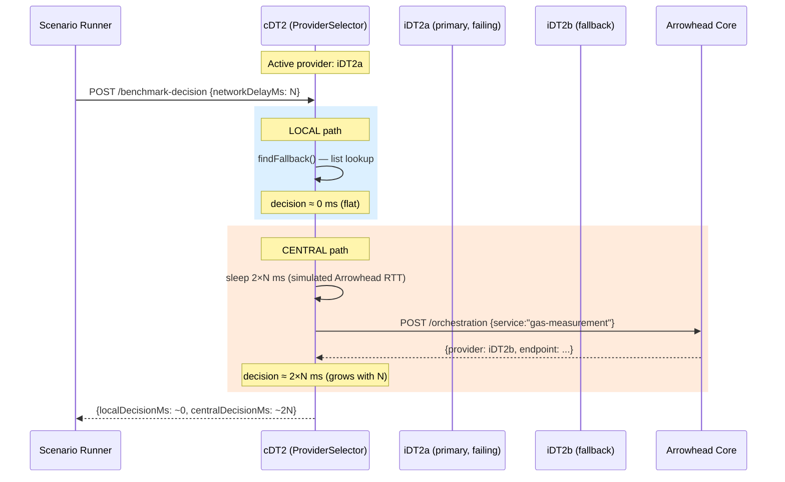

---

## Port Reference

| Service | ID | Port | Type | Description |
|---------|-----|------|------|-------------|
| Arrowhead Core | arrowhead | **8000** | Core | Service registry, orchestration, authorization |
| Inspection Robot A | idt1a | **8101** | iDT | SLAM, mapping, hazard detection |
| Inspection Robot B | idt1b | **8102** | iDT | SLAM, mapping, hazard detection |
| Gas Sensing Unit A | idt2a | **8201** | iDT | CH4, CO, CO2, O2, NO2 monitoring |
| Gas Sensing Unit B | idt2b | **8202** | iDT | CH4, CO, CO2, O2, NO2 monitoring |
| LHD Vehicle A | idt3a | **8301** | iDT | Debris clearance, tramming |
| LHD Vehicle B | idt3b | **8302** | iDT | Debris clearance, tramming |
| Tele-Remote Station | idt4 | **8401** | iDT | Operator override, tele-operation |
| Autonomous Exploration & Mapping | cdt1 | **8501** | lower cDT | Composes iDT1a + iDT1b |
| Gas Concentration Monitoring | cdt2 | **8502** | lower cDT | Composes iDT2a + iDT2b (QoS failover) |
| Hazard Detection & Classification | cdt3 | **8503** | lower cDT | Composes iDT1a + iDT2a |
| Selective Material Handling | cdt4 | **8504** | lower cDT | Composes iDT3a + iDT3b |
| Tele-Remote Intervention | cdt5 | **8505** | lower cDT | Composes iDT4 |
| Inspection & Recovery | cdta | **8601** | upper cDT | Composes cDT1 + cDT3 + cDT4 + cDT5 |
| Hazard Monitoring & Access Control | cdtb | **8602** | upper cDT | Composes cDT2 + cDT3 |
| Scenario Runner | scenario | **8700** | Tool | Post-blast demo + failover experiment |
| Frontend | — | **3000** | UI | React + TypeScript dashboard |

---

## Quick Start (Local)

### Prerequisites

- **Go 1.21+** — `go version`
- **Node.js 18+** — `node --version`
- **npm 9+** — `npm --version`

### Prerequisites for Python experiments

The QoS trade-off and degradation experiments are pure Python simulations and do not require Go or Node.

```bash
# Install Python dependencies using the provided requirements file:
python3 -m venv .venv
.venv/bin/pip install -r scripts/requirements.txt

# Or let run_experiment.sh do it automatically on first run.
```

### Option A: Automated experiment script (recommended)

```bash
# Install frontend dependencies (first time only)
cd frontend && npm install && cd ..

chmod +x run_experiment.sh

# All experiments: QoS trade-off + degradation (Python) + failover benchmark (Go)
./run_experiment.sh --runs 50 --seed 1234

# Python experiments only (no Go services required):
./run_experiment.sh --scenario tradeoff   --runs 50 --seed 1234
./run_experiment.sh --scenario degradation --runs 50 --seed 1234

# Failover benchmark only (starts Go services):
./run_experiment.sh --scenario failover --runs 10

# Skip service startup if Go services are already running:
./run_experiment.sh --scenario failover --no-start
```

When the script finishes you will see:
- Per-run CSVs in `results/*/runs/`
- Aggregated CSVs in `results/*/aggregated.csv`
- Figures (PNG + PDF) in `docs/figures/`
- The base seed printed and saved to `results/manifest.json`

The frontend stays running at **http://localhost:3000** until you press Ctrl+C (for `--scenario failover|all`).

### Option B: Manual launch (step by step)

```bash
cd backend

# 1. Start Arrowhead Core
PORT=8000 go run ./cmd/arrowhead &
sleep 3  # wait for Arrowhead to be ready

# 2. Start iDT layer
PORT=8101 IDT_ID=idt1a IDT_NAME="Inspection Robot A"  ARROWHEAD_URL=http://localhost:8000 go run ./cmd/idt-robot &
PORT=8102 IDT_ID=idt1b IDT_NAME="Inspection Robot B"  ARROWHEAD_URL=http://localhost:8000 go run ./cmd/idt-robot &
PORT=8201 IDT_ID=idt2a IDT_NAME="Gas Sensing Unit A"  ARROWHEAD_URL=http://localhost:8000 go run ./cmd/idt-gas &
PORT=8202 IDT_ID=idt2b IDT_NAME="Gas Sensing Unit B"  ARROWHEAD_URL=http://localhost:8000 go run ./cmd/idt-gas &
PORT=8301 IDT_ID=idt3a IDT_NAME="LHD Vehicle A"       ARROWHEAD_URL=http://localhost:8000 go run ./cmd/idt-lhd &
PORT=8302 IDT_ID=idt3b IDT_NAME="LHD Vehicle B"       ARROWHEAD_URL=http://localhost:8000 go run ./cmd/idt-lhd &
PORT=8401 IDT_ID=idt4  IDT_NAME="Tele-Remote"         ARROWHEAD_URL=http://localhost:8000 go run ./cmd/idt-teleremote &
sleep 3

# 3. Start lower cDT layer
PORT=8501 ARROWHEAD_URL=http://localhost:8000 \
    IDT1A_URL=http://localhost:8101 IDT1B_URL=http://localhost:8102 \
    LOG_DIR=./logs go run ./cmd/cdt1 &
PORT=8502 ARROWHEAD_URL=http://localhost:8000 \
    IDT2A_URL=http://localhost:8201 IDT2B_URL=http://localhost:8202 \
    LOG_DIR=./logs go run ./cmd/cdt2 &
PORT=8503 ARROWHEAD_URL=http://localhost:8000 \
    CDT1_URL=http://localhost:8501 CDT2_URL=http://localhost:8502 \
    IDT1A_URL=http://localhost:8101 IDT1B_URL=http://localhost:8102 go run ./cmd/cdt3 &
PORT=8504 ARROWHEAD_URL=http://localhost:8000 \
    IDT3A_URL=http://localhost:8301 IDT3B_URL=http://localhost:8302 go run ./cmd/cdt4 &
PORT=8505 ARROWHEAD_URL=http://localhost:8000 \
    IDT4_URL=http://localhost:8401 go run ./cmd/cdt5 &
sleep 3

# 4. Start upper cDT layer
PORT=8601 ARROWHEAD_URL=http://localhost:8000 \
    CDT1_URL=http://localhost:8501 CDT3_URL=http://localhost:8503 \
    CDT4_URL=http://localhost:8504 CDT5_URL=http://localhost:8505 go run ./cmd/cdta &
PORT=8602 ARROWHEAD_URL=http://localhost:8000 \
    CDT2_URL=http://localhost:8502 CDT3_URL=http://localhost:8503 go run ./cmd/cdtb &
sleep 2

# 5. Start scenario runner
PORT=8700 ARROWHEAD_URL=http://localhost:8000 \
    IDT1A_URL=http://localhost:8101 IDT1B_URL=http://localhost:8102 \
    IDT2A_URL=http://localhost:8201 IDT2B_URL=http://localhost:8202 \
    IDT3A_URL=http://localhost:8301 IDT3B_URL=http://localhost:8302 \
    IDT4_URL=http://localhost:8401 \
    CDT1_URL=http://localhost:8501 CDT2_URL=http://localhost:8502 \
    CDT3_URL=http://localhost:8503 CDT4_URL=http://localhost:8504 \
    CDT5_URL=http://localhost:8505 \
    CDTA_URL=http://localhost:8601 CDTB_URL=http://localhost:8602 \
    LOG_DIR=./logs go run ./cmd/scenario &

# 6. Start frontend
cd ../frontend
npm install
npm run dev
```

Open **http://localhost:3000** in your browser.

---

## Quick Start (Docker Compose)

### Prerequisites

- Docker 24+ with Compose v2
- `docker compose version`

```bash
docker compose up --build
```

All services build from source. First build takes ~3–5 minutes. Subsequent starts are fast.

To stop:
```bash
docker compose down
```

---

## Demo Scenario

### Post-Blast Inspection and Recovery

This scenario simulates what happens after a controlled blast in an underground mine:

1. **Trigger the scenario** via the frontend (top bar "Start Scenario") or directly:
   ```bash
   curl -X POST http://localhost:8700/scenario/start
   ```

2. **What happens automatically:**
   - Hazards injected on Robot A: 2× loose-rock (medium), 1× misfire (high)
   - Gas spike on Sensor A: CH4=1.5%, CO=35 ppm (above safe threshold)
   - Both LHDs reset to 0% debris cleared
   - cDTa mission starts → phase: `exploring`
   - Robots begin SLAM mapping
   - cDTb closes the gate (hazardous conditions)

3. **Watch the phase progression** in the cDTa view:
   - `exploring` → `hazard_scan` (when mapping >70%)
   - `hazard_scan` → `clearance` (when risk is not critical)
   - `clearance` → `verifying` (when debris >80%)
   - `verifying` → `complete` (when route clear and hazards resolved)

4. **Safe-access** in the cDTb view shows UNSAFE initially. As hazards clear and gas normalises, the gate transitions from `closed` → `conditional` → `open`.

### Manual Controls

| Action | Frontend | Direct API |
|--------|----------|-----------|
| Force gas spike | "Gas Spike" button | `POST http://localhost:8700/scenario/gas-spike` |
| Inject hazard | "Inject Hazard" button | `POST http://localhost:8700/scenario/inject-hazard {"robotId":"idt1a","type":"misfire","severity":"critical"}` |
| Clear all hazards | "Clear All" button | `POST http://localhost:8700/scenario/clear-all` |
| Toggle robot offline | System View | `POST http://localhost:8101/online {"online":false}` |
| Toggle connectivity | System View | `POST http://localhost:8101/connectivity {"connected":false}` |
| Force mission phase | cDTa view | `POST http://localhost:8601/force/phase {"phase":"clearance"}` |
| Open/close gate | cDTb view | `POST http://localhost:8602/gate/open` |
| Add auth policy | System View | `POST http://localhost:8000/authorization/policy {"consumerId":"cdtb","providerId":"cdt4","serviceName":"*","allowed":true}` |

---

## Experiments and Evaluation

This repository provides three reproducible conceptual evaluations, each available in two
**simulation scenarios** (`basic` and `improved01`). All produce per-run CSV files,
aggregated statistics (median, 10th, 90th percentile), and publication-ready PNG + PDF plots.

### Simulation scenarios

Two eval-scenarios control the simulation parameters and provider configuration:

| Flag | Description |
|------|-------------|
| `--eval-scenario basic` | Original evaluation — moderate QoS separation, 2 degradation episodes, 120 s simulation |
| `--eval-scenario improved01` | Strengthened evaluation — wider separation, 3 episodes, 200 s simulation, accuracy-heavy weights |

`--scenario basic` and `--scenario improved01` are accepted as convenient aliases.

#### How `improved01` differs from `basic`

| Parameter | `basic` | `improved01` |
|-----------|---------|--------------|
| Provider A accuracy range | [0.88, 0.99] | [0.90, 0.99] |
| Provider A latency range | [40, 80 ms] | [55, 95 ms] |
| Provider B accuracy range | [0.50, 0.74] | [0.38, 0.62] |
| Provider B latency range | [3, 15 ms] | [2, 9 ms] |
| Provider B reliability range | [0.68, 0.87] | [0.52, 0.76] |
| Degradation episodes | 2 | 3 (alternating A→B→A) |
| Simulation duration | 120 s | 200 s |
| Utility weights (acc/lat/rel) | 0.40 / 0.30 / 0.30 | **0.50 / 0.25 / 0.25** |
| Availability failover threshold | 0.15 | **0.12** (baseline reacts later) |
| QoS switch hysteresis | 0.06 | **0.05** (proposed method more responsive) |

The wider provider separation in `improved01` creates a sharper crossover in the trade-off plot.
The third degradation episode and stronger accuracy weighting make the proposed method's recovery
advantage appear twice in distinct, non-overlapping windows.

### Seed schedule and reproducibility

Only **one optional base seed** is needed, regardless of the number of runs.
Run *i* automatically receives seed `base_seed + i`:

```
runs = 50, base_seed = 1234  →  seeds: 1234, 1235, 1236, …, 1283
```

If `--seed` is not provided a random base seed is generated, printed to the console,
and saved to `results/<eval-scenario>/manifest.json` so the experiment can always be reproduced.

### Running experiments

```bash
# Run the basic scenario (50 runs, reproducible seed):
./run_experiment.sh --eval-scenario basic --runs 50 --seed 1234

# Run the improved scenario:
./run_experiment.sh --eval-scenario improved01 --runs 50 --seed 1234

# Shorthand aliases (equivalent to the above):
./run_experiment.sh --scenario basic   --runs 50 --seed 1234
./run_experiment.sh --scenario improved01 --runs 50 --seed 1234

# Only trade-off analysis (no Go services needed):
./run_experiment.sh --scenario tradeoff --eval-scenario improved01 --runs 50 --seed 1234

# Only controlled degradation (no Go services needed):
./run_experiment.sh --scenario degradation --eval-scenario improved01 --runs 50 --seed 1234

# Failover delay benchmark (starts Go services):
./run_experiment.sh --scenario failover --runs 10

# Python scripts can also be called directly:
python scripts/experiments.py --runs 50 --seed 1234 --eval-scenario improved01
python scripts/plot.py --eval-scenario improved01 --input-dir results/ --output-dir docs/figures/
```

### Script parameters

| Flag | Default | Description |
|------|---------|-------------|
| `--eval-scenario` | `basic` | Simulation scenario: `basic` or `improved01` |
| `--runs N` | `30` | Number of randomised runs per experiment |
| `--seed BASE_SEED` | *(auto)* | Base seed; each run uses `base_seed + i`. Omit for a random seed. |
| `--output-dir PATH` | `./results` | Root directory; outputs go to `<PATH>/<eval-scenario>/` |
| `--scenario` | `all` | Experiment type: `tradeoff`, `degradation`, `failover`, `all`; also accepts `basic`/`improved01` as aliases for `--eval-scenario` |
| `--baseline` | `both` | Degradation methods: `qos_aware`, `availability_based`, or `both` |
| `--no-start` | — | Skip Go service startup (for `failover`/`all` when services are already running) |

### Experiment 1 — QoS Trade-off Analysis

**Goal:** Show how the choice of QoS weights determines which provider is selected and what
utility is achieved, across many randomised QoS profiles.

For each run a unique seed samples two structurally opposed providers:
- **Provider A** ("quality sensor"): high accuracy, high reliability, slow latency
- **Provider B** ("fast sensor"): lower accuracy, lower reliability, fast latency

The accuracy weight `α` is swept from 0 to 1 in 21 steps; the remaining weight is split
evenly between latency and reliability.  The utility function is:

```
utility = α · accuracy + ((1−α)/2) · (1 − latency/100) + ((1−α)/2) · reliability
```

The non-overlapping latency ranges guarantee a genuine accuracy–latency trade-off with a
visible crossover. `improved01` widens this gap, making the crossover sharper.

**Figure — Provider utility vs. accuracy weight (`improved01`):**

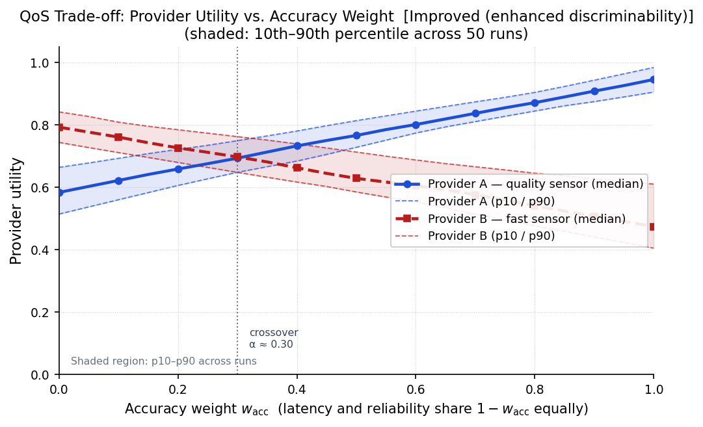

*Median utility of each provider (solid/dashed line) with 10th–90th percentile dashed bounds and
light fill. The vertical dotted line marks the crossover α where Provider B stops dominating.*

**Figure — QoS metrics of selected provider (`improved01`):**

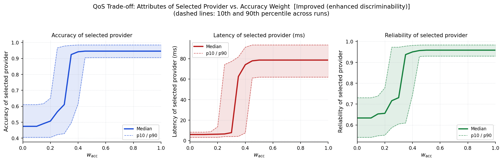

*Accuracy, latency, and reliability of the actually selected provider. At low α the fast provider
dominates; at high α the accurate provider wins. The crossover is abrupt because the provider ranges
do not overlap.*

### Experiment 2 — Controlled Degradation Behaviour

**Goal:** Demonstrate resilience of QoS-aware selection compared to a pure
availability-based baseline under controlled service degradation and recovery.

Each run draws a per-episode scenario:
- **Degraded provider** ~ alternating (A→B for 2 episodes; A→B→A for 3 episodes)
- **Degradation onset** ~ U[10, 18] s / U[12, 20] s after previous recovery
- **Degradation rate** ~ U[0.04, 0.15] / U[0.05, 0.18] accuracy/s
- **Hard-failure window** follows gradual degradation; gradual recovery follows the hard failure

The two strategies are evaluated on the **same** scenario per run (paired comparison):

| Strategy | Switch condition | Switch-back |
|----------|----------------|-------------|
| **QoS-aware** | Active utility < threshold **or** alternative better by > hysteresis | Yes — proactive switch-back after recovery |
| **Availability-based** | Active reliability < threshold (hard failure only) | No — stays on fallback provider |

The proactive switch-back is the key discriminator: QoS-aware returns to the better provider
once it recovers; availability-based remains on whichever provider it switched to.

**Figure — Utility over time + advantage (`improved01`, 3 episodes):**

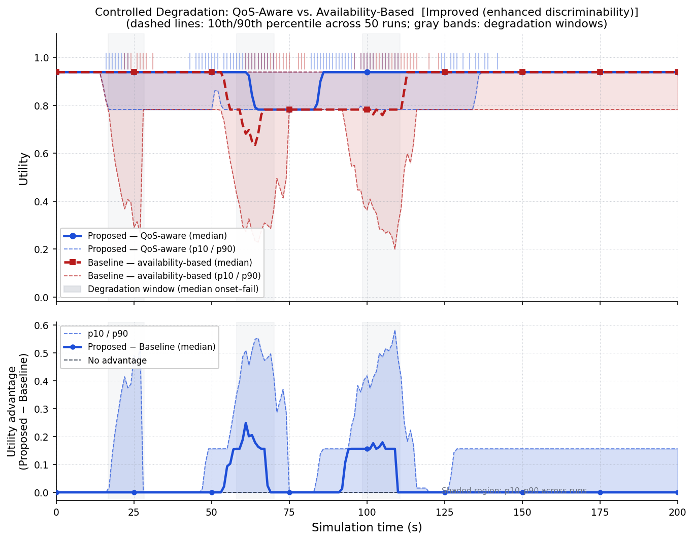

*Top panel: median utility (solid = proposed, dashed = baseline) with 10th/90th percentile dashed
bounds. Gray bands mark the median gradual-degradation windows (onset → hard-fail) for each episode.
Bottom panel: per-timestep utility advantage (proposed − baseline); positive = QoS-aware wins.*

**`basic` scenario for reference (2 episodes, 120 s):**

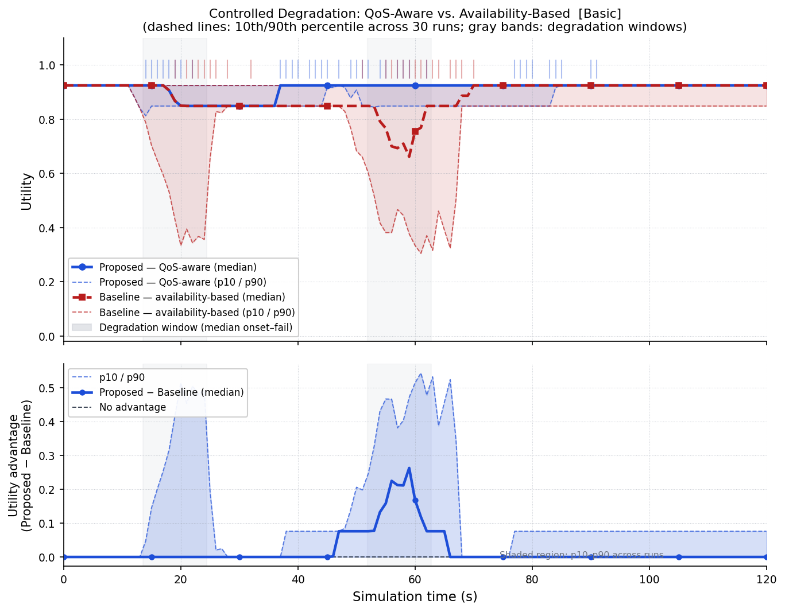

### Experiment 3 — Failover Delay Benchmark

See [QoS-Aware Failover Evaluation](#qos-aware-failover-evaluation) below for full details.
This experiment requires the Go services to be running and is included in `--scenario all`.
Failover data is not namespaced by eval-scenario (it comes from the live Go services).

### Statistical aggregation

All aggregated CSVs contain per-row data for all runs. The plotting script (`scripts/plot.py`)
computes **median, 10th percentile, and 90th percentile** across runs at each x-axis point.

Both methods are evaluated on the same random draws per run, so the advantage plot reflects a
**paired** comparison — noise that affects both methods cancels out.

### Output directory layout

```
results/
├── basic/                                  ← outputs for --eval-scenario basic
│   ├── manifest.json                       ← base seed, run count, reproducibility command
│   ├── tradeoff/
│   │   ├── aggregated.csv
│   │   └── runs/run_NNNN_seed_SSSS.csv     ← per-run detail (gitignored)
│   └── degradation/
│       ├── aggregated.csv
│       └── runs/…
├── improved01/                             ← outputs for --eval-scenario improved01
│   ├── manifest.json
│   ├── tradeoff/aggregated.csv
│   └── degradation/aggregated.csv
└── failover_delay_vs_network_delay.csv     ← Go benchmark output (not scenario-namespaced)

docs/figures/
├── basic/
│   ├── tradeoff_provider_utilities.{png,pdf}
│   ├── tradeoff_qos_metrics_vs_weight.{png,pdf}
│   └── degradation_combined.{png,pdf}
└── improved01/
    ├── tradeoff_provider_utilities.{png,pdf}
    ├── tradeoff_qos_metrics_vs_weight.{png,pdf}
    └── degradation_combined.{png,pdf}
```

Per-run CSV files under `results/*/runs/` are excluded from git (see `.gitignore`).
Aggregated CSVs and all figures under `docs/figures/` are tracked.

---

## QoS-Aware Failover Evaluation

### Overview

cDT1 (Mapping) and cDT2 (Gas Monitoring) each manage a **primary** and a **fallback** iDT provider through a `ProviderSelector`. When the primary provider fails, the selector can switch in one of two modes:

| Mode | Mechanism | Expected latency |
|------|-----------|-----------------|
| **Local** | Picks the pre-configured fallback immediately (in-memory lookup) | ≈ 0 ms, independent of network delay |
| **Centralised** | Queries Arrowhead to discover a replacement provider (one round-trip = 2×network delay) | ≈ 2 × network_delay_ms |

The experiment sweeps the simulated one-way network delay from 0 ms to 50 ms in 5 ms steps and measures the **failover decision time** for both modes at each point.

### Running the Experiment

```bash
# Via the automation script (runs services + experiment + keeps frontend alive):
./run_experiment.sh --runs 5

# Or trigger manually while services are running:
curl -X POST http://localhost:8700/scenario/experiment/run \
     -H "Content-Type: application/json" \
     -d '{"runsPerPoint": 5}'

# Poll for results:
curl http://localhost:8700/scenario/experiment/results
```

The QoS & Failover tab in the frontend also provides a one-click experiment runner with a live results table.

### Output Files

All output is written to `--output-dir` (default `./results`):

| File | Description |
|------|-------------|
| `failover_delay_vs_network_delay.csv` | Aggregated results — mean + p10/p90 per delay point |
| `failover_events.csv` | Every individual failover event with full QoS context |
| `cdt2_gas_stream.csv` | Per-poll gas sensor QoS stream |
| `cdt1_mapping_stream.csv` | Per-poll mapping QoS stream |

### CSV Format

`failover_delay_vs_network_delay.csv` has seven columns, gnuplot-ready:

```
network_delay_ms,local_avg_ms,local_p10_ms,local_p90_ms,central_avg_ms,central_p10_ms,central_p90_ms
0,0.001,0.001,0.001,1.054,0.997,1.096
5,0.001,0.001,0.001,11.783,11.606,12.038
10,0.001,0.001,0.001,21.412,21.102,21.789
...
50,0.002,0.001,0.003,101.54,100.92,102.18
```

### Plotting with gnuplot

```gnuplot
set xlabel 'Network Delay (ms)'
set ylabel 'Failover Decision Delay (ms)'
set title 'Local vs. Centralised Failover — Decision Overhead'
set key top left
set grid

plot "results/failover_delay_vs_network_delay.csv" \
     using 1:2:3:4 with yerrorbars title 'Local (p10–p90)'     lc rgb '#2563eb', \
     ""             using 1:2       with linespoints notitle    lc rgb '#2563eb' lw 2, \
     ""             using 1:5:6:7 with yerrorbars title 'Centralised (p10–p90)' lc rgb '#dc2626', \
     ""             using 1:5       with linespoints notitle    lc rgb '#dc2626' lw 2
```

### Expected Results

```
network_delay_ms   local_avg_ms   central_avg_ms
               0          0.001            1.054
               5          0.001           11.783
              10          0.001           21.412
              20          0.001           41.387
              50          0.002          101.540
```

Local failover remains flat at sub-millisecond regardless of network conditions. Centralised reorchestration grows linearly at ~2× the simulated one-way latency, confirming the architectural trade-off between flexibility (centralised discovery) and response time (local pre-configuration).

### Manual Fault Injection (QoS view)

From the **QoS & Failover** tab in the frontend, or directly:

```bash
# Fail the primary gas sensor
curl -X POST http://localhost:8700/scenario/sensor-fail   -H "Content-Type: application/json" -d '{"sensor":"idt2a"}'

# Recover it
curl -X POST http://localhost:8700/scenario/sensor-recover -H "Content-Type: application/json" -d '{"sensor":"idt2a"}'

# Set orchestration mode (affects normal operation, not the benchmark)
curl -X POST "http://localhost:8700/scenario/config?mode=central"

# Set simulated network delay
curl -X POST "http://localhost:8700/scenario/network-delay?ms=20"
```

---

## API Reference

### Arrowhead Core (`:8000`)

| Method | Path | Description |
|--------|------|-------------|
| `GET` | `/health` | Health check |
| `POST` | `/registry/register` | Register a service |
| `GET` | `/registry` | List all registered services |
| `GET` | `/registry/query?capability=mapping` | Query by capability |
| `POST` | `/orchestration` | Get authorized endpoint for a service |
| `GET` | `/orchestration/logs` | Get orchestration decision log |
| `POST` | `/authorization/check` | Check if a call is authorized |
| `POST` | `/authorization/policy` | Add/update authorization policy |
| `GET` | `/authorization/policies` | List all policies |
| `DELETE` | `/authorization/policy?id=p-cdt1-idt1a` | Delete a policy |

**Example — discover a service:**
```bash
curl -X POST http://localhost:8000/orchestration \
  -H "Content-Type: application/json" \
  -d '{"consumerId":"cdt1","serviceName":"mapping"}'
```

### iDT Robots (`:8101`, `:8102`)

| Method | Path | Description |
|--------|------|-------------|
| `GET` | `/state` | Full robot state |
| `GET` | `/map` | Mapping progress & waypoints |
| `GET` | `/hazards` | Detected hazards |
| `POST` | `/slam/start` | Activate SLAM |
| `POST` | `/slam/stop` | Deactivate SLAM |
| `POST` | `/navigate` | `{"x":50,"y":30}` |
| `POST` | `/online` | `{"online":false}` |
| `POST` | `/connectivity` | `{"connected":false}` |
| `POST` | `/hazard/inject` | `{"type":"misfire","severity":"critical"}` |
| `POST` | `/hazard/clear` | `{"id":"haz-123"}` |

### iDT Gas Sensors (`:8201`, `:8202`)

| Method | Path | Description |
|--------|------|-------------|
| `GET` | `/state` | Full sensor state with gas levels |
| `GET` | `/measurements` | Current gas readings |
| `GET` | `/alerts` | Active gas alerts |
| `POST` | `/simulate/spike` | Trigger dangerous gas spike |
| `POST` | `/simulate/fail` | Put sensor into permanent 503 failure mode |
| `POST` | `/simulate/recover` | Recover sensor from failure mode |
| `POST` | `/simulate/gas` | `{"ch4":1.5,"co":35,"co2":0.5,"o2":20.5,"no2":1.0}` |

### iDT LHD Vehicles (`:8301`, `:8302`)

| Method | Path | Description |
|--------|------|-------------|
| `GET` | `/state` | Full LHD state |
| `GET` | `/clearance/status` | Debris cleared%, ETA, route clear |
| `POST` | `/clearance/start` | Begin debris clearance |
| `POST` | `/clearance/stop` | Stop clearance |
| `POST` | `/availability` | `{"available":false}` |
| `POST` | `/simulate/reset` | Reset debris to 0% |

### cDT2 Gas Monitoring (`:8502`) — QoS endpoints

| Method | Path | Description |
|--------|------|-------------|
| `GET` | `/state` | Gas monitor result + active alerts |
| `GET` | `/providers` | ProviderSelector state: both sensors, QoS metrics, recent failovers |
| `POST` | `/provider/fail` | Force-mark a provider failed: `{"providerId":"idt2a"}` |
| `POST` | `/provider/recover` | Recover a provider: `{"providerId":"idt2a"}` |
| `POST` | `/provider/degrade` | Degrade QoS: `{"providerId":"idt2a","accuracyFactor":0.6,"extraLatencyMs":30}` |
| `POST` | `/benchmark-decision` | Measure local vs. central decision time: `{"networkDelayMs":20}` → `{localDecisionMs, centralDecisionMs}` |
| `POST` | `/config` | Push experiment config into this process: `{"networkDelayMs":20,"orchestrationMode":"central"}` |
| `POST` | `/trigger-poll` | Force an immediate sensor poll cycle; returns latest failover event |
| `POST` | `/simulate/spike` | Trigger a gas spike on the active sensor |

### cDTa Mission Controller (`:8601`)

| Method | Path | Description |
|--------|------|-------------|
| `GET` | `/state` | Full mission status + phase |
| `POST` | `/mission/start` | Start post-blast mission |
| `POST` | `/mission/abort` | Abort to failed |
| `POST` | `/mission/reset` | Reset to idle |
| `POST` | `/force/phase` | `{"phase":"clearance"}` (demo) |
| `GET` | `/recommendations` | Current recommendations |
| `GET` | `/components` | Status of cDT1/3/4/5 |

### cDTb Safe-Access Controller (`:8602`)

| Method | Path | Description |
|--------|------|-------------|
| `GET` | `/state` | Full safe-access decision |
| `GET` | `/gating` | Gate status and conditions |
| `POST` | `/gate/open` | Open gate (if safe) |
| `POST` | `/gate/close` | Close gate |
| `POST` | `/ventilation/check` | Trigger ventilation assessment |
| `GET` | `/recommendations` | Current recommendations |

### Scenario Runner (`:8700`) — experiment endpoints

| Method | Path | Description |
|--------|------|-------------|
| `GET` | `/health` | Health check |
| `GET` | `/state` | Current scenario phase + progress |
| `POST` | `/scenario/start` | Start post-blast demo scenario |
| `POST` | `/scenario/reset` | Reset scenario to idle |
| `POST` | `/scenario/inject-hazard` | `{"robotId":"idt1a","type":"misfire","severity":"high"}` |
| `POST` | `/scenario/gas-spike` | Trigger gas spike on iDT2a |
| `POST` | `/scenario/clear-all` | Clear all injected hazards and gas |
| `POST` | `/scenario/sensor-fail` | Fail a sensor: `{"sensor":"idt2a"}` |
| `POST` | `/scenario/sensor-recover` | Recover a sensor: `{"sensor":"idt2a"}` |
| `POST` | `/scenario/config?mode=local` | Set orchestration mode (`local` or `central`) |
| `POST` | `/scenario/network-delay?ms=20` | Set simulated network delay (0–50 ms) |
| `POST` | `/scenario/experiment/run` | Start full experiment: `{"runsPerPoint":5}` |
| `GET` | `/scenario/experiment/results` | Poll experiment status/results |

---

## Simplifications and Design Choices

| Topic | Paper | This PoC |
|-------|-------|---------|
| Physical machines | Real robots/sensors | Simulated Go goroutines with realistic noise |
| Arrowhead framework | Full Eclipse Arrowhead | Lightweight in-memory implementation of the same contracts |
| Authentication | PKI certificates | Token strings encoding policy IDs (sufficient to demonstrate the concept) |
| Edge deployment | Services near machines | All services run on localhost / same Docker network |
| SLAM | Real LiDAR/SLAM | Progress counter with position noise |
| Gas sensing | Real gas sensors | Gaussian noise around configurable baseline |
| Persistence | Varies | In-memory state (resets on restart) |
| Service mesh | Full SOA | Direct HTTP REST between services |
| Network latency | Real network | Configurable simulated delay injected into every `DoRequest` call |
| Failover experiment | N/A | Benchmark endpoint isolates decision path; sweeps 0–50 ms in 5 ms steps; p10/p90 CIs |

The implementation is intentionally simplified to be runnable on a development laptop while preserving all architectural concepts from the paper: the proxy pattern, iDT/cDT layered composability, Arrowhead-style service discovery/authorization, QoS-aware utility-based service selection, and the post-blast scenario decision support.

---

## Repository Structure

```
.
├── run_experiment.sh             # One-command: run all experiments + generate plots
├── docker-compose.yml            # Full stack deployment (Docker)
├── scripts/
│   ├── experiments.py            # QoS trade-off + controlled degradation simulations
│   ├── plot.py                   # Publication-quality PNG + PDF figure generation
│   ├── requirements.txt          # Python dependencies (numpy, matplotlib)
│   └── start-local.sh            # Alternative: start Go services only
├── results/                      # Experiment output (created at runtime; runs/ excluded from git)
│   ├── manifest.json             # Base seed, run count, reproducibility command
│   ├── tradeoff/aggregated.csv   # QoS trade-off results (all runs × all α values)
│   └── degradation/aggregated.csv # Degradation results (all runs × time × methods)
├── docs/figures/                 # Publication-ready figures (PNG + PDF, tracked in git)
│   ├── tradeoff_utility_vs_weight.{png,pdf}
│   ├── tradeoff_qos_metrics_vs_weight.{png,pdf}
│   ├── degradation_utility_over_time.{png,pdf}
│   ├── degradation_utility_advantage.{png,pdf}
│   └── failover_delay_vs_network_delay.{png,pdf}  ← generated after running failover scenario
├── backend/
│   ├── go.mod                    # Go module: mineio
│   ├── Dockerfile                # Multi-stage build (ARG SERVICE_DIR)
│   ├── internal/common/
│   │   ├── types.go              # Shared data types
│   │   ├── client.go             # Arrowhead HTTP client + global delay/mode globals
│   │   ├── provider.go           # ProviderSelector: QoS-aware failover (local & central)
│   │   ├── qos.go                # QoS metric types and FailoverEvent
│   │   └── qoslog.go             # CSV logger for failover events and QoS streams
│   └── cmd/
│       ├── arrowhead/            # Eclipse Arrowhead Core (:8000)
│       ├── idt-robot/            # iDT1a, iDT1b (:8101, :8102)
│       ├── idt-gas/              # iDT2a, iDT2b (:8201, :8202)
│       ├── idt-lhd/              # iDT3a, iDT3b (:8301, :8302)
│       ├── idt-teleremote/       # iDT4 (:8401)
│       ├── cdt1/                 # Exploration & Mapping (:8501) — QoS failover
│       ├── cdt2/                 # Gas Monitoring (:8502) — QoS failover + benchmark
│       ├── cdt3/                 # Hazard Detection (:8503)
│       ├── cdt4/                 # Material Handling (:8504)
│       ├── cdt5/                 # Tele-Remote Intervention (:8505)
│       ├── cdta/                 # Inspection & Recovery (:8601)
│       ├── cdtb/                 # Hazard Monitoring & Access Control (:8602)
│       └── scenario/             # Demo scenario + failover experiment runner (:8700)
├── frontend/
│   ├── src/
│   │   ├── App.tsx               # Main app: top bar + 4-tab navigation
│   │   ├── api/index.ts          # REST API client (all services)
│   │   ├── types/index.ts        # TypeScript types
│   │   ├── hooks/usePolling.ts   # Generic polling hook (3 s)
│   │   └── components/
│   │       ├── SystemView/       # Service grid, composition graph, auth policies, orch logs
│   │       ├── CDTaView/         # Inspection & recovery mission UI
│   │       ├── CDTbView/         # Hazard monitoring & safe-access gating UI
│   │       └── QoSView/          # Failover experiment controls, provider health, results table
│   └── Dockerfile
└── scripts/
    └── start-local.sh            # Alternative: start services only (no experiment)
```

### Frontend Tabs

| Tab | Component | Description |
|-----|-----------|-------------|
| **System View** | `SystemView` | All 16 services, online/offline status, service composition graph, auth policy management, orchestration logs |
| **cDTa: Inspection & Recovery** | `CDTaView` | Mission phase stepper, mapping progress, hazard report, clearance status |
| **cDTb: Hazard Monitoring** | `CDTbView` | Gas levels, safe-access decision, gate control |
| **QoS & Failover** | `QoSView` | Provider health cards, failover event history, experiment controls (mode, delay, run), results table with gnuplot hint |

---

## License

MIT — see [LICENSE](LICENSE) for details.
