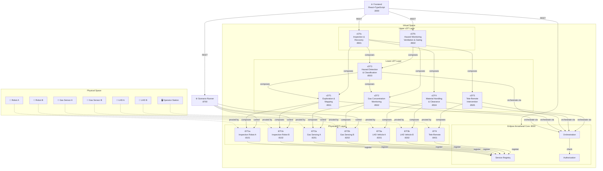
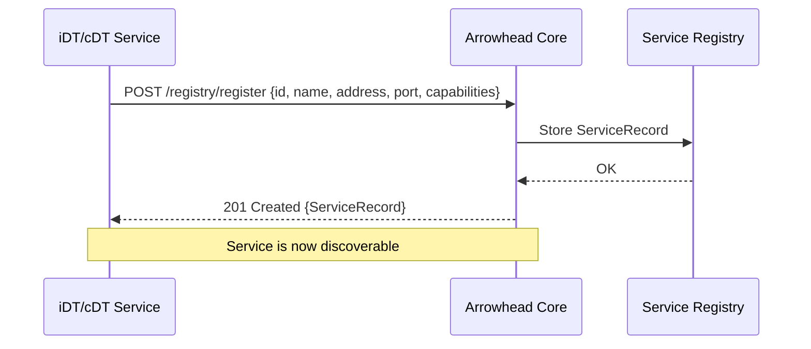
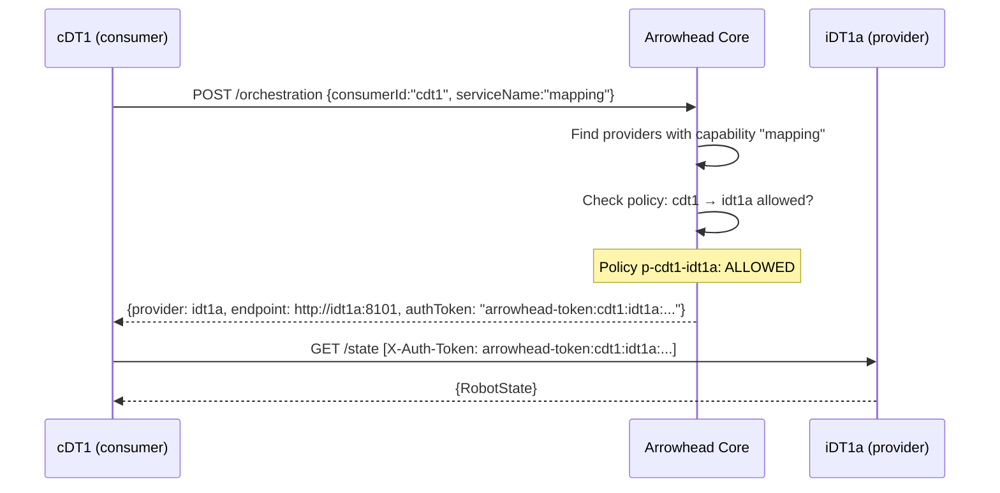
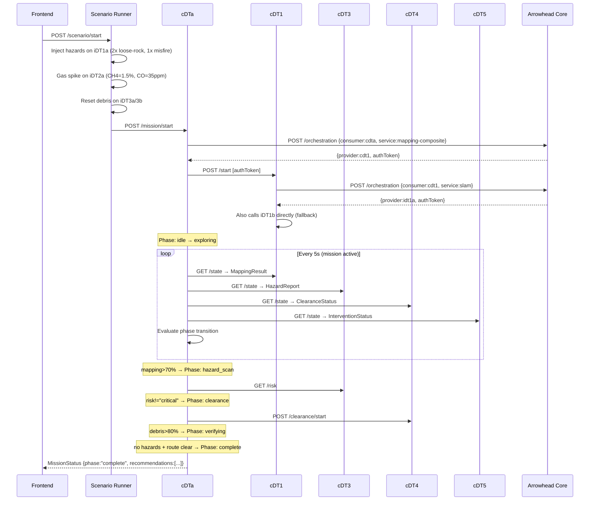
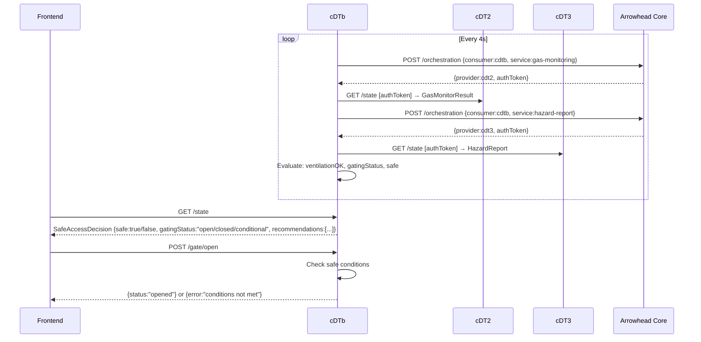
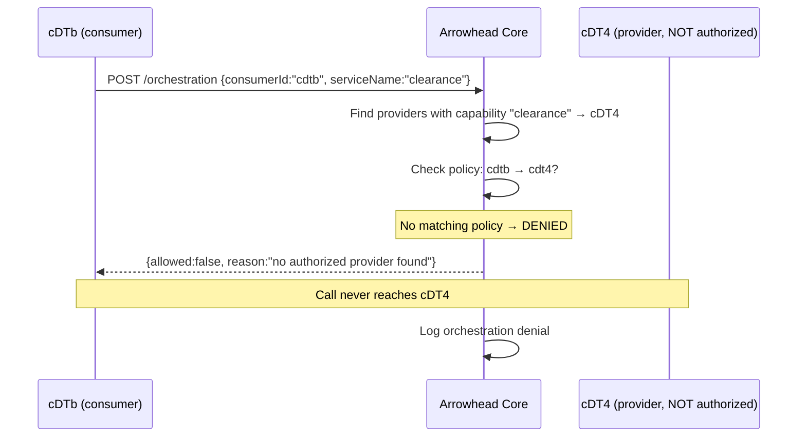

# Composable Digital Twins as Proxies for Part-Autonomous Industrial Mobile Machines

A fully runnable local proof-of-concept implementation of the paper:

> *"Composable Digital Twins as Proxies for Part-Autonomous Industrial Mobile Machines"*

The system emulates a heterogeneous fleet of underground mining machines using a three-layer composable Digital Twin architecture, orchestrated through an Eclipse Arrowhead-style service framework.

---

## Table of Contents

- [Architecture Overview](#architecture-overview)
- [Service Composition Graph](#service-composition-graph)
- [Sequence Diagrams](#sequence-diagrams)
- [Port Reference](#port-reference)
- [Quick Start (Local)](#quick-start-local)
- [Quick Start (Docker Compose)](#quick-start-docker-compose)
- [Demo Scenario](#demo-scenario)
- [API Reference](#api-reference)
- [Simplifications and Design Choices](#simplifications-and-design-choices)

---

## Architecture Overview

The system follows the three-layer architecture described in the paper:

```
┌─────────────────────────────────────────────────────────────────┐
│                        VIRTUAL SPACE                            │
│                                                                 │
│  ┌─────────────────────────────────────────────────────────┐   │
│  │                    UPPER cDT LAYER                      │   │
│  │   cDTa: Inspection & Recovery  │  cDTb: Hazard Monitor  │   │
│  └────────────────────┬────────────────────────┬───────────┘   │
│                       │ composes                │               │
│  ┌────────────────────▼────────────────────────▼───────────┐   │
│  │                    LOWER cDT LAYER                      │   │
│  │  cDT1: Mapping │ cDT2: Gas │ cDT3: Hazard │ cDT4: LHD  │   │
│  │                        cDT5: Tele-Remote               │   │
│  └────────────────────┬────────────────────────┬───────────┘   │
│                       │ orchestrates via        │               │
│  ┌────────────────────▼────────────────────────▼───────────┐   │
│  │              ARROWHEAD CORE FRAMEWORK                   │   │
│  │  Service Registry │ Orchestration │ Authorization       │   │
│  └────────────────────┬────────────────────────┬───────────┘   │
│                       │ proxy for               │               │
│  ┌────────────────────▼────────────────────────▼───────────┐   │
│  │                  PHYSICAL/iDT LAYER                     │   │
│  │  iDT1a/b: Robots │ iDT2a/b: Gas │ iDT3a/b: LHD │ iDT4  │   │
│  └─────────────────────────────────────────────────────────┘   │
└─────────────────────────────────────────────────────────────────┘
         ▲  represents  ▼
┌─────────────────────────────────────────────────────────────────┐
│                       PHYSICAL SPACE                            │
│   Inspection Robots │ Gas Sensors │ LHD Vehicles │ Operator     │
└─────────────────────────────────────────────────────────────────┘
```

### Mermaid Architecture Diagram



---

## Service Composition Graph

The paper defines which services each cDT is authorized to consume:

| Consumer | Authorized Providers | Purpose |
|----------|---------------------|---------|
| **cDT1** | iDT1a, iDT1b | Aggregate robot maps & SLAM progress |
| **cDT2** | iDT2a, iDT2b | Aggregate gas measurements & alerts |
| **cDT3** | cDT1, cDT2, iDT1a, iDT1b | Fuse mapping + gas + robot hazard signals |
| **cDT4** | iDT3a, iDT3b | Coordinate LHD debris clearance |
| **cDT5** | iDT4, iDT1a, iDT1b, iDT3a, iDT3b | Mediate tele-remote intervention |
| **cDTa** | cDT1, cDT3, cDT4, cDT5 | Orchestrate inspection & recovery mission |
| **cDTb** | cDT2, cDT3 | Safe-access / ventilation / gating support |

All cross-service calls are mediated by the Arrowhead Core — services discover endpoints and receive authorization tokens before making calls.

---

## Sequence Diagrams

### 1. Service Registration (startup)



### 2. Arrowhead Orchestration + Authorization (inter-service call)



### 3. Post-Blast Mission Activation (cDTa orchestrating lower cDTs)



### 4. Safe-Access Decision (cDTb)



### 5. Unauthorized Service Call (blocked by Arrowhead)



---

## Port Reference

| Service | ID | Port | Type | Description |
|---------|-----|------|------|-------------|
| Arrowhead Core | arrowhead | **8000** | Core | Service registry, orchestration, authorization |
| Inspection Robot A | idt1a | **8101** | iDT | SLAM, mapping, hazard detection |
| Inspection Robot B | idt1b | **8102** | iDT | SLAM, mapping, hazard detection |
| Gas Sensing Unit A | idt2a | **8201** | iDT | CH4, CO, CO2, O2, NO2 monitoring |
| Gas Sensing Unit B | idt2b | **8202** | iDT | CH4, CO, CO2, O2, NO2 monitoring |
| LHD Vehicle A | idt3a | **8301** | iDT | Debris clearance, tramming |
| LHD Vehicle B | idt3b | **8302** | iDT | Debris clearance, tramming |
| Tele-Remote Station | idt4 | **8401** | iDT | Operator override, tele-operation |
| Autonomous Exploration & Mapping | cdt1 | **8501** | lower cDT | Composes iDT1a + iDT1b |
| Gas Concentration Monitoring | cdt2 | **8502** | lower cDT | Composes iDT2a + iDT2b |
| Hazard Detection & Classification | cdt3 | **8503** | lower cDT | Composes cDT1 + cDT2 + robots |
| Selective Material Handling | cdt4 | **8504** | lower cDT | Composes iDT3a + iDT3b |
| Tele-Remote Intervention | cdt5 | **8505** | lower cDT | Composes iDT4 + machines |
| Inspection & Recovery | cdta | **8601** | upper cDT | Composes cDT1 + cDT3 + cDT4 + cDT5 |
| Hazard Monitoring & Gating | cdtb | **8602** | upper cDT | Composes cDT2 + cDT3 |
| Scenario Runner | scenario | **8700** | Tool | Post-blast demo orchestration |
| Frontend | — | **3000** | UI | React + TypeScript dashboard |

---

## Quick Start (Local)

### Prerequisites

- **Go 1.21+** — `go version`
- **Node.js 18+** — `node --version`
- **npm 9+** — `npm --version`

### Option A: One-script launch

```bash
git clone git@github.com:ulfbod/DT-as-proxies-for-mining-PoC.git
cd DT-as-proxies-for-mining-PoC
chmod +x scripts/start-local.sh
./scripts/start-local.sh
```

The script starts all 16 backend services and the frontend, then waits. Press **Ctrl+C** to stop everything.

### Option B: Manual launch (step by step)

```bash
cd backend

# 1. Start Arrowhead Core
PORT=8000 go run ./cmd/arrowhead &

# 2. Start iDT layer (wait ~2s for Arrowhead to be ready)
sleep 2
IDT_ID=idt1a IDT_NAME="Inspection Robot A" PORT=8101 go run ./cmd/idt-robot &
IDT_ID=idt1b IDT_NAME="Inspection Robot B" PORT=8102 go run ./cmd/idt-robot &
IDT_ID=idt2a IDT_NAME="Gas Sensing Unit A"  PORT=8201 go run ./cmd/idt-gas &
IDT_ID=idt2b IDT_NAME="Gas Sensing Unit B"  PORT=8202 go run ./cmd/idt-gas &
IDT_ID=idt3a IDT_NAME="LHD Vehicle A"       PORT=8301 go run ./cmd/idt-lhd &
IDT_ID=idt3b IDT_NAME="LHD Vehicle B"       PORT=8302 go run ./cmd/idt-lhd &
IDT_ID=idt4  IDT_NAME="Tele-Remote Station" PORT=8401 go run ./cmd/idt-teleremote &

# 3. Start lower cDT layer (wait ~3s for iDTs to register)
sleep 3
PORT=8501 IDT1B_URL=http://localhost:8102 go run ./cmd/cdt1 &
PORT=8502 IDT2B_URL=http://localhost:8202 go run ./cmd/cdt2 &
PORT=8503 CDT1_URL=http://localhost:8501 CDT2_URL=http://localhost:8502 \
          IDT1A_URL=http://localhost:8101 IDT1B_URL=http://localhost:8102 \
          go run ./cmd/cdt3 &
PORT=8504 IDT3B_URL=http://localhost:8302 go run ./cmd/cdt4 &
PORT=8505 IDT4_URL=http://localhost:8401 go run ./cmd/cdt5 &

# 4. Start upper cDT layer
sleep 3
PORT=8601 CDT1_URL=http://localhost:8501 CDT3_URL=http://localhost:8503 \
          CDT4_URL=http://localhost:8504 CDT5_URL=http://localhost:8505 \
          go run ./cmd/cdta &
PORT=8602 CDT2_URL=http://localhost:8502 CDT3_URL=http://localhost:8503 \
          go run ./cmd/cdtb &

# 5. Start scenario runner
PORT=8700 go run ./cmd/scenario &

# 6. Start frontend
cd ../frontend
npm install
npm run dev
```

Open **http://localhost:3000** in your browser.

---

## Quick Start (Docker Compose)

### Prerequisites

- Docker 24+ with Compose v2
- `docker compose version`

```bash
git clone git@github.com:ulfbod/DT-as-proxies-for-mining-PoC.git
cd DT-as-proxies-for-mining-PoC
docker compose up --build
```

All services build from source. First build takes ~3–5 minutes. Subsequent starts are fast.

To stop:
```bash
docker compose down
```

---

## Demo Scenario

### Post-Blast Inspection and Recovery

This scenario simulates what happens after a controlled blast in an underground mine:

1. **Trigger the scenario** via the frontend (top bar "Start Scenario") or directly:
   ```bash
   curl -X POST http://localhost:8700/scenario/start
   ```

2. **What happens automatically:**
   - Hazards injected on Robot A: 2× loose-rock (medium), 1× misfire (high)
   - Gas spike on Sensor A: CH4=1.5%, CO=35 ppm (above safe threshold)
   - Both LHDs reset to 0% debris cleared
   - cDTa mission starts → phase: `exploring`
   - Robots begin SLAM mapping
   - cDTb closes the gate (hazardous conditions)

3. **Watch the phase progression** in the cDTa view:
   - `exploring` → `hazard_scan` (when mapping >70%)
   - `hazard_scan` → `clearance` (when risk is not critical)
   - `clearance` → `verifying` (when debris >80%)
   - `verifying` → `complete` (when route clear and hazards resolved)

4. **Safe-access** in the cDTb view shows UNSAFE initially. As hazards clear and gas normalizes, the gate transitions from `closed` → `conditional` → `open`.

### Manual Controls

| Action | Frontend | Direct API |
|--------|----------|-----------|
| Force gas spike | "Gas Spike" button | `POST http://localhost:8700/scenario/gas-spike` |
| Inject hazard | "Inject Hazard" button | `POST http://localhost:8700/scenario/inject-hazard {"robotId":"idt1a","type":"misfire","severity":"critical"}` |
| Clear all hazards | "Clear All" button | `POST http://localhost:8700/scenario/clear-all` |
| Toggle robot offline | System View toggle | `PUT http://localhost:8101/online {"online":false}` |
| Toggle connectivity | System View toggle | `PUT http://localhost:8101/connectivity {"connected":false}` |
| Force mission phase | cDTa view dropdown | `POST http://localhost:8601/force/phase {"phase":"clearance"}` |
| Open/close gate | cDTb view buttons | `POST http://localhost:8602/gate/open` |
| Add auth policy | System View table | `POST http://localhost:8000/authorization/policy {"consumerId":"cdtb","providerId":"cdt4","serviceName":"*","allowed":true}` |

---

## API Reference

### Arrowhead Core (`:8000`)

| Method | Path | Description |
|--------|------|-------------|
| `GET` | `/health` | Health check |
| `POST` | `/registry/register` | Register a service |
| `GET` | `/registry` | List all registered services |
| `GET` | `/registry/query?capability=mapping` | Query by capability |
| `POST` | `/orchestration` | Get authorized endpoint for a service |
| `GET` | `/orchestration/logs` | Get orchestration decision log |
| `POST` | `/authorization/check` | Check if a call is authorized |
| `POST` | `/authorization/policy` | Add/update authorization policy |
| `GET` | `/authorization/policies` | List all policies |
| `DELETE` | `/authorization/policy?id=p-cdt1-idt1a` | Delete a policy |

**Example — discover a service:**
```bash
curl -X POST http://localhost:8000/orchestration \
  -H "Content-Type: application/json" \
  -d '{"consumerId":"cdt1","serviceName":"mapping"}'
```

**Example — add a policy:**
```bash
curl -X POST http://localhost:8000/authorization/policy \
  -H "Content-Type: application/json" \
  -d '{"consumerId":"cdtb","providerId":"cdt4","serviceName":"*","allowed":true}'
```

### iDT Robots (`:8101`, `:8102`)

| Method | Path | Description |
|--------|------|-------------|
| `GET` | `/state` | Full robot state |
| `GET` | `/map` | Mapping progress & waypoints |
| `GET` | `/hazards` | Detected hazards |
| `POST` | `/slam/start` | Activate SLAM |
| `POST` | `/slam/stop` | Deactivate SLAM |
| `POST` | `/navigate` | `{"x":50,"y":30}` |
| `PUT` | `/online` | `{"online":false}` |
| `PUT` | `/connectivity` | `{"connected":false}` |
| `POST` | `/hazard/inject` | `{"type":"misfire","severity":"critical"}` |
| `POST` | `/hazard/clear` | `{"id":"haz-123"}` |

### iDT Gas Sensors (`:8201`, `:8202`)

| Method | Path | Description |
|--------|------|-------------|
| `GET` | `/state` | Full sensor state with gas levels |
| `GET` | `/measurements` | Current gas readings |
| `GET` | `/alerts` | Active gas alerts |
| `POST` | `/simulate/spike` | Trigger dangerous gas spike |
| `POST` | `/simulate/gas` | `{"ch4":1.5,"co":35,"co2":0.5,"o2":20.5,"no2":1.0}` |

### iDT LHD Vehicles (`:8301`, `:8302`)

| Method | Path | Description |
|--------|------|-------------|
| `GET` | `/state` | Full LHD state |
| `GET` | `/clearance/status` | Debris cleared%, ETA, route clear |
| `POST` | `/clearance/start` | Begin debris clearance |
| `POST` | `/clearance/stop` | Stop clearance |
| `PUT` | `/availability` | `{"available":false}` |
| `POST` | `/simulate/reset` | Reset debris to 0% |

### cDTa Mission Controller (`:8601`)

| Method | Path | Description |
|--------|------|-------------|
| `GET` | `/state` | Full mission status + phase |
| `POST` | `/mission/start` | Start post-blast mission |
| `POST` | `/mission/abort` | Abort to failed |
| `POST` | `/mission/reset` | Reset to idle |
| `POST` | `/force/phase` | `{"phase":"clearance"}` (demo) |
| `GET` | `/recommendations` | Current recommendations |
| `GET` | `/components` | Status of cDT1/3/4/5 |

### cDTb Safe-Access Controller (`:8602`)

| Method | Path | Description |
|--------|------|-------------|
| `GET` | `/state` | Full safe-access decision |
| `GET` | `/gating` | Gate status and conditions |
| `POST` | `/gate/open` | Open gate (if safe) |
| `POST` | `/gate/close` | Close gate |
| `POST` | `/ventilation/check` | Trigger ventilation assessment |
| `GET` | `/recommendations` | Current recommendations |

---

## Simplifications and Design Choices

| Topic | Paper | This PoC |
|-------|-------|---------|
| Physical machines | Real robots/sensors | Simulated Go goroutines with realistic noise |
| Arrowhead framework | Full Eclipse Arrowhead | Lightweight in-memory implementation of the same contracts |
| Authentication | PKI certificates | Token strings encoding policy IDs (sufficient to demonstrate the concept) |
| Edge deployment | Services near machines | All services run on localhost / same Docker network |
| SLAM | Real LiDAR/SLAM | Progress counter with position noise |
| Gas sensing | Real gas sensors | Gaussian noise around configurable baseline |
| Persistence | Varies | In-memory state (resets on restart) |
| Service mesh | Full SOA | Direct HTTP REST between services |

The implementation is intentionally simplified to be runnable on a development laptop while preserving all architectural concepts from the paper: the proxy pattern, composability, Arrowhead-style service discovery/authorization, the three-layer hierarchy, and the post-blast scenario decision support.

---

## Repository Structure

```
.
├── backend/
│   ├── go.mod                    # Go module: mineio
│   ├── Dockerfile                # Multi-stage build (ARG SERVICE_DIR)
│   ├── internal/common/
│   │   ├── types.go              # Shared data types
│   │   └── client.go             # Arrowhead HTTP client helpers
│   └── cmd/
│       ├── arrowhead/            # Eclipse Arrowhead Core (:8000)
│       ├── idt-robot/            # iDT1a, iDT1b (:8101, :8102)
│       ├── idt-gas/              # iDT2a, iDT2b (:8201, :8202)
│       ├── idt-lhd/              # iDT3a, iDT3b (:8301, :8302)
│       ├── idt-teleremote/       # iDT4 (:8401)
│       ├── cdt1/                 # Exploration & Mapping (:8501)
│       ├── cdt2/                 # Gas Monitoring (:8502)
│       ├── cdt3/                 # Hazard Detection (:8503)
│       ├── cdt4/                 # Material Handling (:8504)
│       ├── cdt5/                 # Tele-Remote Intervention (:8505)
│       ├── cdta/                 # Inspection & Recovery (:8601)
│       ├── cdtb/                 # Hazard Monitoring & Gating (:8602)
│       └── scenario/             # Demo scenario runner (:8700)
├── frontend/
│   ├── src/
│   │   ├── App.tsx               # Main app with tab navigation
│   │   ├── api/index.ts          # REST API client
│   │   ├── types/index.ts        # TypeScript types
│   │   ├── hooks/usePolling.ts   # Generic polling hook
│   │   └── components/
│   │       ├── SystemView/       # System overview dashboard
│   │       ├── CDTaView/         # Inspection & recovery mission UI
│   │       └── CDTbView/         # Hazard monitoring & gating UI
│   └── Dockerfile
├── scripts/
│   └── start-local.sh            # One-command local startup
├── docker-compose.yml            # Full stack deployment
└── README.md
```

---

## License

MIT — see [LICENSE](LICENSE) for details.
