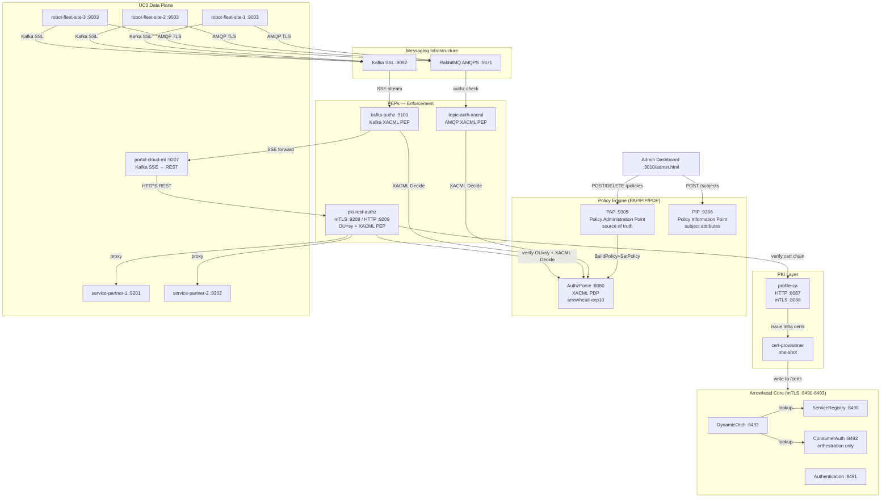
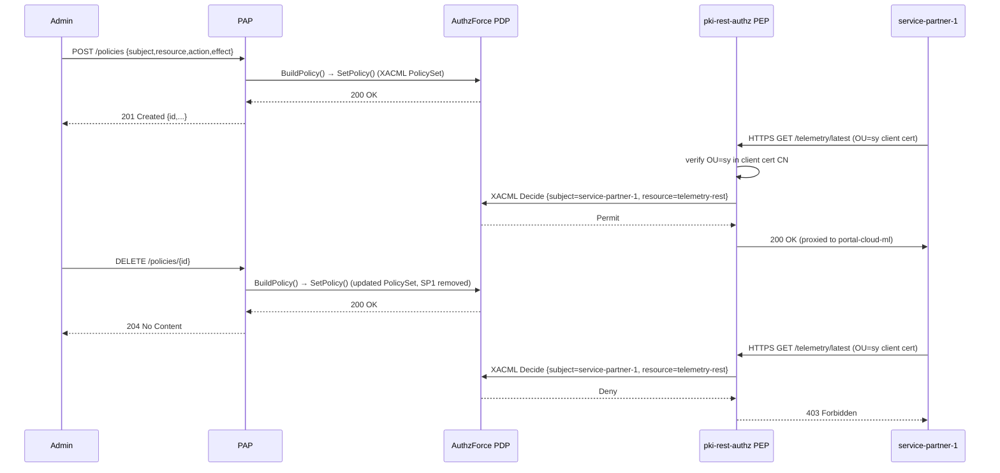
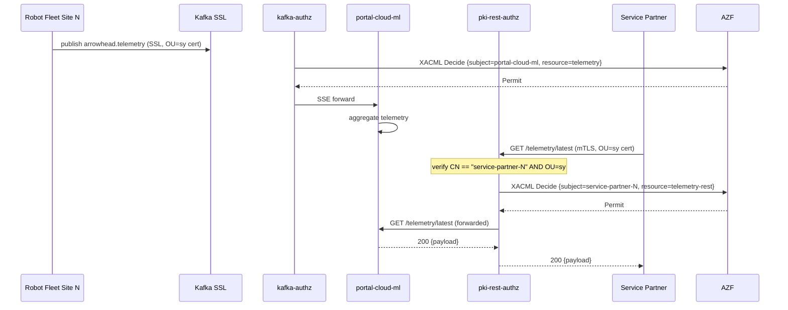
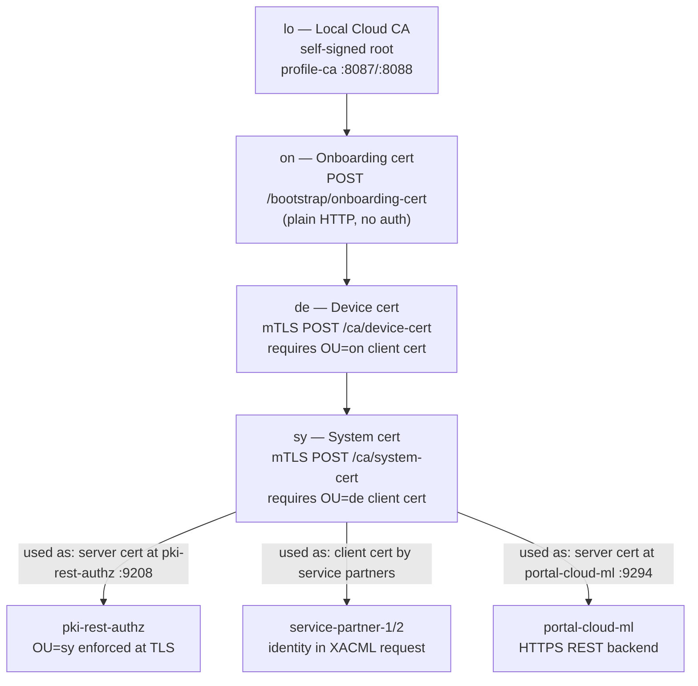

# DIAGRAMS.md — Experiment 10

Mermaid architectural diagrams for experiment-10.

Experiment-10 extends experiment-9 with a **clean PAP/PIP/PDP access-control architecture**:
the `policy-sync` + ConsumerAuth source-of-truth pattern is replaced by a dedicated
**PAP** (Policy Administration Point) that pushes XACML policies to AuthzForce immediately
on every Create/Delete, and a **PIP** (Policy Information Point) for subject attribute resolution.

---

## 1. Full System Component Diagram

---

## 2. PAP/PIP/PDP Interaction Flow

---

## 3. UC3 Data Flow

---

## 4. PKI Certificate Hierarchy

