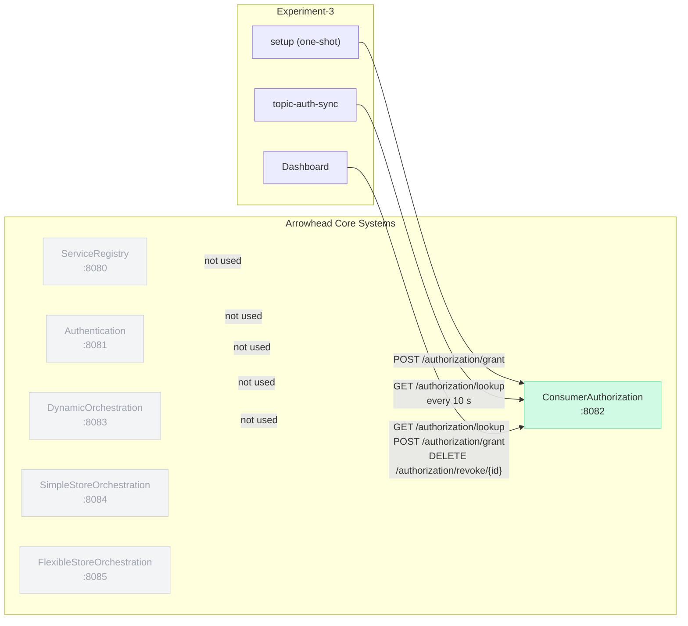
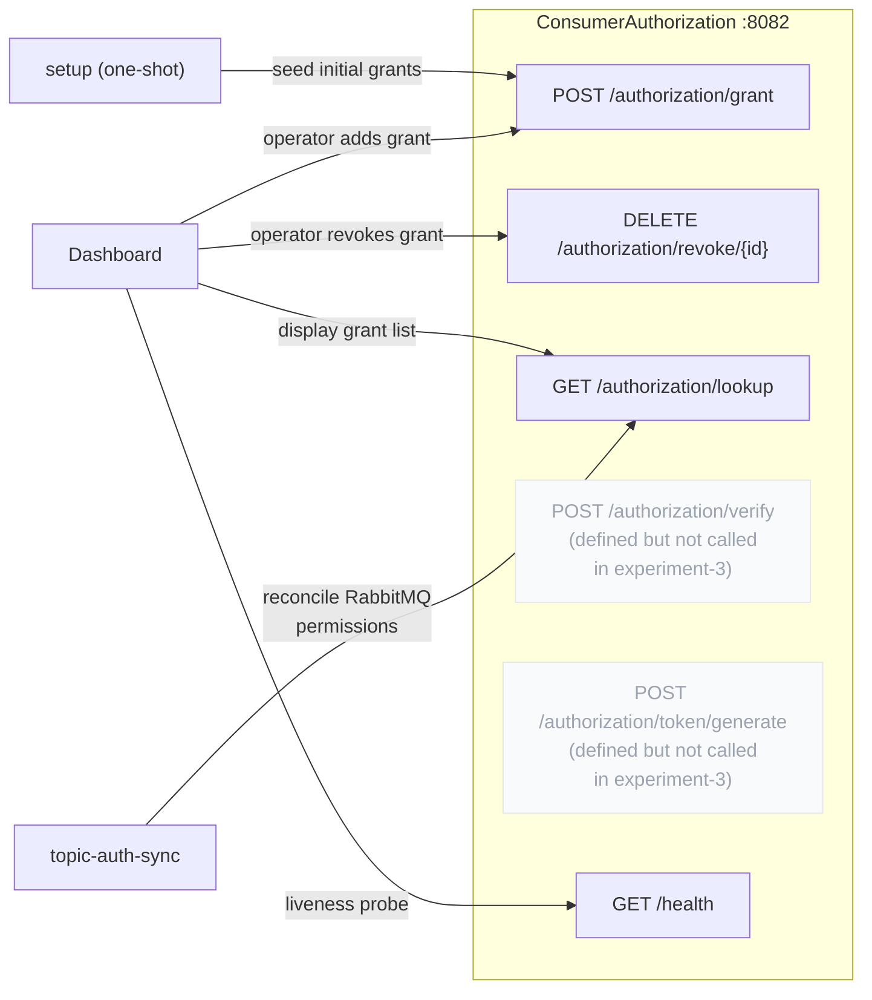
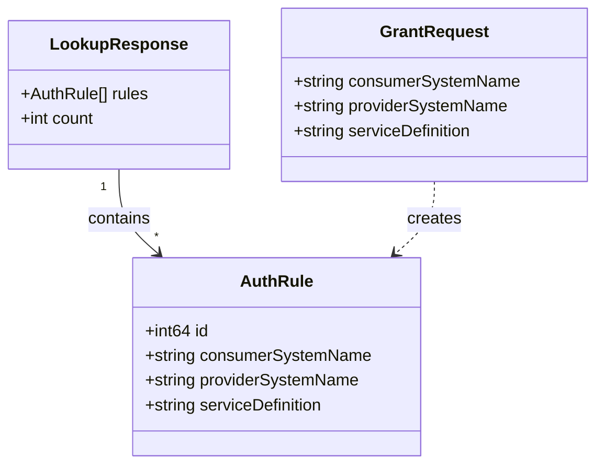
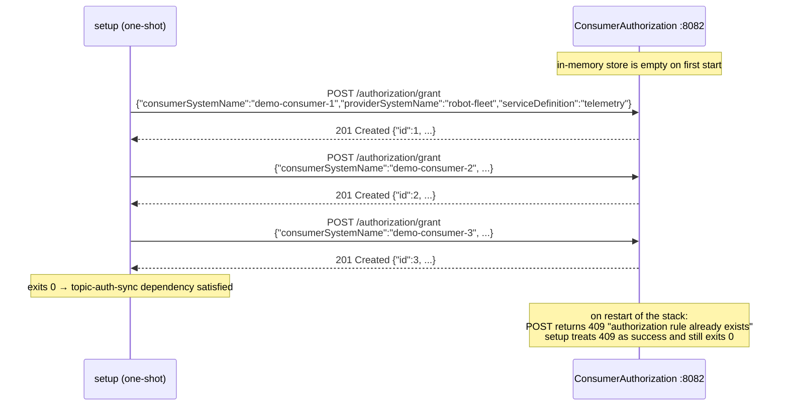
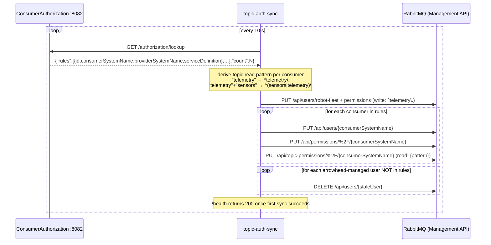
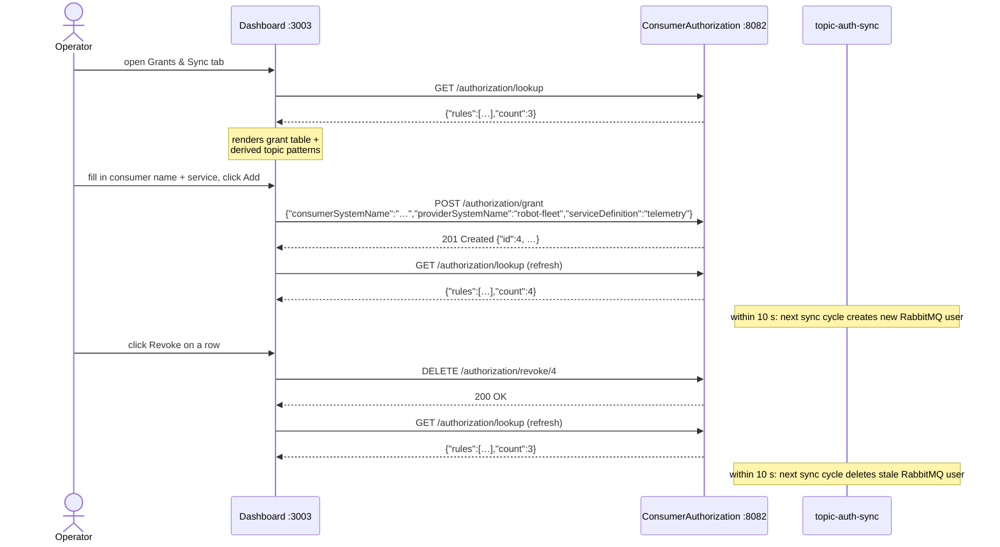
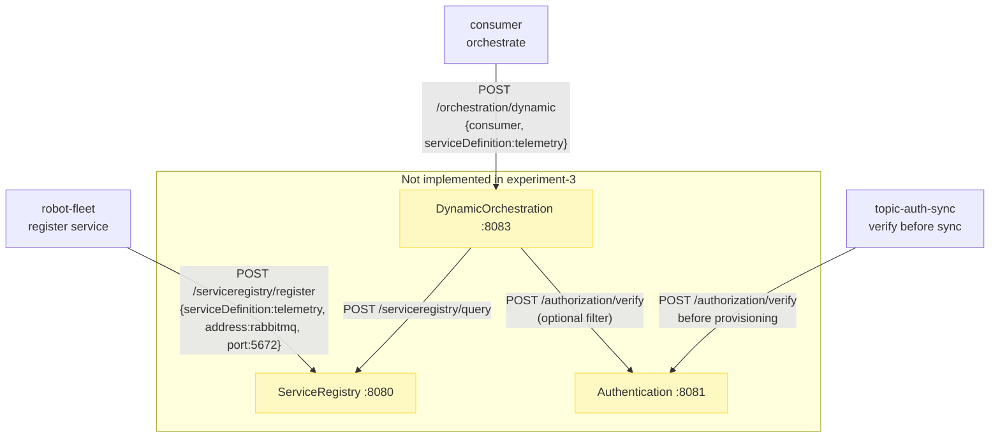

# Experiment 3 — Arrowhead Core System Interactions

This file documents how experiment-3 relates to and interacts with the
Arrowhead 5 core systems.

---

## AHC System Landscape

Experiment-3 uses **one** of the six core systems. The others are
intentionally absent — this experiment isolates the ConsumerAuthorization
policy mechanism without involving service discovery, identity, or
orchestration.

| Core system | Used | Reason |
|---|---|---|
| **ConsumerAuthorization** | ✔ | Authoritative source of consumer-to-service grants; polled by `topic-auth-sync` |
| ServiceRegistry | — | Services locate each other via Docker DNS and environment variables, not AHC discovery |
| Authentication | — | No inter-system identity tokens required in this experiment |
| DynamicOrchestration | — | Service binding is static (AMQP routing key); no runtime endpoint negotiation needed |
| SimpleStoreOrchestration | — | (see above) |
| FlexibleStoreOrchestration | — | (see above) |

---

## ConsumerAuthorization: API Surface Used

---

## Data Model: AuthRule

The only data structure exchanged between experiment-3 services and
ConsumerAuthorization.

---

## Sequence: Seeding Initial Grants (startup)

The `setup` one-shot container calls ConsumerAuthorization once at startup to
create the three default grants. It accepts HTTP 409 (already exists) as a
success condition so the stack can be restarted without re-seeding.

---

## Sequence: topic-auth-sync Reconciliation Loop

Every 10 seconds `topic-auth-sync` queries ConsumerAuthorization and
translates the grant list into RabbitMQ users and topic permissions. This is
the central bridge between the AHC policy layer and the AMQP broker.

---

## Sequence: Grant Lifecycle via Dashboard

The operator interacts with ConsumerAuthorization through the experiment-3
dashboard. Changes are picked up by `topic-auth-sync` within one sync cycle
(≤ 10 s).

---

## What a Full AHC Integration Would Add

The following interactions are **not implemented** in experiment-3 but would be
present in a fully AHC-integrated deployment:

| Missing interaction | What it would provide |
|---|---|
| robot-fleet → ServiceRegistry | Consumers could discover the AMQP endpoint dynamically instead of using a hardcoded env var |
| consumer → DynamicOrchestration | Runtime binding: orchestrator looks up the AMQP endpoint and verifies the consumer is authorized |
| topic-auth-sync → Authentication | Tokens on calls to ConsumerAuthorization, preventing unauthorized policy reads |
