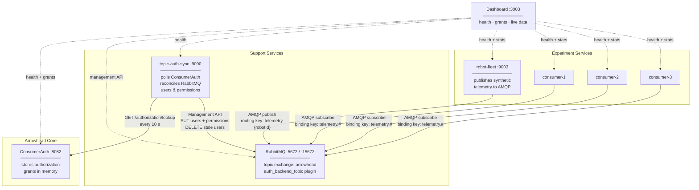
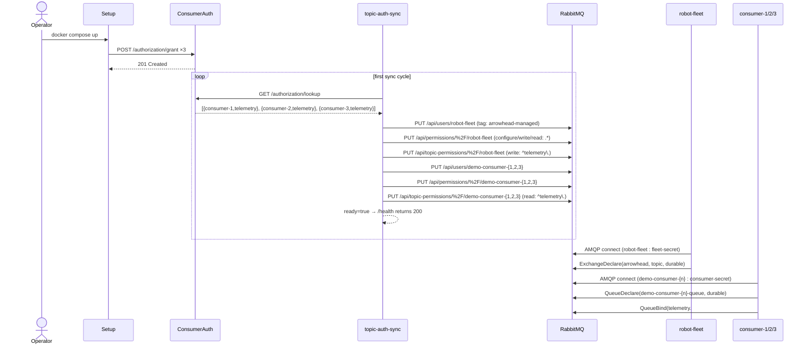
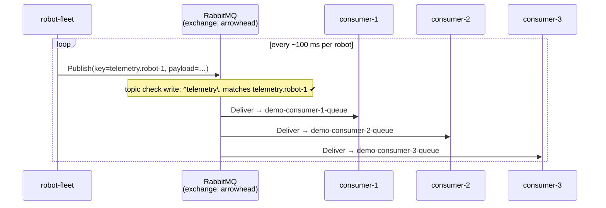
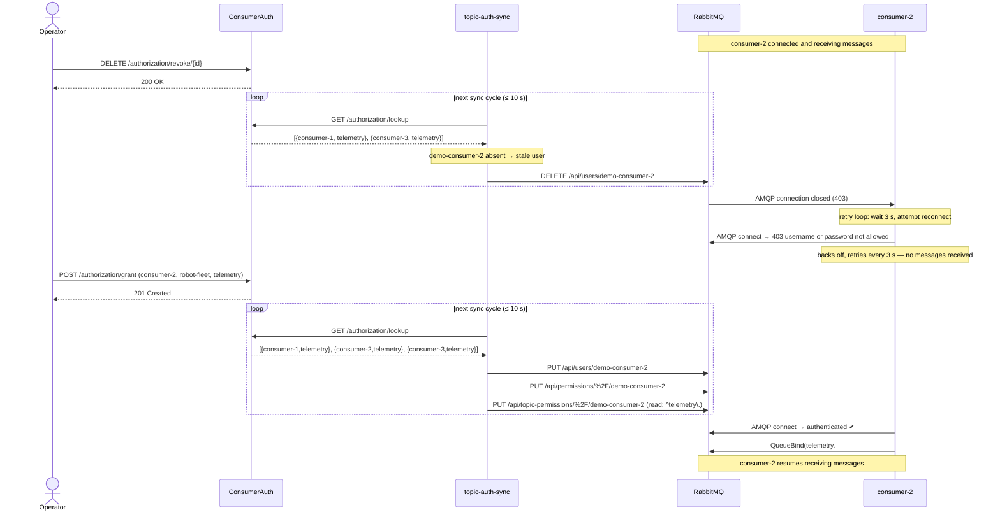

# Experiment 3 — Diagrams

## Component Diagram

Shows the services, their roles, and how they connect.

---

## Sequence Diagram 1 — Startup: provisioning users on first sync

`setup` seeds grants into ConsumerAuth. `topic-auth-sync` runs its first
reconciliation, creates all users and permissions in RabbitMQ, then marks
itself healthy. Only then do robot-fleet and consumers start.

---

## Sequence Diagram 2 — Normal message flow

Once connected, robot-fleet publishes telemetry and RabbitMQ fans it out to
every consumer whose queue is bound to a matching routing key.

---

## Sequence Diagram 3 — Revoke and re-grant: dynamic authorization

The core scenario this experiment demonstrates. Revoking a grant causes
`topic-auth-sync` to delete the RabbitMQ user, which forcibly closes the
consumer's AMQP connection. The consumer's retry loop resumes delivery as
soon as the grant is restored and the next sync cycle runs.

