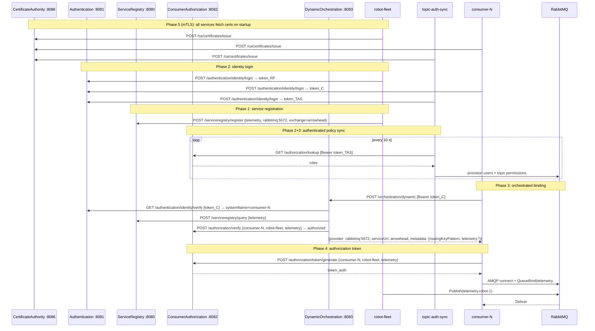
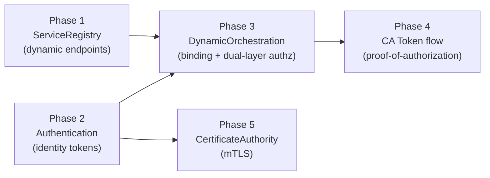

# Full AHC Integration Plan — Experiment 3

Status: **plan only** — nothing in this file is implemented.

This document describes what a complete Arrowhead 5 integration of
experiment-3 would look like, phase by phase, and what value each phase adds.
All reasoning is grounded in `core/SPEC.md`, `core/GAP_ANALYSIS.md`, the
handler/orchestrator source code, and `experiments/CLAUDE_EXPERIMENTS.md`.

---

## Current State (Baseline)

| Concern | How experiment-3 handles it today |
|---|---|
| Service location | Hardcoded env vars (`AMQP_URL`, `RABBITMQ_URL`, `CONSUMERAUTH_URL`) |
| Consumer identity | None — any process with the right password can connect |
| Authorization policy source | ConsumerAuthorization (already integrated) |
| Authorization enforcement | RabbitMQ topic permissions (broker layer only) |
| Inter-system auth | None — ConsumerAuth API is open to anyone on the network |

---

## Phase 1 — Service Registry

### What changes

**robot-fleet** registers its AMQP service at startup and unregisters on shutdown:

```
POST /serviceregistry/register
{
  "serviceDefinition": "telemetry",
  "providerSystem": {
    "systemName": "robot-fleet",
    "address":    "rabbitmq",
    "port":       5672
  },
  "serviceUri":  "arrowhead",
  "interfaces":  ["AMQP-INSECURE-JSON"],
  "version":     1,
  "metadata": {
    "exchangeType":       "topic",
    "routingKeyPattern":  "telemetry.*"
  }
}
```

**topic-auth-sync** discovers the publisher's AMQP coordinates from ServiceRegistry
instead of reading `RABBITMQ_URL` / `PUBLISHER_USER` directly from env:

```
GET /serviceregistry/lookup?serviceDefinition=telemetry
→ {serviceQueryData: [{providerSystem: {address, port}, serviceUri, metadata}]}
```

**consumers** (consumer-direct) replace the hardcoded `AMQP_URL` env var with a
ServiceRegistry lookup on startup:

```
GET /serviceregistry/lookup?serviceDefinition=telemetry
→ build amqp://{user}:{pass}@{address}:{port}/{vhost}
   exchange  = serviceUri
   bindingKey derived from metadata.routingKeyPattern
```

**docker-compose.yml** additions:
- Add `serviceregistry` service (existing core binary, port 8080)
- Change consumer env: remove `AMQP_URL`, add `SERVICE_REGISTRY_URL`
- Change topic-auth-sync env: add `SERVICE_REGISTRY_URL`

### Value

| Before | After |
|---|---|
| Broker address, port, and exchange name are baked into every container's env | Consumers query SR at startup and adapt to whatever the registry says |
| Adding a second robot-fleet requires editing docker-compose and redeploying consumers | Register a second fleet instance; SR returns both providers; consumers pick one or all |
| Changing the exchange name requires coordinated env changes across all services | Change the registration; consumers read `serviceUri` from the SR response |

---

## Phase 2 — Authentication (Identity Tokens)

### What changes

**Every experiment service** calls `POST /authentication/identity/login` at startup
with its system name and credentials, then carries the resulting Bearer token
in all calls to other core systems:

```
POST /authentication/identity/login
{"systemName": "topic-auth-sync", "credentials": "sync-secret"}
→ {"token": "…", "systemName": "topic-auth-sync"}
```

**topic-auth-sync** attaches the token to ConsumerAuth calls:

```
GET /authorization/lookup
Authorization: Bearer <token>
```

ConsumerAuth does not currently validate Bearer tokens (see GAP_ANALYSIS G2/G3),
so this is wired up without enforcement initially. It future-proofs the calls
and enables enforcement once CA is hardened.

**DynamicOrchestration** in `ENABLE_IDENTITY_CHECK=true` mode verifies the
consumer's token (via Authentication) before answering orchestration requests.
Consumers pass their token:

```
POST /orchestration/dynamic
Authorization: Bearer <consumer-token>
{"requesterSystem": {…}, "requestedService": {…}}
```

The orchestrator calls `GET /authentication/identity/verify` and substitutes the
verified `systemName` for the self-reported one — preventing a compromised
consumer from impersonating another.

**docker-compose.yml** additions:
- Add `authentication` service (existing core binary, port 8081)
- Add credentials env vars to each service (`SYSTEM_NAME`, `SYSTEM_CREDENTIALS`)
- Set `ENABLE_IDENTITY_CHECK=true` on DynamicOrchestration

### Value

| Before | After |
|---|---|
| Any process that can reach ConsumerAuth can read all grants | Only authenticated systems can call ConsumerAuth endpoints |
| A compromised consumer-2 could claim to be consumer-1 when calling orchestration | DynamicOrchestration verifies the token and uses the cryptographically confirmed identity |
| No audit trail of which system called which endpoint | Authentication log provides a record of issued tokens by systemName |
| topic-auth-sync trusts that the ConsumerAuth response is authoritative with no way to verify the source | Token on the request proves to CA that the caller is the legitimate sync service |

**Limitation acknowledged (GAP_ANALYSIS G3):** tokens are hex-timestamp strings,
not cryptographically signed JWTs. The current implementation is logically
correct but not cryptographically secure — a sufficiently motivated attacker
could forge a token. This is a known gap, not a design flaw in the plan.

---

## Phase 3 — DynamicOrchestration as the Consumer Binding Point

### What changes

**Consumers** stop connecting to AMQP directly on startup. Instead:

1. Login to Authentication → get Bearer token
2. Call DynamicOrchestration:

```
POST /orchestration/dynamic
Authorization: Bearer <consumer-token>
{
  "requesterSystem": {
    "systemName": "demo-consumer-1",
    "address": "consumer-1", "port": 9002
  },
  "requestedService": {
    "serviceDefinition": "telemetry",
    "interfaces": ["AMQP-INSECURE-JSON"]
  }
}
```

3. DynamicOrchestration (with `ENABLE_AUTH_CHECK=true`):
   - Verifies identity via Authentication (Phase 2)
   - Queries ServiceRegistry for `telemetry` providers (Phase 1)
   - For each provider, calls `POST /authorization/verify` on ConsumerAuthorization
   - Returns only authorized providers

4. Consumer reads the result:
   - `provider.address` / `provider.port` → AMQP host
   - `service.serviceUri` → exchange name
   - `service.metadata.routingKeyPattern` → binding key prefix
   - Builds and opens AMQP connection

**topic-auth-sync** no longer needs to know the consumer password or AMQP URL;
it only synchronizes RabbitMQ permissions as a broker-level enforcement layer.
The orchestration layer is now the primary authorization gate.

**docker-compose.yml** additions:
- Add `dynamicorch` service (existing core binary, port 8083, env: `SR_URL`, `CA_URL`, `AUTH_URL`, `ENABLE_AUTH_CHECK=true`, `ENABLE_IDENTITY_CHECK=true`)
- Change consumer env: remove `AMQP_URL`, add `ORCHESTRATION_URL`, `AUTH_URL`, `SYSTEM_NAME`, `SYSTEM_CREDENTIALS`

### Value

| Before | After |
|---|---|
| Authorization enforced only at broker layer (topic permissions) | Authorization enforced at two independent layers: orchestration gate + broker topic permission |
| Consumer must know broker address, port, vhost, exchange name, and own credentials | Consumer needs only its identity credentials and the orchestration URL |
| A consumer with a stolen AMQP password can connect even if its grant was revoked (until the next topic-auth-sync cycle) | Revoked grant → ConsumerAuth verify returns false → orchestration refuses to return the endpoint → consumer cannot connect regardless of credentials |
| Adding a new consumer requires updating docker-compose with the AMQP URL and password | Add a ConsumerAuth grant; DynamicOrchestration and topic-auth-sync pick it up within one cycle |

---

## Phase 4 — Authorization Token Flow (ConsumerAuth Token)

### What changes

After receiving the orchestration result, each consumer calls:

```
POST /authorization/token/generate
{
  "consumerSystemName":  "demo-consumer-1",
  "providerSystemName":  "robot-fleet",
  "serviceDefinition":   "telemetry"
}
→ {"token": "…", "consumerSystemName": "demo-consumer-1", "serviceDefinition": "telemetry"}
```

This token is a proof-of-authorization that the consumer can present to any
downstream component that needs to verify the consumer's right to the service
without calling ConsumerAuth itself.

In the context of experiment-3, the most natural use of this token is as a
message property on AMQP publishes (consumer-side) or as a header on an
optional HTTP endpoint that robot-fleet could expose for subscription requests.
However, since RabbitMQ does not natively interpret ConsumerAuth tokens, the
primary enforcement remains the topic permission set by topic-auth-sync.

**This phase is most useful as a stepping stone** toward a future experiment
where service providers (e.g. an AMQP gateway) can independently verify
consumer authorization without a live call to ConsumerAuth.

### Value

| Before | After |
|---|---|
| Provider (robot-fleet) has no way to verify a consumer's authorization without calling ConsumerAuth | Consumer presents a token that was issued by ConsumerAuth; provider can cache or verify it out-of-band |
| ConsumerAuth must be reachable at all times for authorization decisions | Token can be verified locally if the provider has a shared secret or CA public key (future work) |

**Limitation acknowledged (GAP_ANALYSIS I4):** The token relay mechanism between
orchestration results and service providers is undefined in AH5. This phase
defines a reasonable interpretation but it is not spec-mandated.

---

## Phase 5 — Certificate Authority (mTLS)

### What changes

Each system requests an X.509 ECDSA leaf certificate from CertificateAuthority
at startup:

```
POST /ca/certificates/issue
{"systemName": "robot-fleet", "publicKey": "<PEM>"}
→ {"certificate": "<PEM>", "issuerCertificate": "<PEM>"}
```

All inter-system HTTP calls switch from plain HTTP to HTTPS with mutual TLS.
Each system presents its certificate and verifies the peer's certificate against
the CA-issued chain.

**docker-compose.yml** additions:
- Add `ca` service (existing core binary, port 8086)
- Provide each service with startup logic to generate a key pair, call CA, and
  configure its HTTP client/server with the resulting certificate

### Value

| Before | After |
|---|---|
| Any process on the Docker network can call any core system API | Certificate presence proves the caller was issued a cert by this local cloud's CA |
| Identity tokens (Phase 2) can be forged (GAP G3) | mTLS provides a cryptographic channel-level identity independent of application tokens |
| Packet capture on the Docker network exposes all grants and orchestration results in plaintext | All inter-system traffic is encrypted |

**Limitation acknowledged (GAP_ANALYSIS G4, G9):** mTLS is not implemented in
the current core codebase (plain HTTP only), and the CA is not part of the AH5
spec. This phase requires the most invasive changes to the existing Go code and
is correctly treated as long-term / research scope.

---

## Interaction Map: Integrated Architecture



---

## Integration Order and Dependencies



Phases 1 and 2 are independent and can be done in parallel. Phase 3 requires
both. Phase 4 builds on Phase 3. Phase 5 is independent of 1–4 at the
architecture level but practically easiest to add after the other phases
stabilize the service topology.

---

## Summary: Value by Concern

| Concern | Experiment-3 today | After full integration |
|---|---|---|
| **Service location** | Hardcoded env vars | ServiceRegistry; consumers adapt without reconfiguration |
| **Consumer identity** | None | Cryptographic token from Authentication; identity verified by DynamicOrchestration |
| **Authorization gate** | Broker topic-permissions only (topic-auth-sync) | Two independent layers: orchestration (denies endpoint) + broker (denies bind) |
| **Policy read security** | ConsumerAuth API open to all | Requires Bearer token; only authenticated systems can read grants |
| **Consumer impersonation** | Possible (password theft = identity theft) | DynamicOrchestration replaces self-reported name with verified token identity |
| **Multi-provider support** | Single hardcoded fleet | Register N fleets; SR + DO return all authorized providers |
| **Transport security** | Plaintext HTTP | mTLS with CA-issued certificates (Phase 5) |
| **AH5 spec compliance** | Partial (ConsumerAuth only) | Full: SR + Auth + CA + DO + ConsumerAuth all in the loop |

---

## Open Questions and Known Gaps

From `core/GAP_ANALYSIS.md`, the following affect the integration plan:

| Gap | Impact on this plan |
|---|---|
| **G2** Credentials not verified | Phase 2 tokens are logically correct but not cryptographically secure; any system that calls `/login` with the right system name gets a valid token |
| **G3** Tokens not crypto-secure | Same as G2; Phase 5 (mTLS) partially mitigates by securing the channel |
| **G4** No mTLS | Phase 5 addresses this but requires core code changes outside experiment scope |
| **I4** Token relay undefined | Phase 4 is an interpretation; the AH5 spec does not define how providers verify consumer tokens |
| **A1** Credential format undefined | Phase 2 must choose a credential format; the current core accepts any non-empty string |

All experiment code would interact with core exclusively via HTTP per
`experiments/CLAUDE_EXPERIMENTS.md` — no imports of `core/internal/` packages.

---

## Testing Plan

The integration plan as written above contains **no tests**. This section
adds them.

### Guiding principles (inherited from `core/TEST_PLAN.md` and `core/TESTING.md`)

- **Deterministic** — no sleeps, no wall-clock dependencies, no random ports
- **In-process** — all HTTP boundaries faked with `httptest.NewServer`
- **External packages** — all test files use `package X_test` for black-box testing
- **Fail-closed** — every security boundary must have a test that verifies
  denial when the upstream is unreachable or returns invalid data
- **No mocking of business logic** — only external HTTP calls are faked;
  the service under test runs its real code
- **Table-driven** for validation cases; named sub-tests for scenario coverage

The one structural addition needed for experiment-3 is a **broker interface**
(`broker.Publisher` / `broker.Subscriber`), because the AMQP connection is an
external dependency just like the HTTP services. Without an interface,
AMQP-level scenarios (connection drop, reconnect) cannot be tested in-process.
See the Infrastructure section below.

---

### Test locations

```
support/topic-auth-sync/
    sync_test.go           ← extend with authenticated-lookup tests (Phase 2)

experiments/experiment-3/services/
    robot-fleet/
        registration_test.go   ← Phase 1: SR registration lifecycle
    consumer-direct/
        discovery_test.go      ← Phase 1+3: SR lookup + orchestration flow
        auth_test.go           ← Phase 2: login, token carriage, refresh

experiments/experiment-3/tests/
    integration_test.go    ← new: Phase 1–4 cross-service E2E (in-process)
    docker_e2e_test.go     ← new: full stack with real RabbitMQ (build tag: docker_e2e)

core/internal/integration/
    e2e_test.go            ← extend with 5 new scenarios covering Phases 1–3
```

---

### Phase 1 — ServiceRegistry tests

**`experiments/experiment-3/services/robot-fleet/registration_test.go`**

| Test | What it verifies |
|---|---|
| `TestRegistersAtStartup` | On startup, robot-fleet sends `POST /serviceregistry/register` with correct `serviceDefinition`, `providerSystem`, `serviceUri`, `interfaces`, and `metadata.routingKeyPattern` |
| `TestRegistrationBody` | Table-driven: each required field absent → register not attempted or error returned |
| `TestUnregistersOnShutdown` | Graceful shutdown triggers `DELETE /serviceregistry/unregister` with matching system name |
| `TestRegistrationRetriesOnTransientError` | SR returns 503 once, then 201 → verify retry; assert final registration succeeds |
| `TestRegistrationFailsClosedAfterExhaustion` | SR closed permanently → after N retries service exits with non-nil error (fail-closed) |

**`experiments/experiment-3/services/consumer-direct/discovery_test.go`** (Phase 1 part)

| Test | What it verifies |
|---|---|
| `TestSRLookupBuildsCorrectAMQPURL` | Mock SR returns `{address:"rabbitmq", port:5672, serviceUri:"arrowhead"}` → consumer builds `amqp://…@rabbitmq:5672/` with exchange `arrowhead` |
| `TestSRLookupExtractsBindingKeyFromMetadata` | `metadata.routingKeyPattern = "telemetry.*"` → consumer binds with `telemetry.#` |
| `TestSRLookupEmptyResultRetries` | SR returns empty service list → consumer does not connect; retries after backoff |
| `TestSRLookupRetriesOnHTTPError` | SR returns 503 → consumer retries; asserts no connection attempted until SR succeeds |

---

### Phase 2 — Authentication tests

**`experiments/experiment-3/services/consumer-direct/auth_test.go`**

| Test | What it verifies |
|---|---|
| `TestLoginAtStartup` | Fake Auth server captures `POST /authentication/identity/login`; asserts `systemName` and `credentials` fields present |
| `TestBearerTokenCarriedToOrchestration` | After login returns a token, the next `POST /orchestration/dynamic` includes `Authorization: Bearer <token>` header |
| `TestTokenRefreshOnExpiry` | Auth server issues a token valid for 0 s (past expiry trick from `TESTING.md`); on next orchestration call, consumer re-authenticates; asserts `/login` called twice |
| `TestAuthUnreachableAtStartupIsFailClosed` | Auth server closed → consumer does not proceed to orchestration or AMQP; returns startup error |
| `TestAuthUnreachableMidRunReauthentication` | Auth server closes after first successful login; on token expiry, re-auth fails; consumer suspends AMQP activity and retries login |

**`support/topic-auth-sync/sync_test.go`** (new test added to existing file)

| Test | What it verifies |
|---|---|
| `TestSync_lookupIncludesBearerToken` | Mock ConsumerAuth server captures headers; after login, `GET /authorization/lookup` contains `Authorization: Bearer <token>` |
| `TestSync_reAuthenticatesOnTokenExpiry` | Auth server marks token expired on second verify; sync service re-logs in and retries lookup; asserts `/login` called twice |
| `TestSync_authUnreachableIsFailClosed` | Auth server closed; sync returns error rather than proceeding unauthenticated; asserts no RabbitMQ writes occur |

---

### Phase 3 — DynamicOrchestration tests

**`experiments/experiment-3/services/consumer-direct/discovery_test.go`** (Phase 3 additions)

| Test | What it verifies |
|---|---|
| `TestConsumerCallsOrchestrationWithCorrectBody` | Mock DO captures request; asserts `requesterSystem.systemName`, `requestedService.serviceDefinition`, and `Authorization: Bearer` header |
| `TestConsumerBuildsAMQPURLFromOrchResult` | DO returns `{provider:{address:"rabbitmq",port:5672}, service:{serviceUri:"arrowhead",metadata:{routingKeyPattern:"telemetry.*"}}}` → correct AMQP URL and exchange name |
| `TestConsumerHandlesEmptyOrchResult` | DO returns `{response:[]}` (no authorized providers) → consumer does not connect; retries orchestration after backoff |
| `TestConsumerHandlesOrch401Retokenizes` | DO returns 401 → consumer re-authenticates with Auth; retries orchestration with new token; asserts AMQP URL eventually built |
| `TestConsumerReorchestrates_OnAMQPDrop` | Mock broker signals disconnect → consumer calls orchestration again (not just raw reconnect), asserting the AHC path is re-entered |
| `TestConsumerGrantRevoked_StaysDisconnected` | First orchestration: DO returns provider. AMQP drops. Second orchestration: DO returns empty (grant gone). Assert consumer does **not** reconnect; msgCount stays at 0 |

The last two tests require the broker interface described below.

---

### Phase 4 — Authorization token tests

**`experiments/experiment-3/services/consumer-direct/discovery_test.go`** (Phase 4 additions)

| Test | What it verifies |
|---|---|
| `TestTokenGeneratedAfterOrchestration` | After DO returns a provider, consumer calls `POST /authorization/token/generate`; asserts correct body (`consumerSystemName`, `providerSystemName`, `serviceDefinition`) |
| `TestTokenGenerationDeniedHandledGracefully` | CA returns 403 on token/generate (should not happen given DO pre-checked, but defensive); consumer logs the event and does not crash; orchestration result still used |

---

### Phase 5 — CertificateAuthority tests

Note: `core/TESTING.md` states "No TLS testing: All tests use plain HTTP." Phase 5
tests require TLS-capable test infrastructure and are treated as a separate test
tier from the in-process tests.

**`experiments/experiment-3/services/{service}/cert_test.go`** (per service)

| Test | What it verifies |
|---|---|
| `TestCertRequestedAtStartup` | Mock CA (plain HTTP) captures `POST /ca/certificates/issue`; asserts `systemName` field correct |
| `TestCertRequestMissingSystemName` | CA returns 400 → service fails startup (fail-closed) |
| `TestHTTPClientConfiguredWithClientCert` | After cert issued, service's HTTP client is configured with the certificate (inspect `tls.Config.Certificates`) |
| `TestMTLSRejectsClientWithoutCert` | httptest HTTPS server requiring client cert → client without cert → `tls: certificate required` error |
| `TestMTLSRejectsClientWithWrongCA` | httptest HTTPS server with CA-A cert → client with CA-B cert → `x509: certificate signed by unknown authority` |

---

### Cross-cutting E2E tests (in-process)

**`core/internal/integration/e2e_test.go`** — five new tests appended to the existing file:

| Test | Systems wired | What it verifies |
|---|---|---|
| `TestE2EFullIntegratedFlow` | SR + Auth + CA + DO | robot-fleet registers; consumer logs in, orchestrates (DO queries SR + CA); gets provider endpoint |
| `TestE2EFullFlowRevokeBlocks` | SR + Auth + CA + DO | Setup as above; revoke grant; consumer re-orchestrates; DO returns empty (CA verify → false) |
| `TestE2EFullFlowRevokeAndRestore` | SR + Auth + CA + DO | Revoke then restore grant; third orchestration returns provider again |
| `TestE2EImpersonationBlockedInIntegratedFlow` | SR + Auth + CA + DO with `ENABLE_IDENTITY_CHECK=true` | consumer-1 token + body claiming consumer-2 → DO uses verified name (consumer-1) → CA grant for consumer-1 → authorized; same token with body claiming consumer-3 (no grant for consumer-3) → denied |
| `TestE2EAuthDownBlocksConsumer` | Auth closed + DO with `ENABLE_IDENTITY_CHECK=true` | Consumer presents any token; DO calls Auth → unreachable → 401 fail-closed |

The revoke/restore test (`TestE2EFullFlowRevokeAndRestore`) is the most
important new test in the plan: it validates the central claim of Phase 3 that
revocation is **immediately effective at the orchestration gate**, not eventually
effective via the next topic-auth-sync cycle. This is the property that
distinguishes Phase 3 from the existing broker-only enforcement.

---

### Full-stack E2E with real RabbitMQ

**`experiments/experiment-3/tests/docker_e2e_test.go`** (build tag `docker_e2e`)

Run separately via:
```bash
go test -tags docker_e2e -v ./experiments/experiment-3/tests/
```

| Test | What it verifies |
|---|---|
| `TestDockerE2EFullRevokeReconnectCycle` | All AHC services + real RabbitMQ (from Docker Compose); consumer receives messages → grant revoked → topic-auth-sync removes user + AMQP drops + re-orchestration denied → grant restored → consumer reconnects and resumes |
| `TestDockerE2ENewConsumerOnboarded` | Add a fourth grant at runtime → topic-auth-sync provisions user → new consumer logs in, orchestrates, connects, receives messages |
| `TestDockerE2EImpersonationRejectedBrokerLayer` | Consumer-2 token used to connect as consumer-1 → broker rejects (wrong RabbitMQ credentials); asserts both AHC layer and broker layer deny independently |

These tests are the only ones that cross process boundaries and require Docker.
They are excluded from `go test ./...` by the build tag and run in a dedicated
CI step after `docker compose up --build`.

---

### Required infrastructure: broker interface

The in-process consumer tests (Phase 3: `TestConsumerReorchestrates_OnAMQPDrop`,
`TestConsumerGrantRevoked_StaysDisconnected`) require a way to simulate a
dropped AMQP connection without a real broker.

The change needed: extract the `broker.Broker` struct behind a `Broker`
interface in `support/message-broker/broker.go`:

```go
type Broker interface {
    Publish(routingKey string, payload []byte) error
    Subscribe(queue, bindingKey string, handler Handler) error
    Done() <-chan struct{}
    Close() error
}
```

`broker.New(…)` returns a `*realBroker` (the existing struct, renamed) that
implements this interface. Tests supply a `fakeBroker` that:
- Records `Subscribe` calls (queue name, binding key)
- Exposes a `SimulateDrop()` method that closes its `done` channel,
  causing `<-b.Done()` in consumer-direct to unblock and trigger reconnection
- Returns a configurable sequence of errors from `Publish`

This is the only structural change to existing code required by the test plan.
It is a refactor, not a feature — `realBroker` behaviour is unchanged; only
the surface type changes from struct to interface.

---

### Test coverage summary by phase

| Phase | Unit tests | Integration (in-process) | Docker E2E |
|---|---|---|---|
| 1 — ServiceRegistry | Registration lifecycle, SR lookup URL building | `TestE2EFullIntegratedFlow` | `TestDockerE2ENewConsumerOnboarded` |
| 2 — Authentication | Login, token carriage, refresh, fail-closed | `TestE2EAuthDownBlocksConsumer` | (covered by all Docker E2E) |
| 3 — DynamicOrchestration | Orchestration request, empty result, 401 retry, re-orchestration on drop, revoke stays disconnected | `TestE2EFullFlowRevokeBlocks`, `TestE2EFullFlowRevokeAndRestore`, `TestE2EImpersonationBlockedInIntegratedFlow` | `TestDockerE2EFullRevokeReconnectCycle`, `TestDockerE2EImpersonationRejectedBrokerLayer` |
| 4 — CA token flow | Token generation, 403 handled | `TestE2EFullIntegratedFlow` (token step) | — |
| 5 — mTLS | Cert request, client cert config, mTLS rejection | — (TLS not in-process) | Separate TLS integration suite |
