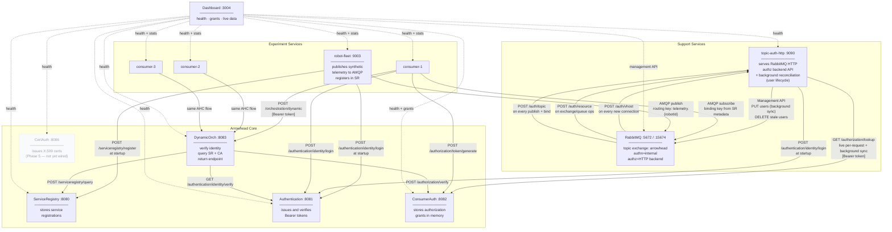
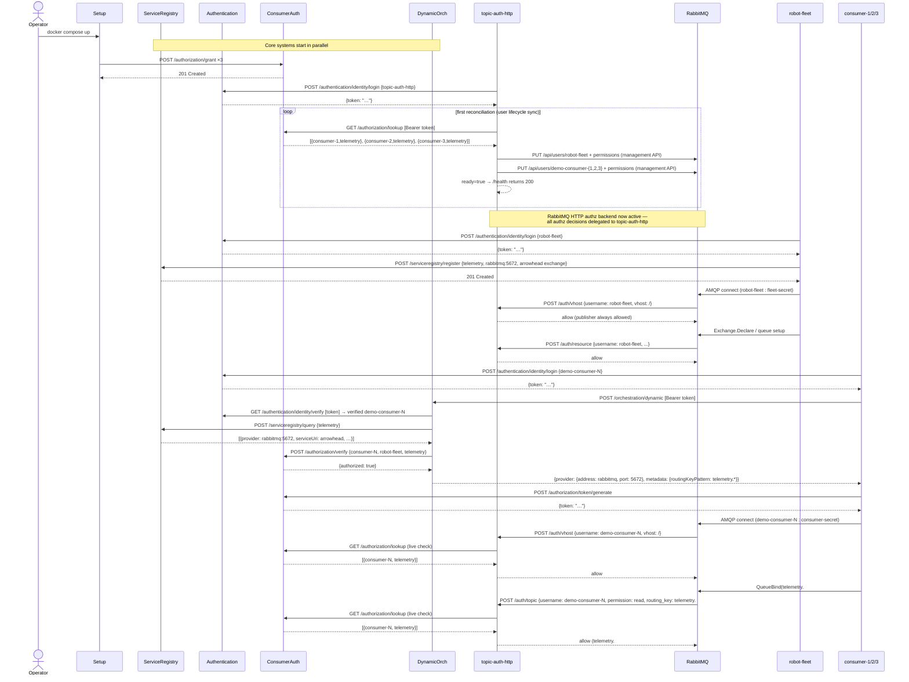
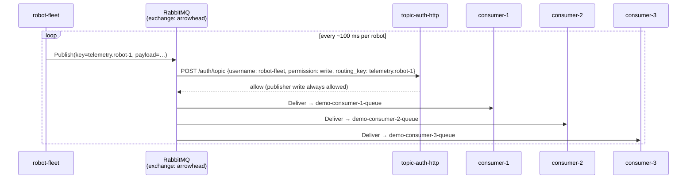
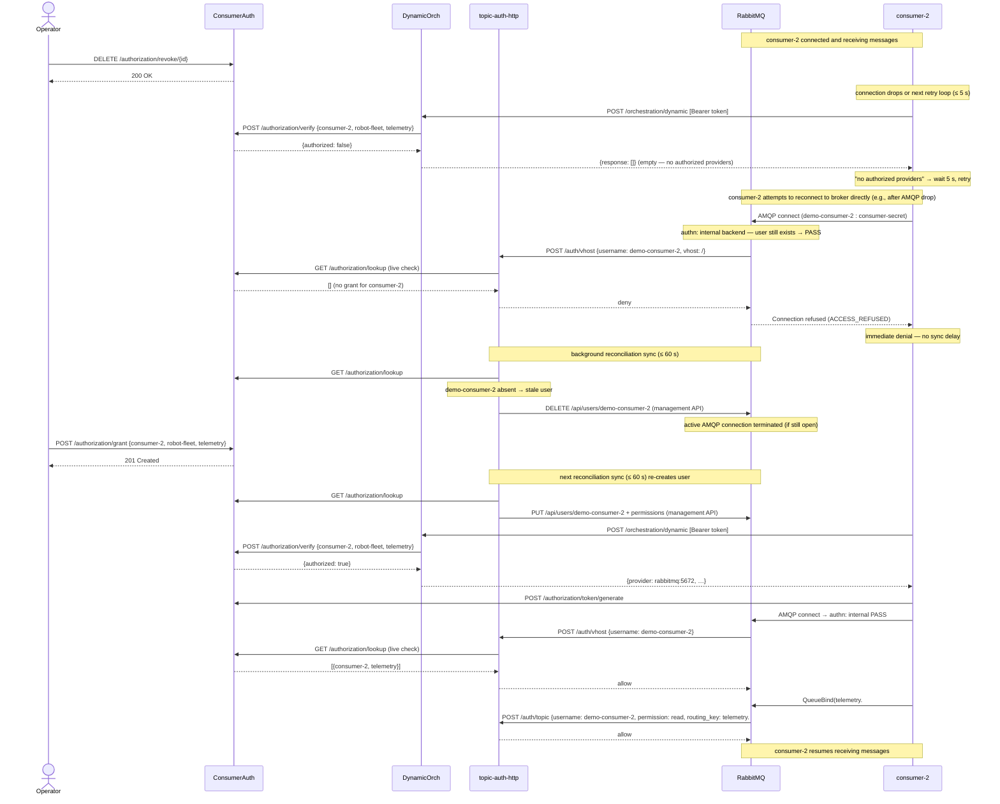

# Experiment 4 — Diagrams

## Component Diagram

Shows all services, their roles, and how they connect.

---

## Sequence Diagram 1 — Startup

`setup` seeds grants, `topic-auth-http` authenticates and runs its first
reconciliation (creating RabbitMQ users), then `robot-fleet` and consumers start.
RabbitMQ calls `topic-auth-http` for every vhost and topic authz check.

---

## Sequence Diagram 2 — Normal message flow

Once connected, robot-fleet publishes telemetry. RabbitMQ calls topic-auth-http for
every publish to verify the routing key. Messages are then delivered to subscribed
consumers without further authorization checks per delivery.

---

## Sequence Diagram 3 — Revoke and re-grant: dual-layer enforcement

Revoking a grant is effective immediately at the orchestration layer (DO returns
empty) and immediately at the broker layer when the consumer reconnects
(vhost authz check via topic-auth-http denies). An active idle subscriber is
disconnected within SYNC_INTERVAL (60 s) when the reconciliation sync deletes the user.

