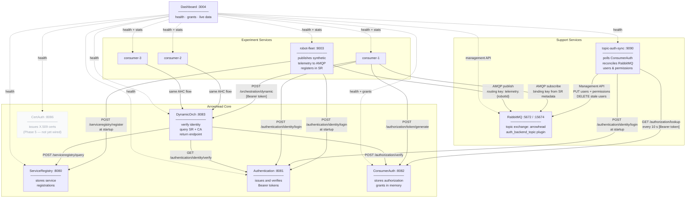
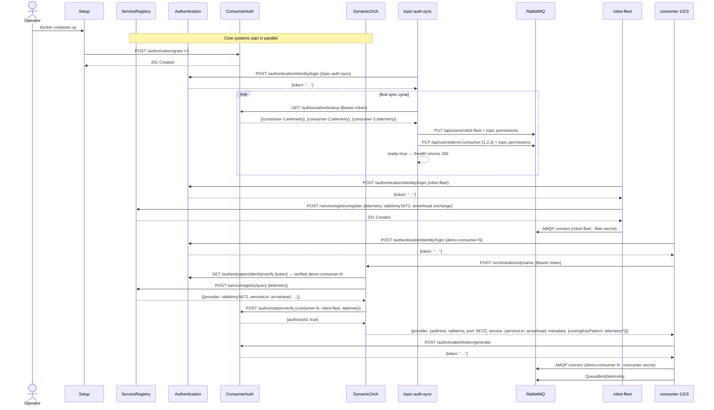
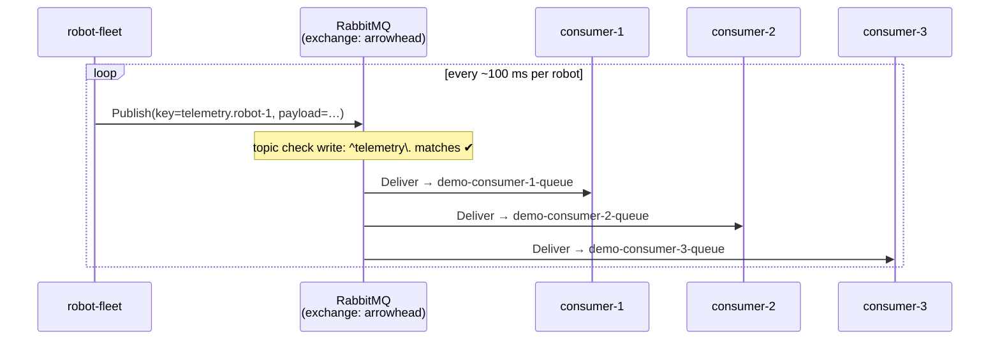
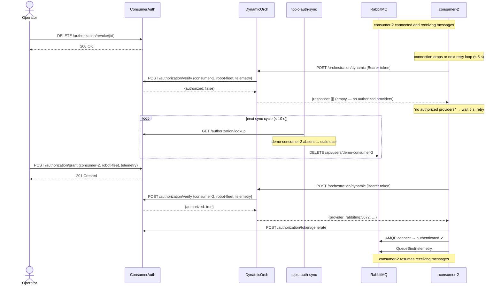

# Experiment 4 — Diagrams

## Component Diagram

Shows all services, their roles, and how they connect.

---

## Sequence Diagram 1 — Startup

`setup` seeds grants, `topic-auth-sync` authenticates and runs its first
reconciliation, `robot-fleet` authenticates and registers in ServiceRegistry,
then consumers start.

---

## Sequence Diagram 2 — Normal message flow

Once connected, robot-fleet publishes telemetry and RabbitMQ fans it out to
every consumer whose queue is bound to a matching routing key.

---

## Sequence Diagram 3 — Revoke and re-grant: dual-layer enforcement

Revoking a grant is effective immediately at the orchestration layer (DO returns
empty) and within ≤ 10 s at the broker layer (topic-auth-sync deletes the user).
Re-granting restores access via the same two-step path.

