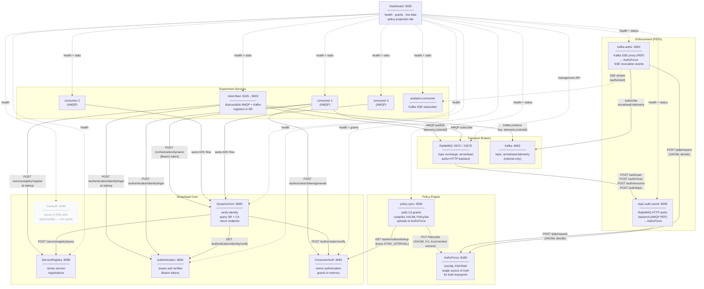
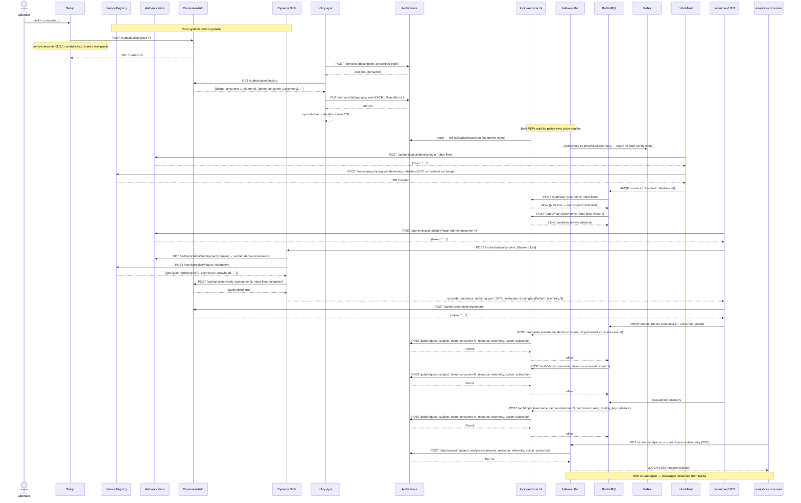
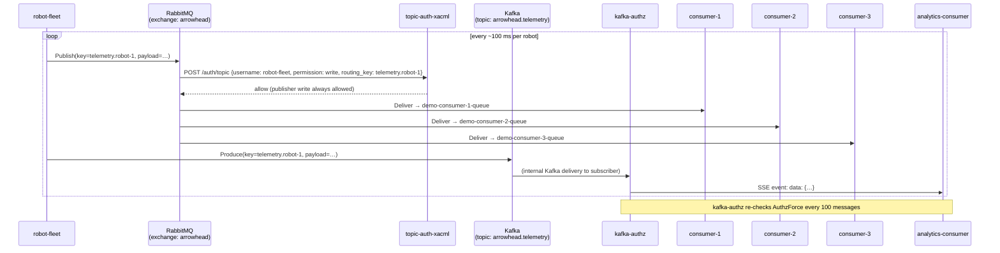
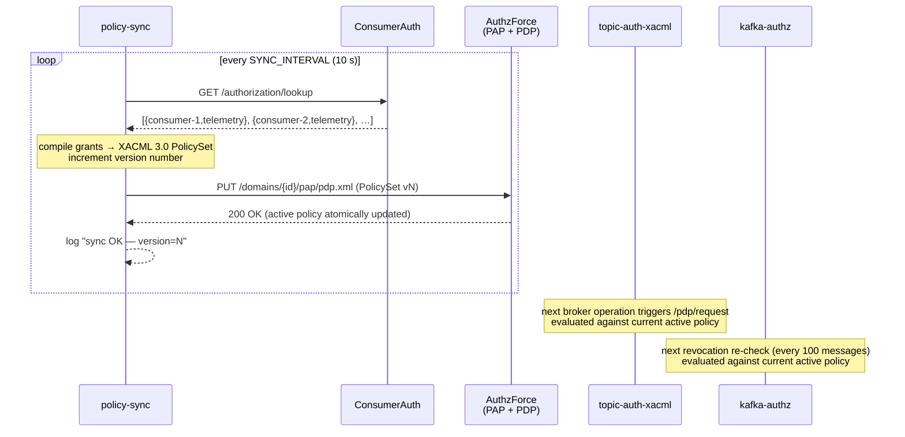

# Experiment 5 — Diagrams

## Component Diagram

Shows all services, their roles, and how they connect.



---

## Sequence Diagram 1 — Startup

`setup` seeds grants, `policy-sync` authenticates (optionally), creates the AuthzForce
domain, compiles the first PolicySet, and marks itself healthy, gating both PEPs.
`robot-fleet` and consumers start once the enforcement layer is ready.



---

## Sequence Diagram 2 — Normal message flow (dual-publish)

Once connected, `robot-fleet` publishes telemetry to both transports simultaneously.
RabbitMQ calls `topic-auth-xacml` on every publish. Kafka messages flow directly
to `kafka-authz`, which forwards them as SSE events to `analytics-consumer`.



---

## Sequence Diagram 3 — Policy sync cycle

`policy-sync` runs every `SYNC_INTERVAL` (default 10 s). If grants change between
cycles, it uploads a new versioned PolicySet to AuthzForce. Both PEPs immediately
evaluate against the new policy on the next incoming request.



---

## Sequence Diagram 4 — Revoke and re-grant: unified policy enforcement

Revoking a grant causes `policy-sync` to upload a new PolicySet within one sync
interval. Both PEPs (AMQP and Kafka) begin denying access on their next check —
without any per-transport configuration change.

```mermaid
sequenceDiagram
    actor Operator
    participant CA as ConsumerAuth
    participant PS as policy-sync
    participant AZ as AuthzForce
    participant DO as DynamicOrch
    participant TAX as topic-auth-xacml
    participant RMQ as RabbitMQ
    participant KA as kafka-authz
    participant C2 as consumer-2<br/>(AMQP)
    participant AC as analytics-consumer<br/>(Kafka SSE)

    Note over C2,RMQ: consumer-2 connected and receiving messages
    Note over AC,KA: analytics-consumer SSE stream open

    Operator->>CA: DELETE /authorization/revoke/{id}  (revoke analytics-consumer)
    CA-->>Operator: 200 OK

    Note over PS: next sync cycle (≤ 10 s)
    PS->>CA: GET /authorization/lookup
    CA-->>PS: [{consumer-1,telemetry}, {consumer-2,telemetry}, {consumer-3,telemetry}]
    Note over PS: analytics-consumer absent → removed from PolicySet
    PS->>AZ: PUT /domains/{id}/pap/pdp.xml  (PolicySet vN+1)
    AZ-->>PS: 200 OK

    Note over KA,AC: kafka-authz re-check at message 100N
    KA->>AZ: POST /pdp/request  {subject: analytics-consumer, resource: telemetry, action: subscribe}
    AZ-->>KA: Deny
    KA->>AC: SSE event: revoked\ndata: {"reason":"grant revoked"}
    Note over AC: disconnects and retries with exponential back-off

    AC->>KA: GET /stream/analytics-consumer?service=telemetry  (retry)
    KA->>AZ: POST /pdp/request  {subject: analytics-consumer, resource: telemetry, action: subscribe}
    AZ-->>KA: Deny
    KA-->>AC: 403 Forbidden
    Note over AC: back-off and retry

    Note over C2,RMQ: consumer-2 unaffected — its grant was not revoked

    Operator->>CA: POST /authorization/grant {analytics-consumer, robot-fleet, telemetry}
    CA-->>Operator: 201 Created

    Note over PS: next sync cycle (≤ 10 s)
    PS->>CA: GET /authorization/lookup
    CA-->>PS: [{consumer-1,…}, {consumer-2,…}, {consumer-3,…}, {analytics-consumer,telemetry}]
    PS->>AZ: PUT /domains/{id}/pap/pdp.xml  (PolicySet vN+2)
    AZ-->>PS: 200 OK

    AC->>KA: GET /stream/analytics-consumer?service=telemetry  (retry)
    KA->>AZ: POST /pdp/request  {subject: analytics-consumer, resource: telemetry, action: subscribe}
    AZ-->>KA: Permit
    KA-->>AC: 200 OK (SSE stream re-opened)
    Note over AC,KA: analytics-consumer resumes receiving messages

---

    Note over Operator: Separate scenario — revoke an AMQP consumer

    Operator->>CA: DELETE /authorization/revoke/{id}  (revoke demo-consumer-2)
    CA-->>Operator: 200 OK

    Note over PS: next sync cycle (≤ 10 s)
    PS->>AZ: PUT /domains/{id}/pap/pdp.xml  (PolicySet without demo-consumer-2)
    AZ-->>PS: 200 OK

    Note over C2: connection drops or next retry loop (≤ 5 s)
    C2->>DO: POST /orchestration/dynamic  [Bearer token]
    DO->>CA: POST /authorization/verify {consumer-2, robot-fleet, telemetry}
    CA-->>DO: {authorized: false}
    DO-->>C2: {response: []}  (empty — no authorized providers)
    Note over C2: "no authorized providers" → wait 5 s, retry

    Note over C2,RMQ: consumer-2 attempts to reconnect to broker
    C2->>RMQ: AMQP connect (demo-consumer-2 : consumer-secret)
    RMQ->>TAX: POST /auth/user  {username: demo-consumer-2, password: consumer-secret}
    TAX->>AZ: POST /pdp/request  {subject: demo-consumer-2, resource: telemetry, action: subscribe}
    AZ-->>TAX: Deny
    TAX-->>RMQ: deny
    RMQ-->>C2: Connection refused (ACCESS_REFUSED)
    Note over C2: denied immediately — policy already updated
```
