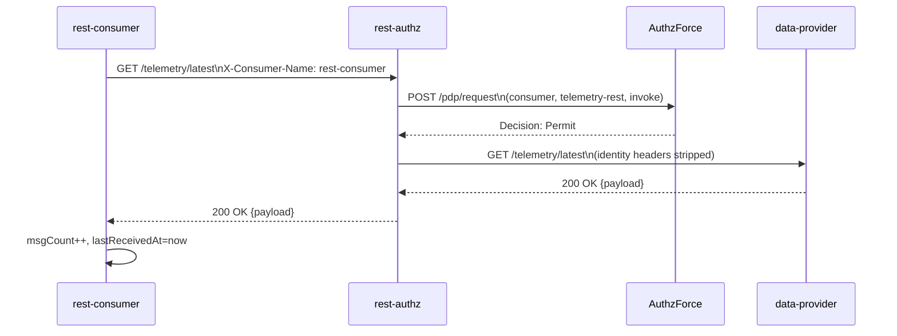
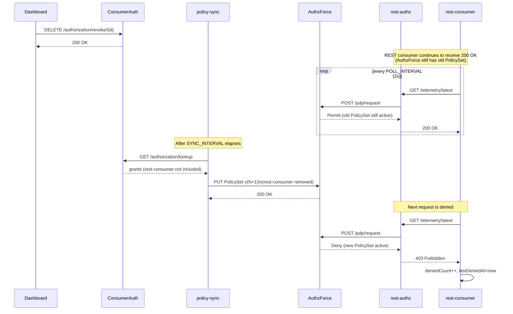
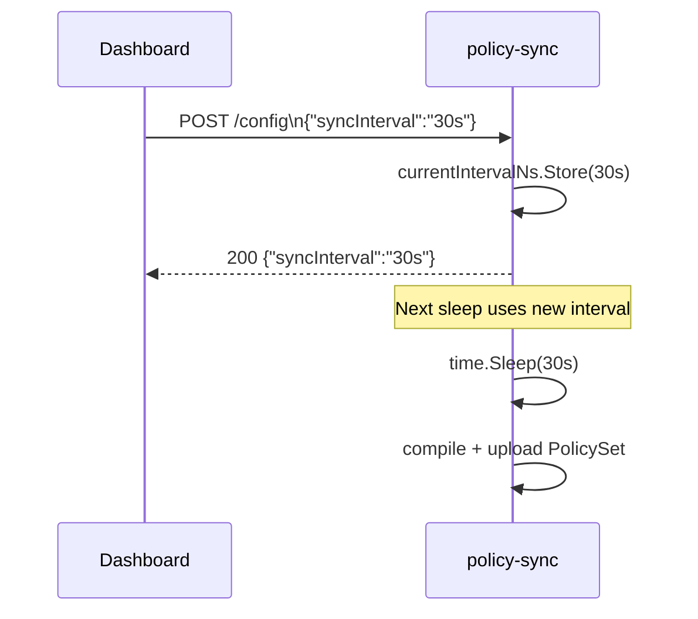

# Experiment 6 — Diagrams

## Component Diagram

Shows all services, their roles, and how they connect.  Experiment-6 adds
`rest-authz`, `data-provider`, and `rest-consumer` to the experiment-5 topology.

```mermaid
graph TD
    subgraph core["Arrowhead Core"]
        SR["ServiceRegistry :8080\n─────────────\nstores service\nregistrations"]
        AUTH["Authentication :8081\n─────────────\nissues and verifies\nBearer tokens"]
        CA["ConsumerAuth :8082\n─────────────\nstores authorization\ngrants in memory"]
        DO["DynamicOrch :8083\n─────────────\nverify identity\nquery SR + CA\nreturn endpoint"]
        CA_cert["CertAuth :8086\n─────────────\nissues X.509 certs\n(placeholder — not wired)"]
    end

    subgraph policy["Policy Engine"]
        PS["policy-sync :9095\n─────────────\npolls CA grants\ncompiles XACML PolicySet\nuploads to AuthzForce\n/config → runtime interval"]
        AZ["AuthzForce :8186\n─────────────\nXACML PDP/PAP\nsingle source of truth\nfor all three transports"]
    end

    subgraph enforcement["Enforcement (PEPs)"]
        TAX["topic-auth-xacml :9090\n─────────────\nRabbitMQ HTTP authz\nbackend (AMQP PEP)\n→ AuthzForce"]
        KA["kafka-authz :9091\n─────────────\nKafka SSE proxy (PEP)\n→ AuthzForce\nSSE revocation events"]
        RA["rest-authz :9093\n─────────────\nHTTP reverse proxy (PEP)\n→ AuthzForce\nX-Consumer-Name header\nSync-delay caveat applies"]
    end

    subgraph transport["Transport Brokers"]
        RMQ["RabbitMQ :5672 / :15676\n─────────────\ntopic exchange: arrowhead\nauthz=HTTP backend"]
        KFK["Kafka :9092\n─────────────\ntopic: arrowhead.telemetry\n(internal only)"]
    end

    subgraph experiment["Experiment Services"]
        RF["robot-fleet :9106→9003\n─────────────\ndual-publish AMQP + Kafka\nregisters in SR"]
        C1["consumer-1\n(AMQP)"]
        C2["consumer-2\n(AMQP)"]
        C3["consumer-3\n(AMQP)"]
        AC["analytics-consumer\n─────────────\nKafka SSE subscriber"]
        DP["data-provider :9094\n─────────────\nKafka consumer group\nREST API: /telemetry/latest\n(upstream of rest-authz)"]
        RC["rest-consumer\n─────────────\npolls rest-authz/telemetry/latest\nX-Consumer-Name header"]
    end

    DB["Dashboard :3006\n─────────────\nhealth · grants · live data\npolicy projection\nConfig: SYNC_INTERVAL control"]

    PS  -->|"GET /authorization/lookup\n[every SYNC_INTERVAL]"| CA
    PS  -->|"PUT PolicySet\n(XACML 3.0, incremented version)"| AZ

    TAX -->|"POST /pdp/request\n(XACML decide)"| AZ
    KA  -->|"POST /pdp/request\n(XACML decide)"| AZ
    RA  -->|"POST /pdp/request\n(XACML decide)"| AZ

    RMQ -->|"POST /auth/user\nPOST /auth/vhost\nPOST /auth/resource\nPOST /auth/topic"| TAX

    KA  -->|"subscribe\narrowhead.telemetry"| KFK
    KA  -.->|"SSE stream\n(authorized)"| AC

    DP  -->|"Kafka consumer group\narrowhead.telemetry"| KFK
    RA  -->|"GET /telemetry/latest\n(authorized requests)"| DP
    RC  -->|"GET /telemetry/latest\nX-Consumer-Name: rest-consumer"| RA

    RF  -->|"POST /serviceregistry/register"| SR
    RF  -->|"AMQP publish\ntelemetry.{robotId}"| RMQ
    RF  -->|"Kafka produce\nkey: telemetry.{robotId}"| KFK

    C1  -->|"POST /authentication/identity/login"| AUTH
    C1  -->|"POST /orchestration/dynamic\n[Bearer token]"| DO
    C1  -->|"POST /authorization/token/generate"| CA
    C1  -->|"AMQP subscribe"| RMQ

    C2  -->|"same AHC flow"| DO
    C3  -->|"same AHC flow"| DO

    DB  -.->|"POST /config\n{syncInterval: Ns}"| PS
    DB  -.->|health + stats| RC
    DB  -.->|health + stats| DP
    DB  -.->|health + status| RA
```



---

## Sequence: REST Authorization Flow



---

## Sequence: Revocation Propagation (REST path)



---

## Sequence: policy-sync /config (Runtime Interval Update)



---

## Policy Projection: Triple-Transport Model

```
  ConsumerAuthorization (CA)
        │ grants/revokes
        ▼
  policy-sync ──► AuthzForce PDP/PAP  (XACML 3.0 PolicySet, arrowhead-exp6)
  (SYNC_INTERVAL       │
   configurable)       │
              ┌────────┼─────────────┐
              │        │             │
              ▼        ▼             ▼
     topic-auth-xacml  kafka-authz  rest-authz
     (AMQP PEP)        (Kafka PEP)  (REST PEP)
              │        │             │
              ▼        ▼             ▼
     Consumer-1/2/3  analytics-consumer  rest-consumer
     (AMQP)          (SSE / Kafka)       (REST HTTP)
     ─────────────────────────────────────────────
     Enforcement:     per request      per request
     immediate after  + every 100      with sync-delay
     sync cycle       messages         caveat
```
