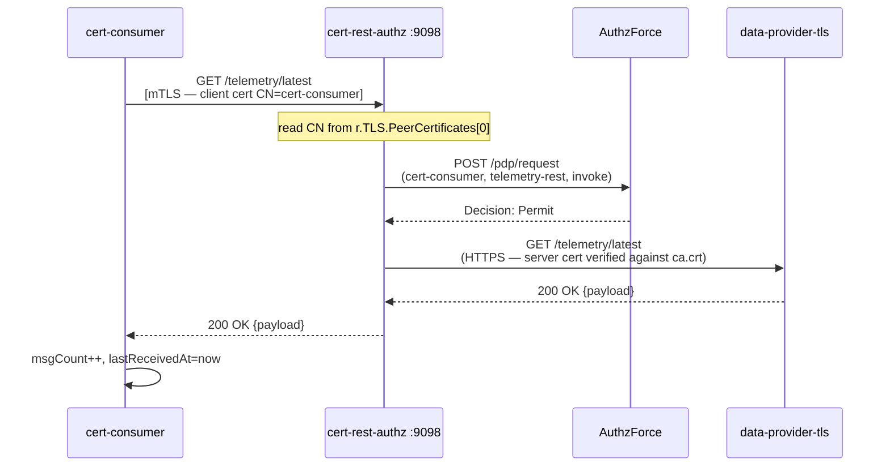
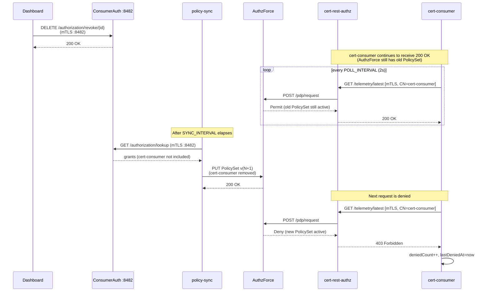
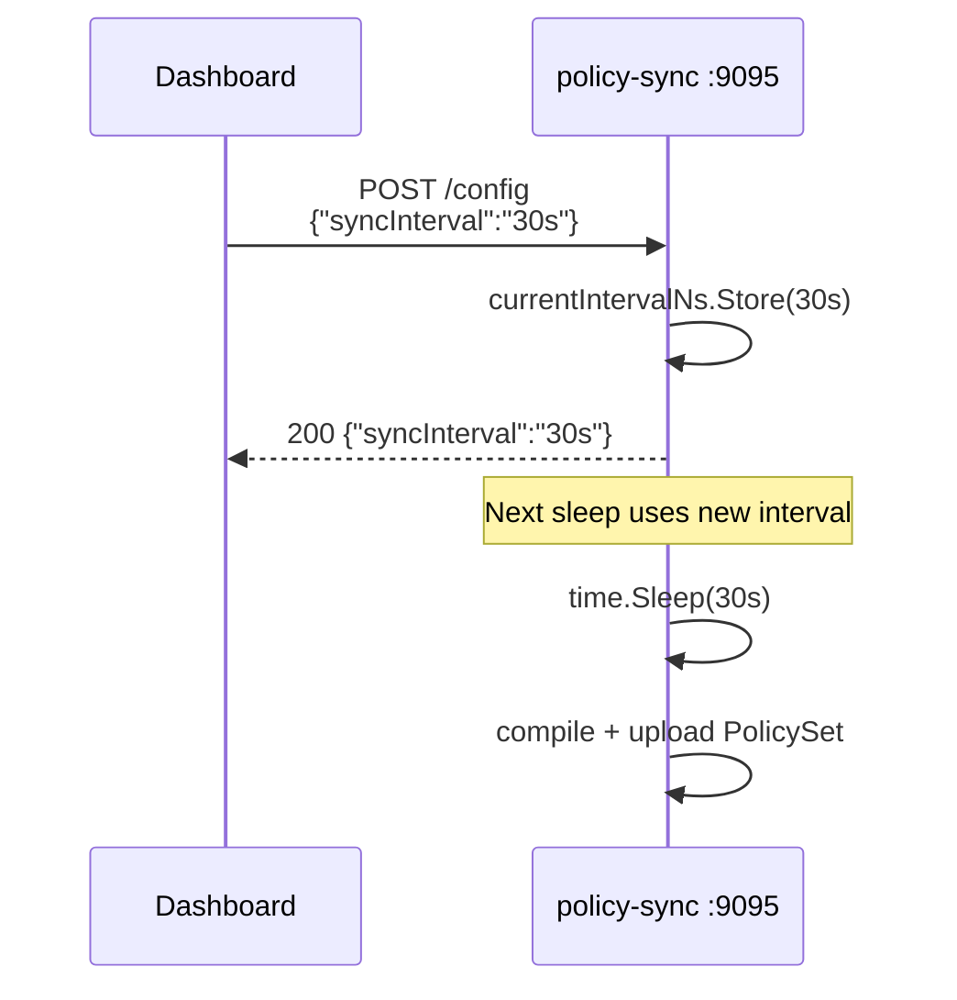
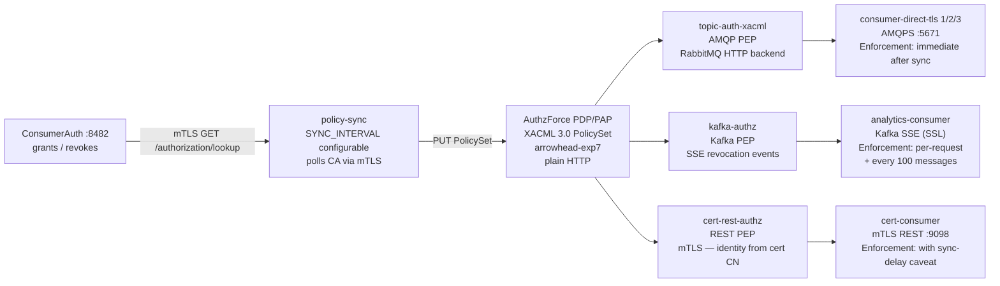

# Experiment-7 — Basic Architecture Diagrams

Covers the same diagram types as `experiment-6/DIAGRAMS.md`, updated for the
experiment-7 topology. The key differences from experiment-6:

- All Arrowhead core-system calls use **mTLS** (ports 8480–8483); plain HTTP ports
  (8080–8083) are Docker-internal only.
- `rest-authz` is replaced by **`cert-rest-authz`**: consumer identity is read from
  the X.509 client certificate CN, not from the `X-Consumer-Name` header.
- `rest-consumer` is replaced by **`cert-consumer`**: issues its own cert at startup
  and authenticates with it.
- `robot-fleet` → **`robot-fleet-tls`**: registers via mTLS; publishes over AMQPS and
  Kafka/SSL.
- `consumer-1/2/3` → **`consumer-direct-tls` ×3**: authenticate and orchestrate via mTLS.
- `data-provider` → **`data-provider-tls`**: served over HTTPS.
- A **`cert-provisioner`** init container pre-provisions certificates for all
  file-based services (brokers, core systems, policy-sync) before the stack starts.
- RabbitMQ listens on **AMQPS :5671**; Kafka uses **SSL :9092**.

---

## Component Diagram

```mermaid
graph TD
    subgraph core["Arrowhead Core (plain HTTP internal + mTLS host-exposed)"]
        SR["ServiceRegistry\n:8080 HTTP (healthchecks)\n:8480 HTTPS/mTLS\n─────────────\nstores service registrations"]
        AUTH["Authentication\n:8081 HTTP (healthchecks)\n:8481 HTTPS/mTLS\n─────────────\nissues and verifies Bearer tokens"]
        CA_AUTH["ConsumerAuth\n:8082 HTTP (healthchecks + setup)\n:8482 HTTPS/mTLS\n─────────────\nstores authorization grants"]
        DO["DynamicOrch\n:8083 HTTP (healthchecks)\n:8483 HTTPS/mTLS\n─────────────\nverify identity · query SR + CA\nreturn endpoint"]
        CA_CERT["CertAuth :8086\n─────────────\nissues X.509 ECDSA P-256 certs\ntrust anchor (plain HTTP only)"]
    end

    subgraph bootstrap["Bootstrap"]
        CP["cert-provisioner\n─────────────\ninit container\nPOSTs to CA, writes /certs volume\nexits 0 before brokers start"]
    end

    subgraph policy["Policy Engine"]
        PS["policy-sync :9095\n─────────────\npolls CA grants via mTLS :8482\ncompiles XACML PolicySet\nuploads to AuthzForce\n/config → runtime sync interval"]
        AZ["AuthzForce :8186\n─────────────\nXACML PDP/PAP\nsingle source of truth\nfor all three transports\n(plain HTTP)"]
    end

    subgraph enforcement["Enforcement (PEPs)"]
        TAX["topic-auth-xacml :9090\n─────────────\nRabbitMQ HTTP authz backend\n(AMQP PEP) → AuthzForce"]
        KA["kafka-authz :9091\n─────────────\nKafka SSE proxy (PEP)\n→ AuthzForce\nSSE revocation events\n(Kafka SSL)"]
        CRA["cert-rest-authz\n:9098 HTTPS/mTLS (proxy)\n:9099 HTTP (health/check)\n─────────────\nmTLS reverse proxy (PEP)\nconsumer = cert CN\n→ AuthzForce"]
    end

    subgraph transport["Transport Brokers"]
        RMQ["RabbitMQ :5671\n─────────────\ntopic exchange: arrowhead\nAMQPS (server-only TLS)\nauthz=HTTP backend"]
        KFK["Kafka :9092\n─────────────\ntopic: arrowhead.telemetry\nSSL (server-only TLS)"]
    end

    subgraph experiment["Experiment Services"]
        RF["robot-fleet-tls\n─────────────\ndual-publish AMQPS + Kafka/SSL\nregisters in SR via mTLS :8480\nissues own cert at startup"]
        CDT1["consumer-direct-tls-1\n(AMQPS)"]
        CDT2["consumer-direct-tls-2\n(AMQPS)"]
        CDT3["consumer-direct-tls-3\n(AMQPS)"]
        AC["analytics-consumer\n─────────────\nKafka SSE subscriber"]
        DP["data-provider-tls :9094\n─────────────\nKafka/SSL partition reader\nHTTPS REST: /telemetry/latest\n(upstream of cert-rest-authz)"]
        CC["cert-consumer :9096\n─────────────\nissues own cert at startup\npolls cert-rest-authz via mTLS\nCN = identity (no header)"]
    end

    %% cert-provisioner → CA and /certs volume
    CP  -->|"POST /ca/certificate/issue\n(plain HTTP)"| CA_CERT
    CP  -->|"writes /certs volume\n(ca.crt, per-service certs)"| RMQ
    CP  -->|"writes /certs volume"| KFK

    %% policy-sync
    PS  -->|"GET /authorization/lookup\n[every SYNC_INTERVAL]\nmTLS :8482"| CA_AUTH
    PS  -->|"PUT PolicySet\n(XACML 3.0, incremented version)"| AZ

    %% PEP → AuthzForce
    TAX -->|"POST /pdp/request\n(XACML decide)"| AZ
    KA  -->|"POST /pdp/request\n(XACML decide)"| AZ
    CRA -->|"POST /pdp/request\n(XACML decide)"| AZ

    %% RabbitMQ → PEP
    RMQ -->|"POST /auth/user\nPOST /auth/vhost\nPOST /auth/resource\nPOST /auth/topic"| TAX

    %% Kafka paths
    KA  -->|"subscribe arrowhead.telemetry\n(Kafka SSL)"| KFK
    KA  -.->|"SSE stream (authorized)"| AC
    DP  -->|"partition reader\narrowhead.telemetry (Kafka SSL)"| KFK

    %% cert-rest-authz chain
    CRA -->|"GET /telemetry/latest\n(HTTPS, server cert verified)"| DP
    CC  -->|"GET /telemetry/latest\nmTLS client cert (CN = cert-consumer)"| CRA

    %% robot-fleet-tls
    RF  -->|"POST /serviceregistry/register\nmTLS :8480"| SR
    RF  -->|"POST /authentication/identity/login\nmTLS :8481"| AUTH
    RF  -->|"AMQPS publish telemetry.{robotId}"| RMQ
    RF  -->|"Kafka/SSL produce\nkey: telemetry.{robotId}"| KFK
    RF  -->|"POST /ca/certificate/issue\n(runtime, own cert)"| CA_CERT

    %% consumer-direct-tls
    CDT1 -->|"POST /authentication/identity/login\nmTLS :8481"| AUTH
    CDT1 -->|"POST /orchestration/dynamic\nmTLS :8483 [Bearer]"| DO
    CDT1 -->|"AMQPS subscribe"| RMQ
    CDT1 -->|"POST /ca/certificate/issue\n(runtime, own cert)"| CA_CERT
    CDT2 -->|"same AHC flow via mTLS"| DO
    CDT3 -->|"same AHC flow via mTLS"| DO

    %% cert-consumer
    CC  -->|"POST /ca/certificate/issue\n(runtime, own cert)"| CA_CERT

    %% DynamicOrch outbound mTLS
    DO  -->|"query SR\nmTLS :8480"| SR
    DO  -->|"query CA\nmTLS :8482"| CA_AUTH
    DO  -->|"verify identity token\nmTLS :8481"| AUTH
```

---

## Sequence: Certificate-based REST Authorization Flow

Consumer identity is derived from the X.509 client certificate CN — no
`X-Consumer-Name` header is involved.

---

## Sequence: Revocation Propagation (REST / mTLS path)

The sync-delay caveat from experiment-6 applies unchanged: REST enforcement lags
ConsumerAuth by up to `SYNC_INTERVAL`. Revocation is submitted to the mTLS port
(:8482); the sync cycle polls the same port.

---

## Sequence: policy-sync /config (Runtime Interval Update)

Unchanged from experiment-6. The interval controls how quickly revocations propagate
to all three transports.

---

## Policy Projection: Triple-Transport Model

