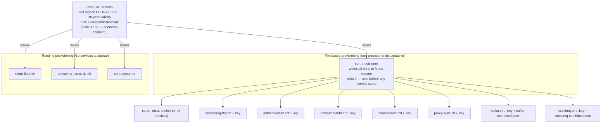
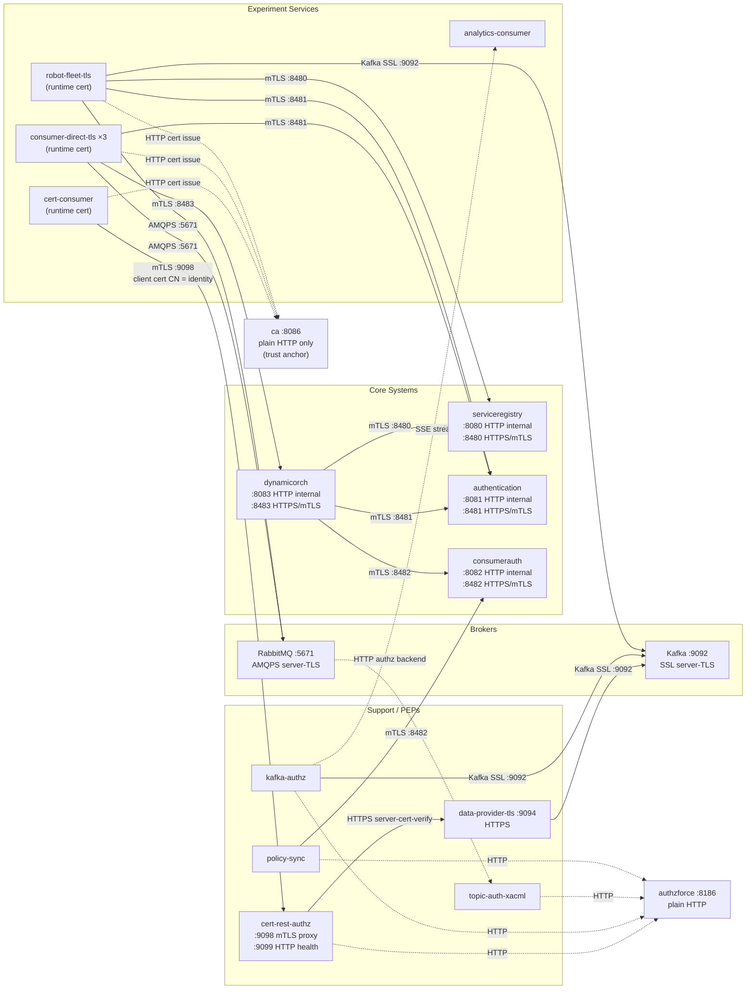
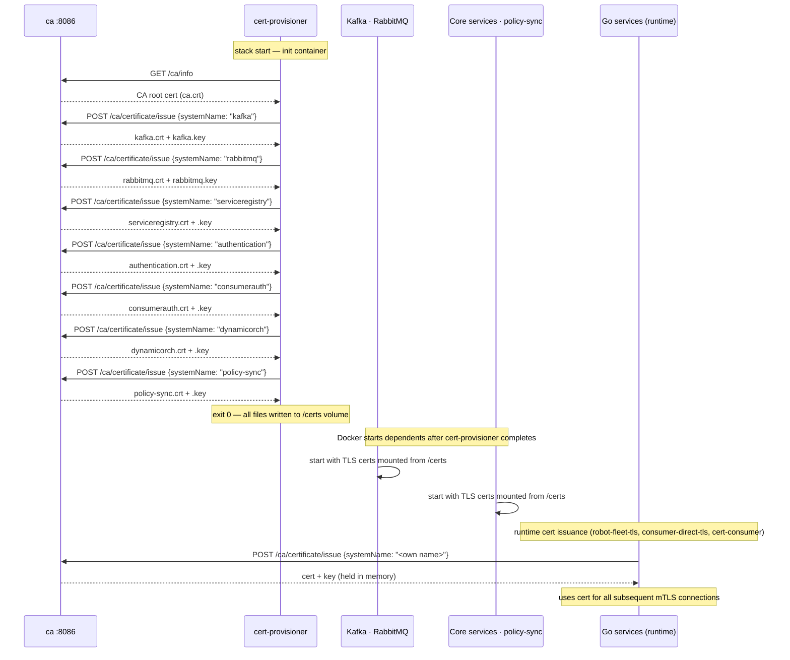
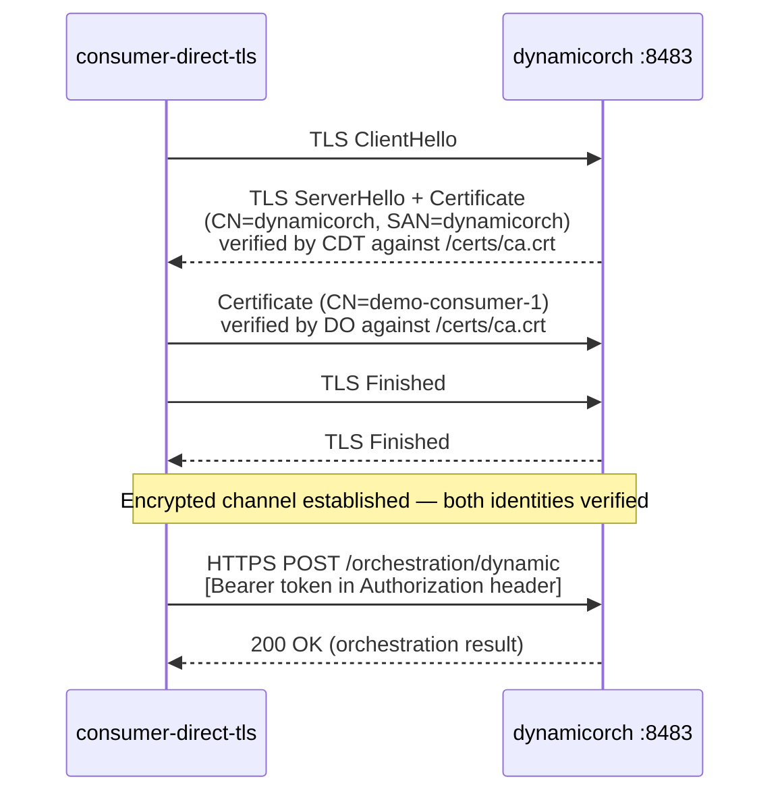

# Experiment-7 — Security Architecture Diagrams

Mermaid versions of the diagrams in `DIAGRAMS.md`. The content is identical; only
the presentation format has changed from ASCII art to Mermaid.

---

## 1. TLS Trust Model

All certificates share a single self-signed ECDSA P-256 root CA (`ca:8086`). Two
provisioning paths exist: file-based (cert-provisioner init container, runs before the
stack), and runtime (Go services call the CA at startup to obtain their own cert).

---

## 2. Service Communication — TLS Coverage

Solid arrows are TLS-protected connections. Dashed arrows are plain HTTP (Docker-internal
only). All host-accessible core-system ports are TLS; plain HTTP ports (8080–8083)
are restricted to Docker-internal traffic (healthchecks and bootstrap).

---

## 3. Certificate Provisioning Sequence

Two phases: cert-provisioner runs as an init container and provisions all file-based
certificates synchronously. After it exits 0, Docker starts the dependent services.
Go experiment services issue their own certificates at runtime.

---

## 4. mTLS Handshake — Core Service Path

Example: `consumer-direct-tls → dynamicorch:8483`. Both sides present certificates
issued by the same CA root; both sides verify the peer against that root.

---

## 5. Gap Status Summary (G4)

G4 ("No mutual TLS") is fully closed for all core-system paths in experiment-7.

### Path status

| Path | Before G4 fix | After G4 fix |
|---|---|---|
| robot-fleet-tls → serviceregistry | plain HTTP | mTLS (runtime-issued cert) |
| robot-fleet-tls → authentication | plain HTTP | mTLS |
| consumer-direct-tls → authentication | plain HTTP | mTLS |
| consumer-direct-tls → dynamicorch | plain HTTP | mTLS |
| dynamicorch → serviceregistry | plain HTTP | mTLS (file cert) |
| dynamicorch → consumerauth | plain HTTP | mTLS |
| dynamicorch → authentication | plain HTTP | mTLS |
| policy-sync → consumerauth | plain HTTP | mTLS (file cert) |
| cert-consumer → cert-rest-authz | mTLS (unchanged) | mTLS (unchanged) |
| cert-rest-authz → data-provider-tls | HTTPS (unchanged) | HTTPS (unchanged) |

### Plain HTTP port exposure

| Service | Plain HTTP port | Host-exposed? | Used for |
|---|---|---|---|
| serviceregistry | 8080 | No (Docker-internal only) | Docker healthchecks |
| authentication | 8081 | No (Docker-internal only) | Docker healthchecks |
| consumerauth | 8082 | No (Docker-internal only) | Healthchecks + setup container bootstrap |
| dynamicorch | 8083 | No (Docker-internal only) | Docker healthchecks |
| ca | 8086 | Yes (required) | Bootstrap trust anchor — cannot self-authenticate |
| authzforce | 8080 (host: 8186) | Yes (required) | External Java service, HTTP-only |

The TLS ports 8480–8483 are the only host-accessible entry points for core systems.
`test-system.sh` section 14 verifies that ports 8080–8083 are connection-refused from the host.

### Items intentionally out of scope

| Item | Reason |
|---|---|
| CA plain HTTP | Bootstrap constraint — cannot use its own cert to authenticate itself |
| AuthzForce plain HTTP | External Java service — TLS configuration is outside this experiment's scope |
| Kafka / RabbitMQ client cert | Server-only TLS — brokers do not require client certificates (`KAFKA_SSL_CLIENT_AUTH: none`) |
| Docker internal healthchecks | Plain HTTP on Docker-internal network only — not reachable from host |
