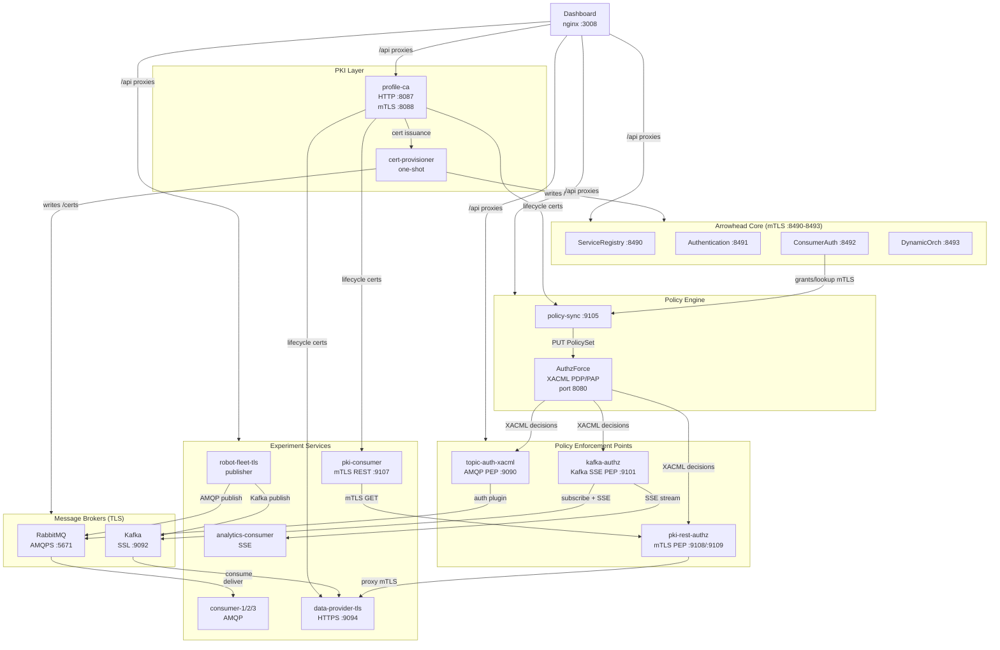
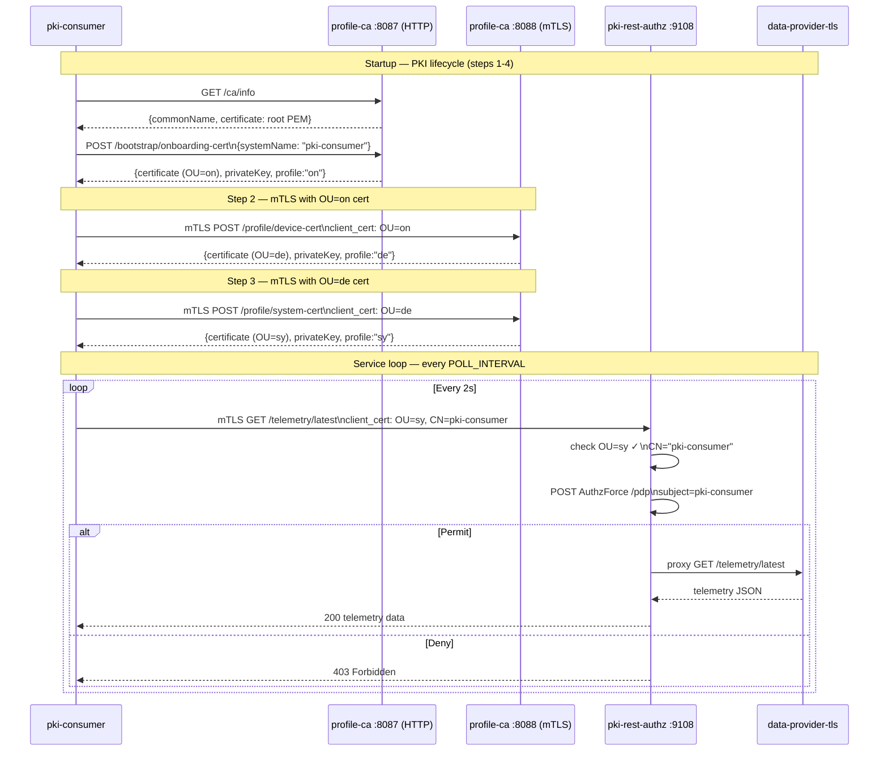
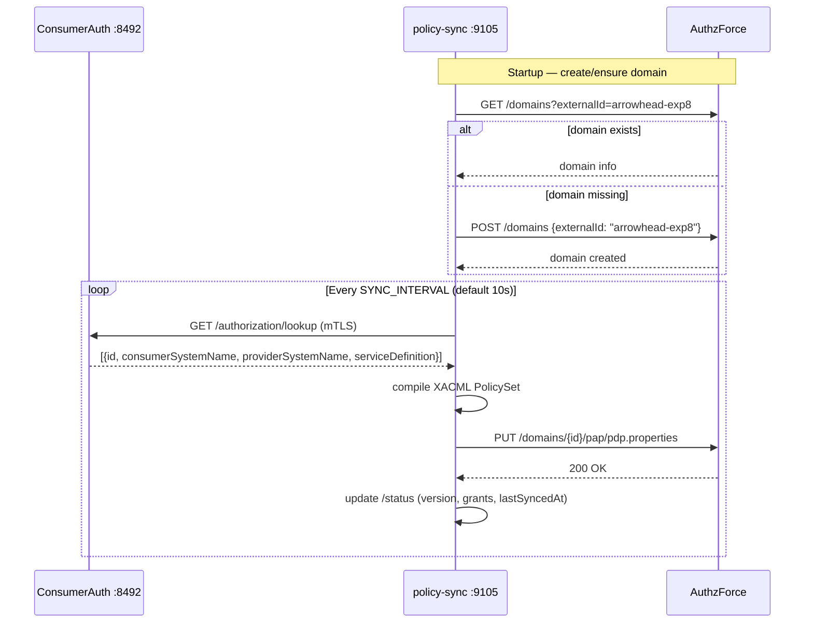
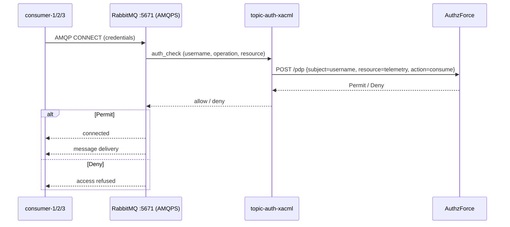
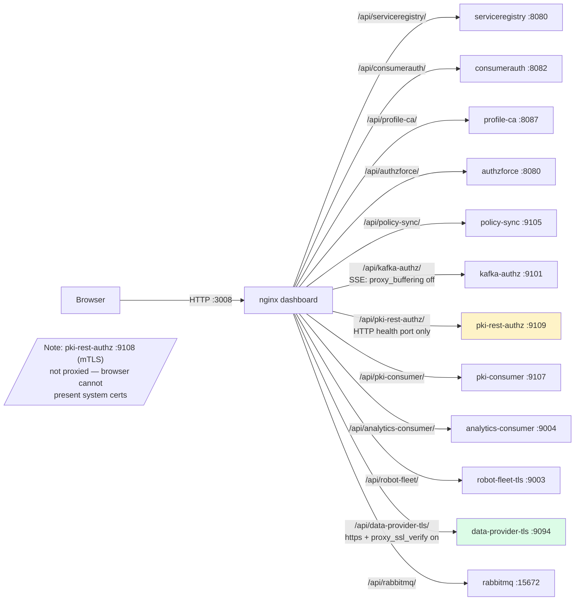

# DIAGRAMS_MERMAID_BASICS.md — Experiment 8

Mermaid component and sequence diagrams for experiment-8.
For ASCII-art versions see DIAGRAMS.md.
For security-focused diagrams see DIAGRAMS_MERMAID_SECURITY.md.

---

## 1. System Component Diagram

---

## 2. pki-consumer Certificate Lifecycle Sequence

---

## 3. Policy Sync Sequence

---

## 4. AMQP Authorization Sequence

---

## 5. Dashboard Routing Diagram

