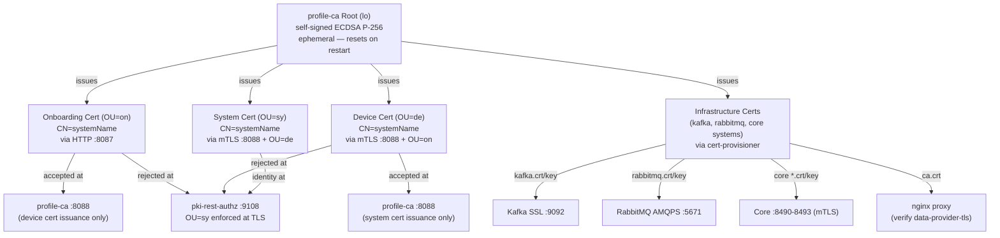
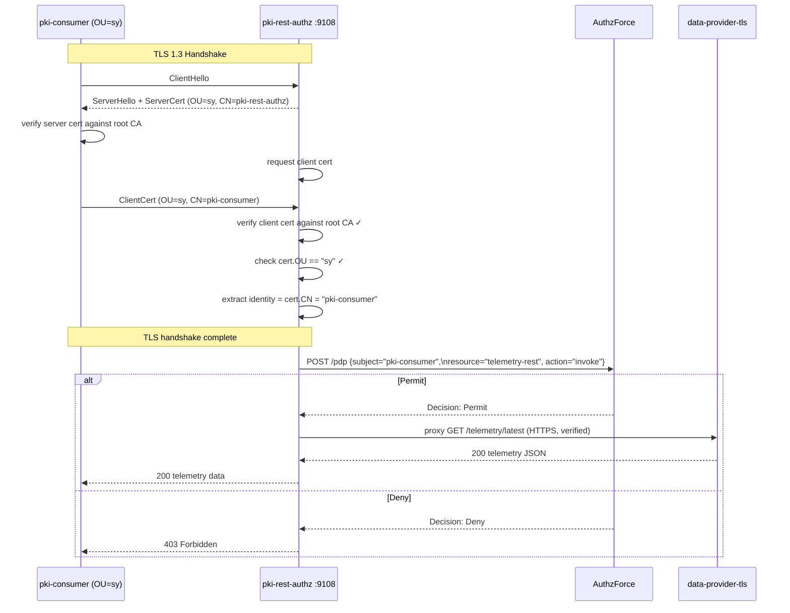
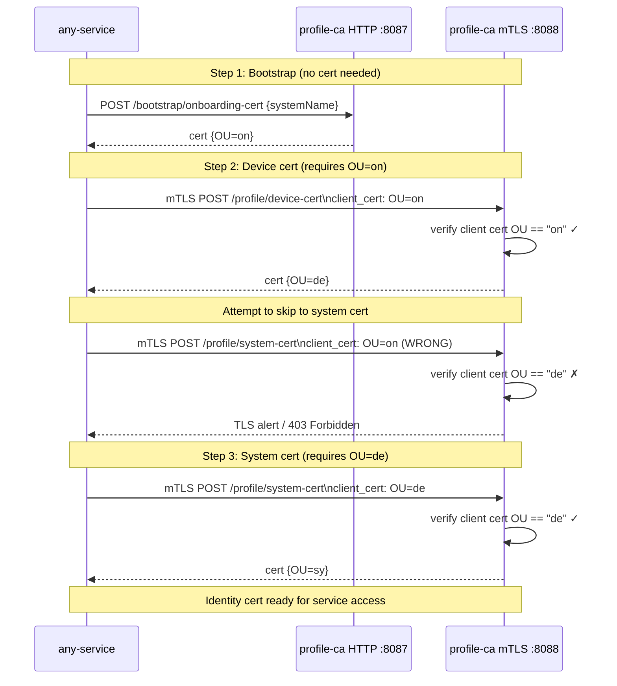
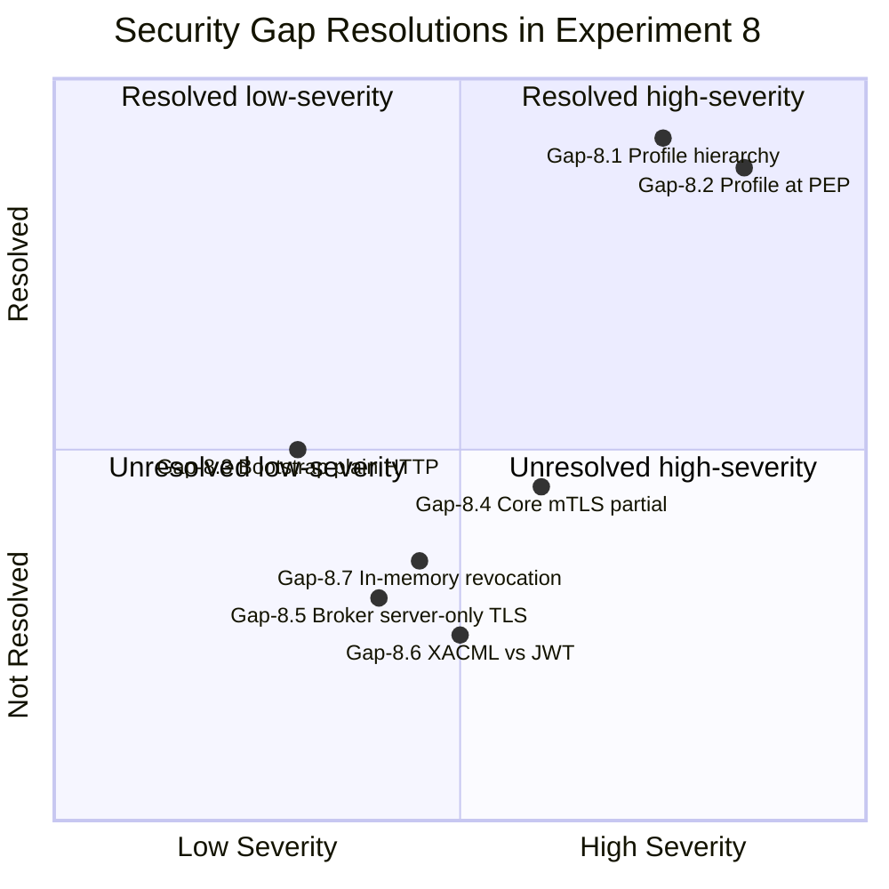
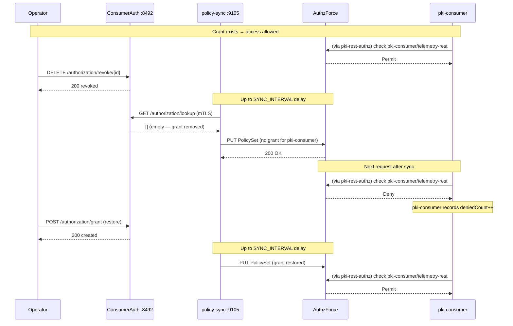

# DIAGRAMS_MERMAID_SECURITY.md — Experiment 8

Security-focused Mermaid diagrams for experiment-8.
Covers: TLS trust model, profile enforcement, mTLS handshake, security gaps.

---

## 1. TLS Trust Model



---

## 2. Profile Enforcement State Machine

```mermaid
stateDiagram-v2
    [*] --> NoIdentity : system starts

    NoIdentity --> HasOnboarding : POST /bootstrap/onboarding-cert\n(HTTP, no cert needed)
    HasOnboarding --> HasDevice : mTLS POST /profile/device-cert\n(present OU=on cert)
    HasDevice --> HasSystem : mTLS POST /profile/system-cert\n(present OU=de cert)
    HasSystem --> ServiceAccess : mTLS GET pki-rest-authz:9108\n(present OU=sy cert)

    ServiceAccess --> ServiceAccess : Permit → data received
    ServiceAccess --> Denied : Deny → 403 (no grant)
    Denied --> ServiceAccess : grant restored + SYNC_INTERVAL

    HasOnboarding --> Rejected1 : mTLS POST /profile/system-cert\n(skipping de — rejected)
    HasOnboarding --> Rejected2 : mTLS GET pki-rest-authz\n(wrong profile — TLS rejection)
    HasDevice --> Rejected3 : mTLS GET pki-rest-authz\n(wrong profile — TLS rejection)

    note right of Rejected1 : TLS rejection:\nwrong profile order
    note right of Rejected2 : TLS rejection:\nOU=on ≠ OU=sy
    note right of Rejected3 : TLS rejection:\nOU=de ≠ OU=sy
```

---

## 3. mTLS Handshake at pki-rest-authz



---

## 4. Profile Cert Issuance Sequence (mTLS enforcement at profile-ca)



---

## 5. Security Gap Status



---

## 6. Authorization Revocation Propagation


