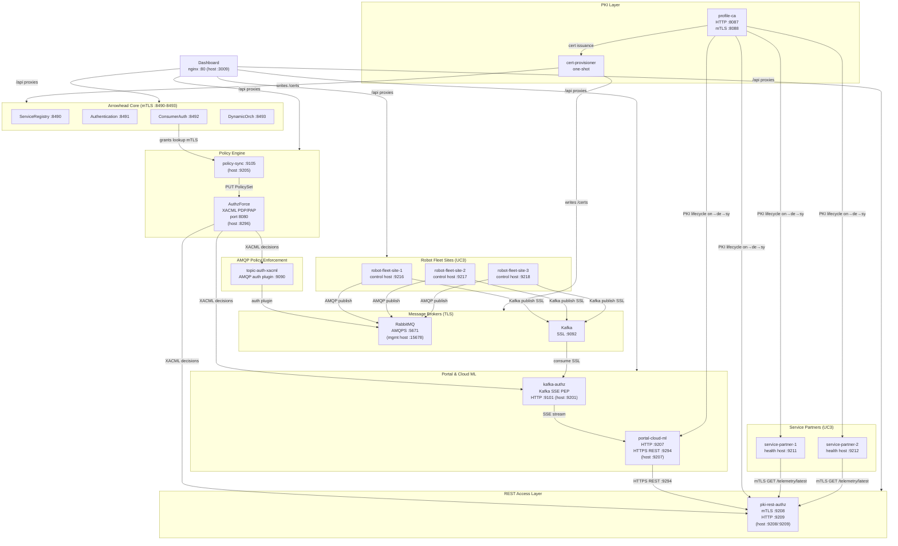
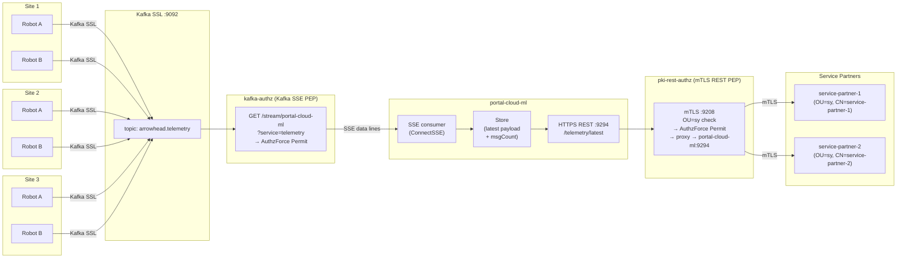
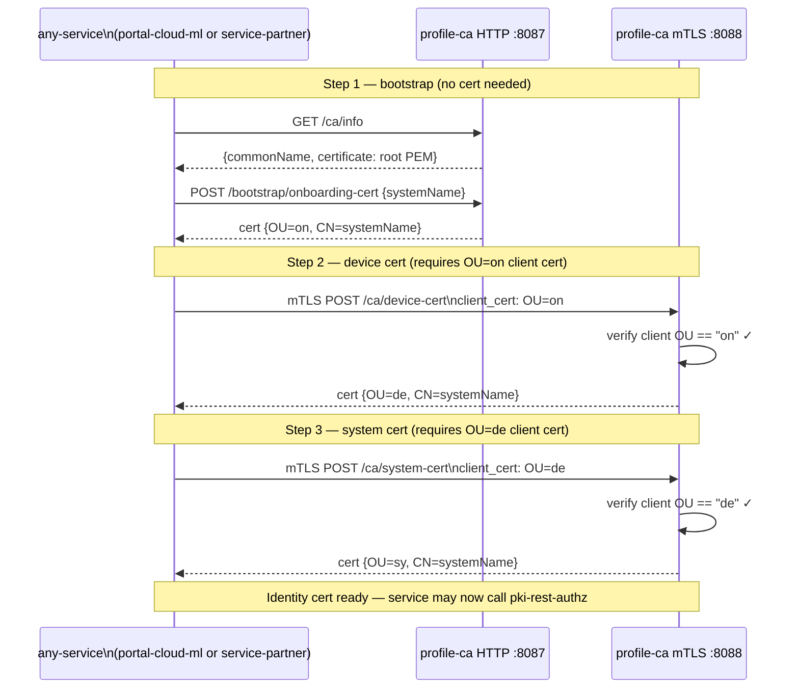
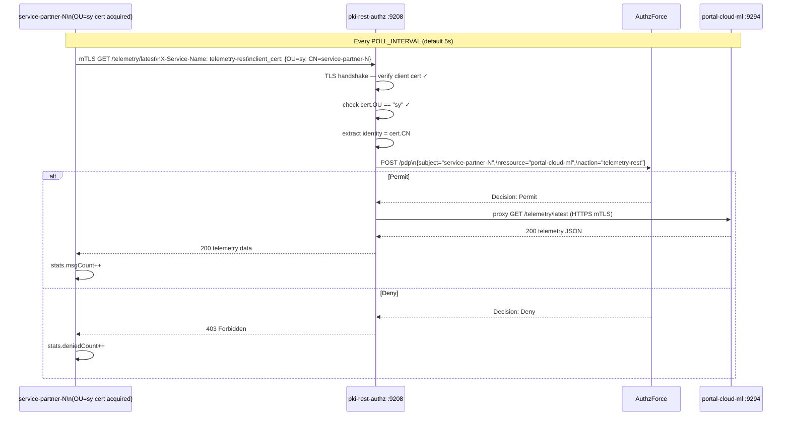
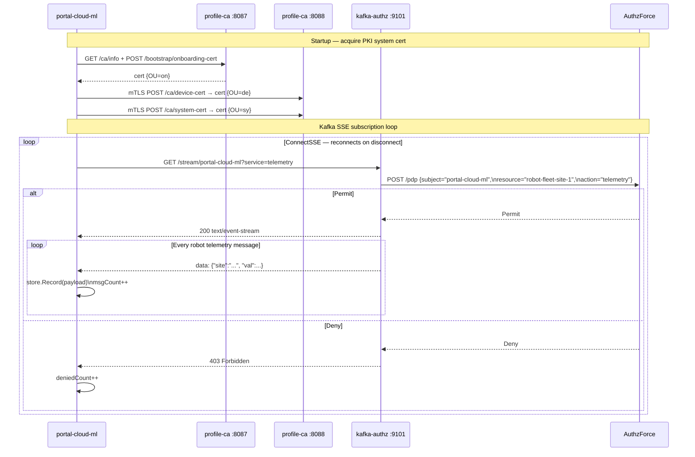
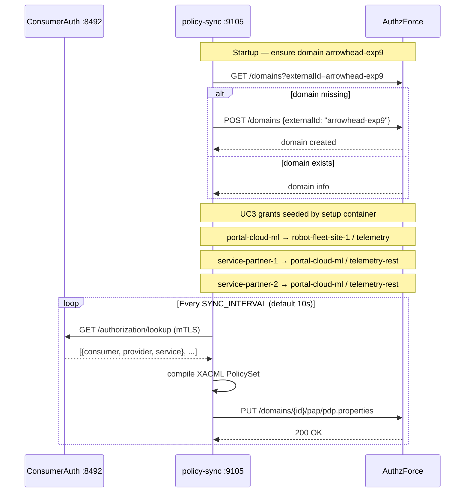
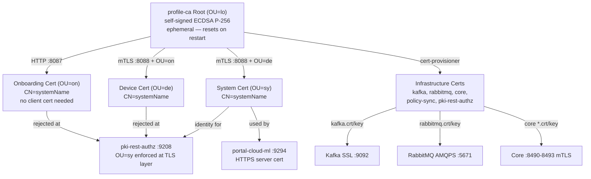
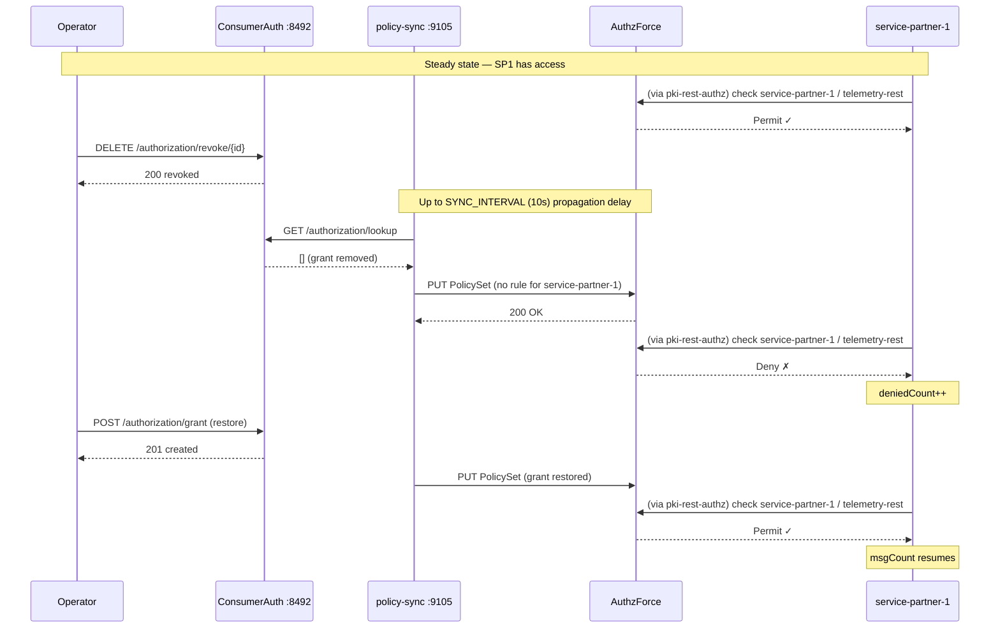
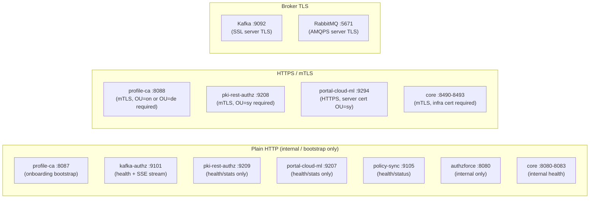
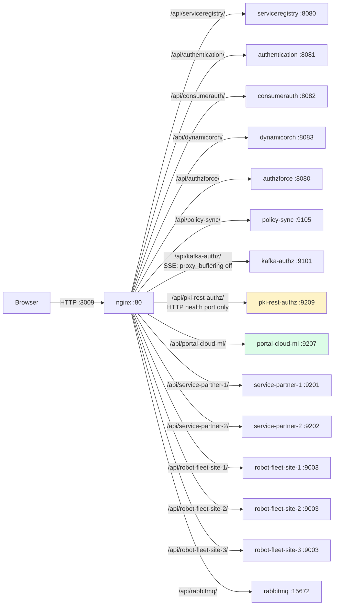

# DIAGRAMS.md — Experiment 9

Mermaid architectural diagrams for experiment-9.

Experiment 9 extends experiment-8 to the AIMS5.0 **UC3 "Lawn Mowing as a Service"** scenario:
three robot-fleet sites publish telemetry via Kafka (TLS) and AMQP (TLS); a **Portal & Cloud ML**
service aggregates the streams and exposes an HTTPS REST API; two **Service Partners** (SP1/SP2)
consume that API via the `pki-rest-authz` mTLS PEP.

---

## 1. Full System Component Diagram



---

## 2. UC3 Data Flow — Telemetry End-to-End



---

## 3. Arrowhead 5.2 PKI Lifecycle (on → de → sy)



---

## 4. Service Partner Authorization Flow



---

## 5. portal-cloud-ml SSE Consumer Flow



---

## 6. Policy Sync Sequence



---

## 7. PKI Trust Hierarchy



---

## 8. PKI Profile Enforcement State Machine

```mermaid
stateDiagram-v2
    [*] --> NoIdentity : service-partner or portal-cloud-ml starts

    NoIdentity --> HasOnboarding : POST /bootstrap/onboarding-cert\n(HTTP, no cert needed)
    HasOnboarding --> HasDevice : mTLS POST /ca/device-cert\n(present OU=on cert)
    HasDevice --> HasSystem : mTLS POST /ca/system-cert\n(present OU=de cert)
    HasSystem --> ServiceAccess : mTLS → pki-rest-authz :9208\n(present OU=sy cert)

    ServiceAccess --> ServiceAccess : Permit → telemetry received
    ServiceAccess --> Denied : Deny → 403 (no grant in AuthzForce)
    Denied --> ServiceAccess : grant restored + SYNC_INTERVAL passes

    HasOnboarding --> Rejected1 : mTLS POST /ca/system-cert\n(skipped de — TLS rejection)
    HasDevice --> Rejected2 : mTLS → pki-rest-authz\n(OU=de ≠ OU=sy — TLS rejection)
    HasOnboarding --> Rejected3 : mTLS → pki-rest-authz\n(OU=on ≠ OU=sy — TLS rejection)

    note right of Rejected1 : Profile ordering enforced:\ncannot skip de step
    note right of Rejected2 : PEP rejects non-sy certs\nat TLS handshake
```

---

## 9. Revocation and Re-grant Flow



---

## 10. TLS Coverage Map



---

## 11. Dashboard Proxy Routing



> **Note:** `pki-rest-authz :9208` (mTLS) and `portal-cloud-ml :9294` (HTTPS) are not proxied — the browser cannot present system certificates. Only service processes that completed the PKI lifecycle may connect to these endpoints.
