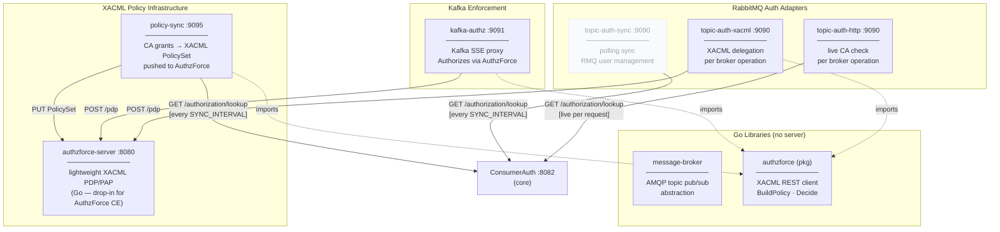
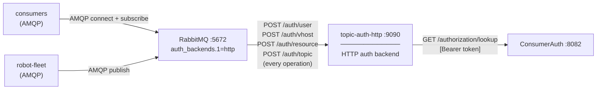
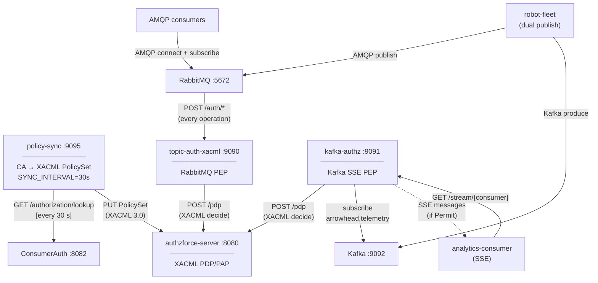
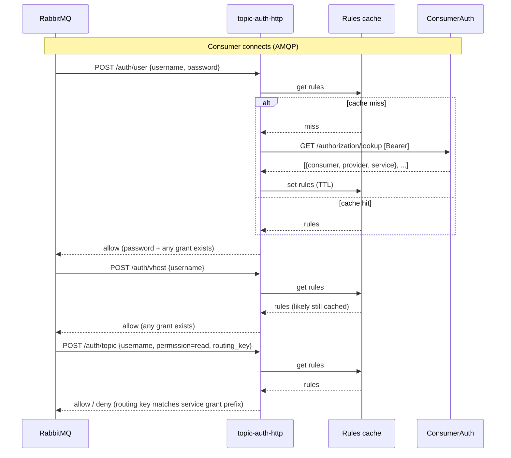
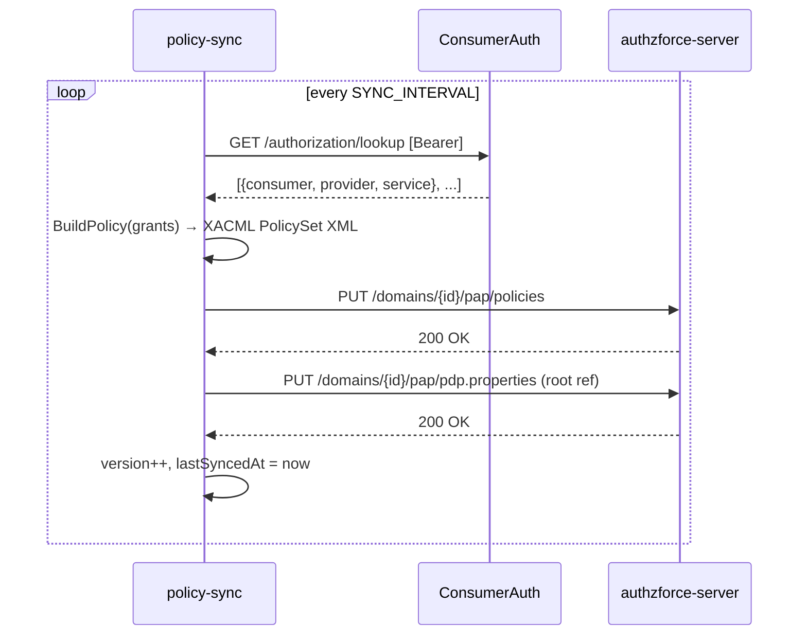

# Support — Diagrams

## Module Map

Shows all support modules, their kinds, and internal dependencies.

---

## Experiment-4 Context — Live HTTP Auth Backend

`topic-auth-http` is the sole auth backend for RabbitMQ. Every broker
operation triggers a live ConsumerAuth check. No polling delay — a revoked
grant is effective on the consumer's next operation.

---

## Experiment-5 Context — Unified XACML Policy Projection

`policy-sync` is the single writer: it compiles CA grants into a XACML
PolicySet and pushes it to AuthzForce. Both `topic-auth-xacml` (RabbitMQ) and
`kafka-authz` (Kafka SSE) query the same AuthzForce PDP — a single policy
governs both transports.

---

## topic-auth-http — Decision Flow

One sequence per RabbitMQ operation type. The `handleResource` handler
always returns `allow`; fine-grained control is enforced at the topic level.

---

## policy-sync — Sync Cycle

